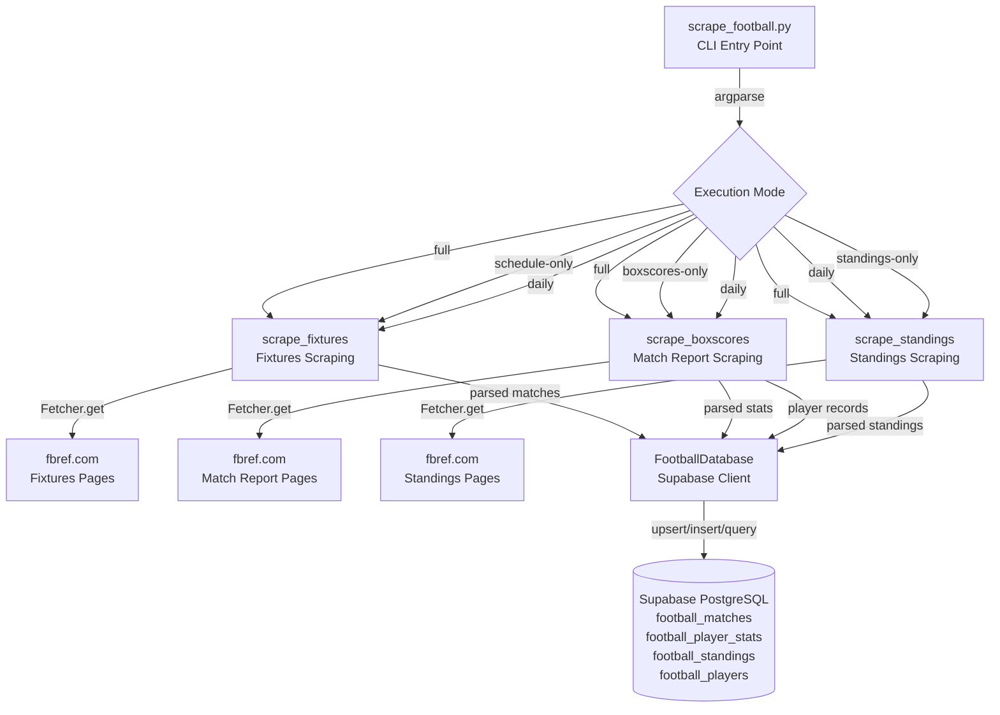
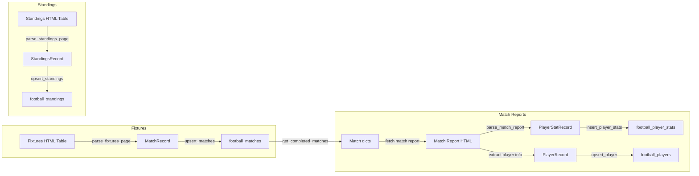

# Design Document: Football Scraper

## Overview

The Football Scraper is a standalone Python CLI application (`scripts/scrape_football.py`) that collects football/soccer match schedules, detailed player statistics from match reports, league standings, and player master records from fbref.com. It covers the top 5 European leagues (Premier League, La Liga, Bundesliga, Serie A, Ligue 1) for the 2024-25 season and persists all data to a Supabase PostgreSQL database.

The scraper uses the Scrapling library's `Fetcher.get()` with `stealthy_headers=True` for HTTP requests and the `supabase-py` client for database operations. It follows the same single-file architecture pattern as the existing `scrape_nba.py`.

### Key Design Decisions

1. **Scrapling Fetcher with stealthy_headers**: FBRef serves static HTML but may rate-limit aggressive scrapers. Stealthy headers present realistic browser-like request signatures without the overhead of a full browser.
2. **Supabase-py client over raw psycopg2**: Matches the existing project pattern, provides built-in connection pooling, and supports RLS-aware operations via the service role key.
3. **Single-file architecture**: Mirrors `scrape_nba.py` — all logic in `scripts/scrape_football.py` with classes and functions organized by concern within the file.
4. **Upsert-based match persistence**: Uses `match_url` as the conflict key to safely re-run schedule scraping without duplicates.
5. **Delete-and-reinsert for player stats**: Ensures data consistency when re-scraping match reports by replacing all stats for a match atomically within a transaction.
6. **Configurable rate limiting**: Default 3-second delay between requests with exponential backoff on 429/5xx responses, respecting FBRef's server resources.

## Architecture



### Data Flow



### Execution Order

1. **Full mode**: Fixtures → (persist) → Match Reports → Standings
2. **Daily mode**: Fixtures → (persist) → Match Reports (last 2 days) → Standings
3. **Schedule-only**: Fixtures only
4. **Boxscores-only**: Match Reports only (unscraped, max 500)
5. **Standings-only**: Standings only

## Components and Interfaces

### Configuration & Constants

```python
from dataclasses import dataclass, field
from typing import Optional
from datetime import date

# League configuration
LEAGUES = {
    "Premier League": {"comp_id": 9, "url_name": "Premier-League"},
    "La Liga": {"comp_id": 12, "url_name": "La-Liga"},
    "Bundesliga": {"comp_id": 20, "url_name": "Bundesliga"},
    "Serie A": {"comp_id": 11, "url_name": "Serie-A"},
    "Ligue 1": {"comp_id": 13, "url_name": "Ligue-1"},
}

VALID_LEAGUES = set(LEAGUES.keys())
BASE_URL = "https://fbref.com"
SEASON = "2024-25"

FIXTURES_URL_TEMPLATE = "{base}/en/comps/{comp_id}/schedule/{url_name}-Scores-and-Fixtures"
STANDINGS_URL_TEMPLATE = "{base}/en/comps/{comp_id}/{url_name}-Stats"
MATCH_REPORT_URL_TEMPLATE = "{base}{match_url}"
PLAYER_URL_TEMPLATE = "{base}/en/players/{player_id}/"


@dataclass
class ScraperConfig:
    request_delay: float = 3.0          # seconds between requests (1-30)
    backoff_delay: float = 60.0         # seconds to wait on 429/5xx (10-300)
    max_retries: int = 3                # max retry attempts per URL
    request_timeout: int = 30           # HTTP timeout in seconds
    max_matches_per_run: int = 500      # max match reports per boxscores-only invocation
    season: str = SEASON
    log_dir: str = "scripts/logs"
    log_max_bytes: int = 10 * 1024 * 1024  # 10 MB
    log_backup_count: int = 5

    def validate(self) -> None:
        """Validate config ranges. Raises ValueError if invalid."""
        if not (1 <= self.request_delay <= 30):
            raise ValueError(
                f"request_delay must be between 1 and 30 seconds, got {self.request_delay}"
            )
        if not (10 <= self.backoff_delay <= 300):
            raise ValueError(
                f"backoff_delay must be between 10 and 300 seconds, got {self.backoff_delay}"
            )
```

### Data Classes

```python
@dataclass
class MatchRecord:
    match_date: str              # ISO 8601 date (YYYY-MM-DD)
    match_url: str               # FBRef match report URL slug or generated ID
    home_team: str
    away_team: str
    home_score: Optional[int]    # null if not yet played
    away_score: Optional[int]    # null if not yet played
    status: str                  # "completed" | "scheduled"
    league: str                  # e.g., "Premier League"
    comp_id: int                 # e.g., 9
    season: str                  # "2024-25"
    round: Optional[str]         # matchweek/round
    venue: Optional[str]         # stadium name
    kickoff_time: Optional[str]  # HH:MM format or null


@dataclass
class PlayerStatRecord:
    player_name: str
    player_fbref_id: str
    team: str                    # full team name
    opponent: str                # opposing team full name
    match_date: str              # ISO 8601 date
    position: Optional[str]
    is_starter: bool
    minutes: Optional[int]
    goals: Optional[int]
    assists: Optional[int]
    shots: Optional[int]
    shots_on_target: Optional[int]
    passes_completed: Optional[int]
    passes_attempted: Optional[int]
    pass_completion_pct: Optional[float]
    key_passes: Optional[int]
    through_balls: Optional[int]
    tackles: Optional[int]
    interceptions: Optional[int]
    blocks: Optional[int]
    clearances: Optional[int]
    aerials_won: Optional[int]
    fouls_committed: Optional[int]
    fouls_drawn: Optional[int]
    yellow_cards: Optional[int]
    red_cards: Optional[int]
    xg: Optional[float]
    xag: Optional[float]
    progressive_carries: Optional[int]
    progressive_passes: Optional[int]


@dataclass
class StandingsRecord:
    team: str
    league: str
    comp_id: int
    season: str
    position: int
    matches_played: int
    wins: int
    draws: int
    losses: int
    goals_for: int
    goals_against: int
    goal_difference: int
    points: int
    xg: Optional[float]
    xga: Optional[float]
    last_5: Optional[str]        # e.g., "WDWLW"


@dataclass
class PlayerRecord:
    player_fbref_id: str         # max 50 chars
    player_name: str             # max 200 chars
    current_team: str            # max 100 chars
    position: Optional[str]      # max 50 chars
    nationality: Optional[str]   # max 100 chars
```

### Main Entry Point

```python
def main() -> int:
    """Entry point. Returns exit code (0=success, 1=error)."""
    ...

def parse_args() -> argparse.Namespace:
    """Parse and validate CLI arguments.
    
    Positional: mode (full|schedule-only|boxscores-only|daily|standings-only)
    Optional: --start-date, --end-date, --delay, --league
    """
    ...

def setup_logging(config: ScraperConfig) -> logging.Logger:
    """Configure dual-output logging (stdout + rotating file in scripts/logs/)."""
    ...
```

### Fixtures Scraping

```python
def scrape_fixtures(config: ScraperConfig, logger: logging.Logger) -> list[dict]:
    """Scrape fixtures pages for all Top 5 leagues.
    
    Returns list of match record dicts ready for DB insertion.
    Waits config.request_delay between requests.
    Retries on 429/5xx up to config.max_retries times.
    """
    ...

def parse_fixtures_page(page, league_name: str, comp_id: int, logger: logging.Logger) -> list[dict]:
    """Parse a single fixtures page HTML into match record dicts.
    
    Extracts: date, kickoff_time, home_team, away_team, scores,
    match_url, round, venue from the fixtures table.
    """
    ...

def determine_status(home_score: Optional[int], away_score: Optional[int]) -> tuple[str, Optional[int], Optional[int]]:
    """Determine match status from score values.
    
    Returns (status, home_score, away_score) where:
    - Both non-null integers → ("completed", home_score, away_score)
    - Both null → ("scheduled", None, None)
    - One present, one null → ("scheduled", None, None)
    """
    ...

def generate_fallback_match_url(match_date: str, home_team: str, away_team: str) -> str:
    """Generate a deterministic match_url when no match report link exists.
    
    Format: {YYYY-MM-DD}-{home-team}-{away-team}
    All lowercase, spaces replaced with hyphens.
    """
    ...

def build_fixtures_url(comp_id: int, url_name: str) -> str:
    """Construct fixtures page URL from league config."""
    ...
```

### Match Report Scraping

```python
def scrape_boxscores(
    db: 'FootballDatabase',
    config: ScraperConfig,
    logger: logging.Logger,
    start_date: Optional[date] = None,
    end_date: Optional[date] = None,
    leagues: Optional[list[str]] = None,
    unscraped_only: bool = False,
) -> tuple[int, int]:
    """Scrape match report pages. Returns (success_count, error_count).
    
    Queries DB for target matches, fetches each report page,
    parses player stats, and persists to DB.
    """
    ...

def parse_match_report(page, home_team: str, away_team: str, logger: logging.Logger) -> list[PlayerStatRecord]:
    """Parse a match report page into PlayerStatRecord list.
    
    Finds both team stat tables, extracts player rows,
    identifies starters vs substitutes.
    """
    ...

def parse_team_stats_table(
    table, team: str, opponent: str, logger: logging.Logger
) -> list[PlayerStatRecord]:
    """Parse a single team's player stats table.
    
    Rows before substitutes separator → is_starter=True
    Rows after separator → is_starter=False
    Skips players with 0 or empty minutes.
    """
    ...

def parse_stat_value(cell_text: str, is_decimal: bool = False) -> Optional[int | float]:
    """Parse a stat cell value.
    
    Returns None for empty strings, dashes, or non-numeric text.
    Returns int for integer stats, float (2 decimal places) for decimal stats.
    """
    ...

def parse_minutes(minutes_text: str) -> Optional[int]:
    """Parse minutes field, handling added-time notation.
    
    "90" → 90
    "45+2" → 45
    "" → None
    "0" → None (triggers player exclusion)
    """
    ...

def extract_player_fbref_id(href: str) -> Optional[str]:
    """Extract player ID from href pattern /en/players/{player_id}/...
    
    Returns None if pattern doesn't match or ID is empty/whitespace.
    """
    ...
```

### Standings Scraping

```python
def scrape_standings(config: ScraperConfig, logger: logging.Logger) -> list[dict]:
    """Scrape standings pages for all Top 5 leagues.
    
    Returns list of standings record dicts ready for DB insertion.
    """
    ...

def parse_standings_page(page, league_name: str, comp_id: int, logger: logging.Logger) -> list[dict]:
    """Parse a standings page HTML into standings record dicts.
    
    Extracts: team, position, MP, W, D, L, GF, GA, GD, Pts, xG, xGA, last 5.
    """
    ...

def build_standings_url(comp_id: int, url_name: str) -> str:
    """Construct standings page URL from league config."""
    ...
```

### Database Operations

```python
class FootballDatabase:
    def __init__(self, url: str, key: str):
        """Initialize Supabase client."""
        self.client: Client = create_client(url, key)
        self.logger = logging.getLogger("football_scraper")

    def upsert_matches(self, matches: list[dict]) -> int:
        """Upsert match records in batches (conflict on match_url).
        
        Preserves existing non-null values when new value is null.
        Returns count of rows affected.
        """
        ...

    def get_completed_matches(
        self,
        start_date: Optional[date] = None,
        end_date: Optional[date] = None,
        leagues: Optional[list[str]] = None,
        unscraped_only: bool = False,
        limit: int = 500,
    ) -> list[dict]:
        """Query completed matches matching filters.
        
        Ordered by match_date ascending.
        Filters combined with logical AND.
        """
        ...

    def insert_player_stats(self, match_id: str, stats: list[dict]) -> int:
        """Delete existing stats for match_id and insert new batch in a transaction.
        
        Rolls back on failure to preserve existing data.
        Returns count inserted.
        """
        ...

    def upsert_player(self, player: dict) -> bool:
        """Insert or update player master record (conflict on player_fbref_id).
        
        Updates player_name, current_team, position, nationality
        only when new value is non-null.
        Returns True on success.
        """
        ...

    def upsert_standings(self, standings: list[dict]) -> int:
        """Upsert standings records (conflict on team+league+season).
        
        Returns count of rows affected.
        """
        ...

    def get_match_by_url(self, match_url: str) -> Optional[dict]:
        """Look up a single match by match_url. Returns None if not found."""
        ...

    def match_has_stats(self, match_id: str) -> bool:
        """Check if player stats exist for a match."""
        ...
```

### HTTP Request Helper

```python
def fetch_page(url: str, config: ScraperConfig, logger: logging.Logger):
    """Fetch a page with retry logic.
    
    Uses Fetcher.get(url, stealthy_headers=True, timeout=config.request_timeout).
    Retries on 429 (respects Retry-After, capped at 300s) and 5xx.
    Max retries: config.max_retries.
    Returns page response or None on failure.
    """
    ...

def calculate_retry_wait(response, config: ScraperConfig) -> float:
    """Calculate wait time from Retry-After header or default backoff.
    
    Parses Retry-After header value, caps at 300 seconds.
    Falls back to config.backoff_delay if header absent.
    """
    ...
```

### Validation Helpers

```python
def validate_match_record(record: dict) -> bool:
    """Validate that a match record has all required fields.
    
    Required: match_date, match_url, home_team, away_team, league.
    Returns True if valid, False otherwise.
    """
    ...

def validate_date_range(start_date: Optional[date], end_date: Optional[date]) -> None:
    """Validate date range. Raises ValueError if start_date > end_date."""
    ...

def validate_leagues(leagues: list[str]) -> None:
    """Validate league names against VALID_LEAGUES set.
    
    Raises ValueError listing invalid names and allowed values.
    """
    ...

def merge_match_records(existing: dict, new: dict) -> dict:
    """Merge new match data into existing record.
    
    New non-null values overwrite existing.
    New null values preserve existing non-null values.
    """
    ...

def merge_player_records(existing: dict, new: dict) -> dict:
    """Merge new player data into existing player record.
    
    Updates player_name, current_team, position, nationality
    only when new value is non-null and differs from existing.
    """
    ...

def calculate_daily_window() -> tuple[date, date]:
    """Calculate the 2-day inclusive window for daily mode.
    
    Returns (yesterday_utc, today_utc).
    """
    ...
```

## Data Models

### Database Schema (new tables)

**`football_matches`**
| Column | Type | Constraints | Description |
|--------|------|-------------|-------------|
| id | UUID | PK, auto-generated | Match identifier |
| match_date | DATE | NOT NULL | Date of the match |
| match_url | TEXT | UNIQUE, NOT NULL | FBRef match report URL slug or generated ID |
| home_team | TEXT | NOT NULL | Home team name |
| away_team | TEXT | NOT NULL | Away team name |
| home_score | INTEGER | nullable | Home team final score |
| away_score | INTEGER | nullable | Away team final score |
| status | TEXT | NOT NULL, CHECK (status IN ('completed', 'scheduled')) | Match status |
| league | TEXT | NOT NULL | League name (e.g., "Premier League") |
| comp_id | INTEGER | NOT NULL | FBRef competition ID |
| season | TEXT | NOT NULL, default '2024-25' | Season identifier |
| round | TEXT | nullable | Matchweek/round |
| venue | TEXT | nullable | Stadium name |
| kickoff_time | TEXT | nullable | Kickoff time (HH:MM) |
| created_at | TIMESTAMPTZ | NOT NULL, auto | Record creation time |
| updated_at | TIMESTAMPTZ | NOT NULL, auto | Last update time |

**Indexes:** `idx_football_matches_status` on (status), `idx_football_matches_league` on (league), `idx_football_matches_date` on (match_date)

**`football_player_stats`**
| Column | Type | Constraints | Description |
|--------|------|-------------|-------------|
| id | UUID | PK, auto-generated | Stat record identifier |
| match_id | UUID | FK → football_matches(id) ON DELETE CASCADE, NOT NULL | Associated match |
| player_name | TEXT | NOT NULL | Player full name |
| player_fbref_id | TEXT | NOT NULL | FBRef player identifier |
| team | TEXT | NOT NULL | Player's team (full name, max 100 chars) |
| opponent | TEXT | NOT NULL | Opposing team (full name, max 100 chars) |
| match_date | DATE | NOT NULL | Match date (denormalized for query performance) |
| position | TEXT | nullable | Player position |
| is_starter | BOOLEAN | NOT NULL, default false | Whether player started |
| minutes | INTEGER | nullable | Minutes played |
| goals | INTEGER | nullable | Goals scored |
| assists | INTEGER | nullable | Assists |
| shots | INTEGER | nullable | Total shots |
| shots_on_target | INTEGER | nullable | Shots on target |
| passes_completed | INTEGER | nullable | Passes completed |
| passes_attempted | INTEGER | nullable | Passes attempted |
| pass_completion_pct | NUMERIC(5,2) | nullable | Pass completion % |
| key_passes | INTEGER | nullable | Key passes |
| through_balls | INTEGER | nullable | Through balls |
| tackles | INTEGER | nullable | Tackles |
| interceptions | INTEGER | nullable | Interceptions |
| blocks | INTEGER | nullable | Blocks |
| clearances | INTEGER | nullable | Clearances |
| aerials_won | INTEGER | nullable | Aerials won |
| fouls_committed | INTEGER | nullable | Fouls committed |
| fouls_drawn | INTEGER | nullable | Fouls drawn |
| yellow_cards | INTEGER | nullable | Yellow cards |
| red_cards | INTEGER | nullable | Red cards |
| xg | NUMERIC(5,2) | nullable | Expected goals |
| xag | NUMERIC(5,2) | nullable | Expected assisted goals |
| progressive_carries | INTEGER | nullable | Progressive carries |
| progressive_passes | INTEGER | nullable | Progressive passes |
| created_at | TIMESTAMPTZ | NOT NULL, auto | Record creation time |

**Indexes:** `idx_football_player_stats_match_id` on (match_id), `idx_football_player_stats_player` on (player_fbref_id), `idx_football_player_stats_date` on (match_date)

**`football_standings`**
| Column | Type | Constraints | Description |
|--------|------|-------------|-------------|
| id | UUID | PK, auto-generated | Record identifier |
| team | TEXT | NOT NULL | Team name |
| league | TEXT | NOT NULL | League name |
| comp_id | INTEGER | NOT NULL | FBRef competition ID |
| season | TEXT | NOT NULL, default '2024-25' | Season identifier |
| position | INTEGER | NOT NULL | League position/rank |
| matches_played | INTEGER | NOT NULL | Matches played |
| wins | INTEGER | NOT NULL | Wins |
| draws | INTEGER | NOT NULL | Draws |
| losses | INTEGER | NOT NULL | Losses |
| goals_for | INTEGER | NOT NULL | Goals scored |
| goals_against | INTEGER | NOT NULL | Goals conceded |
| goal_difference | INTEGER | NOT NULL | Goal difference |
| points | INTEGER | NOT NULL | Total points |
| xg | NUMERIC(5,2) | nullable | Expected goals |
| xga | NUMERIC(5,2) | nullable | Expected goals against |
| last_5 | TEXT | nullable | Last 5 results (e.g., "WDWLW") |
| created_at | TIMESTAMPTZ | NOT NULL, auto | Record creation time |
| updated_at | TIMESTAMPTZ | NOT NULL, auto | Last update time |

**Unique constraint:** `uq_football_standings_team_league_season` on (team, league, season)

**`football_players`**
| Column | Type | Constraints | Description |
|--------|------|-------------|-------------|
| id | UUID | PK, auto-generated | Record identifier |
| player_fbref_id | TEXT | UNIQUE, NOT NULL, max 50 | FBRef player identifier |
| player_name | TEXT | NOT NULL, max 200 | Player full name |
| current_team | TEXT | NOT NULL, max 100 | Current team name |
| position | TEXT | nullable, max 50 | Player position |
| nationality | TEXT | nullable, max 100 | Player nationality |
| created_at | TIMESTAMPTZ | NOT NULL, auto | Record creation time |
| updated_at | TIMESTAMPTZ | NOT NULL, auto | Last update time |

**Indexes:** `idx_football_players_fbref_id` on (player_fbref_id), `idx_football_players_team` on (current_team)

### SQL Migration

```sql
-- football_matches
CREATE TABLE IF NOT EXISTS football_matches (
    id UUID PRIMARY KEY DEFAULT gen_random_uuid(),
    match_date DATE NOT NULL,
    match_url TEXT UNIQUE NOT NULL,
    home_team TEXT NOT NULL,
    away_team TEXT NOT NULL,
    home_score INTEGER,
    away_score INTEGER,
    status TEXT NOT NULL CHECK (status IN ('completed', 'scheduled')),
    league TEXT NOT NULL,
    comp_id INTEGER NOT NULL,
    season TEXT NOT NULL DEFAULT '2024-25',
    round TEXT,
    venue TEXT,
    kickoff_time TEXT,
    created_at TIMESTAMPTZ NOT NULL DEFAULT now(),
    updated_at TIMESTAMPTZ NOT NULL DEFAULT now()
);

CREATE INDEX idx_football_matches_status ON football_matches(status);
CREATE INDEX idx_football_matches_league ON football_matches(league);
CREATE INDEX idx_football_matches_date ON football_matches(match_date);

-- football_player_stats
CREATE TABLE IF NOT EXISTS football_player_stats (
    id UUID PRIMARY KEY DEFAULT gen_random_uuid(),
    match_id UUID NOT NULL REFERENCES football_matches(id) ON DELETE CASCADE,
    player_name TEXT NOT NULL,
    player_fbref_id TEXT NOT NULL,
    team TEXT NOT NULL,
    opponent TEXT NOT NULL,
    match_date DATE NOT NULL,
    position TEXT,
    is_starter BOOLEAN NOT NULL DEFAULT false,
    minutes INTEGER,
    goals INTEGER,
    assists INTEGER,
    shots INTEGER,
    shots_on_target INTEGER,
    passes_completed INTEGER,
    passes_attempted INTEGER,
    pass_completion_pct NUMERIC(5,2),
    key_passes INTEGER,
    through_balls INTEGER,
    tackles INTEGER,
    interceptions INTEGER,
    blocks INTEGER,
    clearances INTEGER,
    aerials_won INTEGER,
    fouls_committed INTEGER,
    fouls_drawn INTEGER,
    yellow_cards INTEGER,
    red_cards INTEGER,
    xg NUMERIC(5,2),
    xag NUMERIC(5,2),
    progressive_carries INTEGER,
    progressive_passes INTEGER,
    created_at TIMESTAMPTZ NOT NULL DEFAULT now()
);

CREATE INDEX idx_football_player_stats_match_id ON football_player_stats(match_id);
CREATE INDEX idx_football_player_stats_player ON football_player_stats(player_fbref_id);
CREATE INDEX idx_football_player_stats_date ON football_player_stats(match_date);

-- football_standings
CREATE TABLE IF NOT EXISTS football_standings (
    id UUID PRIMARY KEY DEFAULT gen_random_uuid(),
    team TEXT NOT NULL,
    league TEXT NOT NULL,
    comp_id INTEGER NOT NULL,
    season TEXT NOT NULL DEFAULT '2024-25',
    position INTEGER NOT NULL,
    matches_played INTEGER NOT NULL,
    wins INTEGER NOT NULL,
    draws INTEGER NOT NULL,
    losses INTEGER NOT NULL,
    goals_for INTEGER NOT NULL,
    goals_against INTEGER NOT NULL,
    goal_difference INTEGER NOT NULL,
    points INTEGER NOT NULL,
    xg NUMERIC(5,2),
    xga NUMERIC(5,2),
    last_5 TEXT,
    created_at TIMESTAMPTZ NOT NULL DEFAULT now(),
    updated_at TIMESTAMPTZ NOT NULL DEFAULT now(),
    UNIQUE(team, league, season)
);

-- football_players
CREATE TABLE IF NOT EXISTS football_players (
    id UUID PRIMARY KEY DEFAULT gen_random_uuid(),
    player_fbref_id TEXT UNIQUE NOT NULL,
    player_name TEXT NOT NULL,
    current_team TEXT NOT NULL,
    position TEXT,
    nationality TEXT,
    created_at TIMESTAMPTZ NOT NULL DEFAULT now(),
    updated_at TIMESTAMPTZ NOT NULL DEFAULT now()
);

CREATE INDEX idx_football_players_fbref_id ON football_players(player_fbref_id);
CREATE INDEX idx_football_players_team ON football_players(current_team);
```


## Correctness Properties

*A property is a characteristic or behavior that should hold true across all valid executions of a system — essentially, a formal statement about what the system should do. Properties serve as the bridge between human-readable specifications and machine-verifiable correctness guarantees.*

### Property 1: Fixtures parsing extracts all required fields

*For any* valid fixtures HTML table containing match rows with dates, team names, scores, match report links, round, and venue columns, parsing the table SHALL produce match record dicts where each record contains all required keys (match_date, match_url, home_team, away_team, home_score, away_score, status, league, comp_id, season, round, venue, kickoff_time) and the extracted values match the corresponding source HTML cell values.

**Validates: Requirements 1.2, 1.3, 1.10**

### Property 2: Fallback match_url generation is deterministic and correctly formatted

*For any* match date string (YYYY-MM-DD format) and any pair of team name strings, the generated fallback match_url SHALL be identical across multiple invocations with the same inputs, SHALL be entirely lowercase, SHALL contain no spaces (replaced by hyphens), and SHALL encode the date, home team, and away team in the format `{date}-{home}-{away}`.

**Validates: Requirements 1.4**

### Property 3: Status determination from scores

*For any* pair of optional integer values (home_score, away_score): if both are non-null non-negative integers then status SHALL be "completed" with both scores preserved; if both are null then status SHALL be "scheduled" with both scores null; if exactly one is non-null then status SHALL be "scheduled" and both score fields SHALL be null in the output.

**Validates: Requirements 1.6, 2.3, 2.4, 2.5**

### Property 4: Match record validation rejects incomplete records

*For any* match record dict missing one or more of the required fields (match_date, match_url, home_team, away_team, league), the validation function SHALL return False. *For any* match record dict containing all required fields as non-empty strings, the validation function SHALL return True.

**Validates: Requirements 2.7**

### Property 5: Match record merge preserves existing non-null values

*For any* existing match record and any new match record with the same match_url, the merged result SHALL contain the new value for any field where the new value is non-null, and SHALL preserve the existing value for any field where the new value is null and the existing value is non-null.

**Validates: Requirements 2.6**

### Property 6: Date range filtering correctness

*For any* date range where start_date is on or before end_date, and any set of match records with various dates, the filter SHALL include exactly those matches whose match_date falls within the inclusive range [start_date, end_date]. *For any* range where start_date is after end_date, the filter SHALL raise a validation error. When only start_date is provided, include matches on or after start_date. When only end_date is provided, include matches on or before end_date.

**Validates: Requirements 3.3, 3.4, 3.10**

### Property 7: League filter validation

*For any* list of league names where all names are members of the valid set (Premier League, La Liga, Bundesliga, Serie A, Ligue 1), validation SHALL accept the input. *For any* list containing at least one name not in the valid set, validation SHALL raise a ValueError listing the invalid name and the allowed values.

**Validates: Requirements 3.8, 3.9**

### Property 8: Stat value parsing handles all cell content types

*For any* string that is empty, equals "-", or contains only non-numeric characters (excluding decimal points), `parse_stat_value` SHALL return None. *For any* string representing a valid integer, it SHALL return that integer. *For any* string representing a valid decimal number, it SHALL return a float rounded to 2 decimal places.

**Validates: Requirements 4.3, 4.10, 5.8, 6.8**

### Property 9: Starter detection based on table position

*For any* team stats table HTML with a substitutes separator row, all player rows before the separator SHALL produce PlayerStatRecords with `is_starter=True`, and all player rows after the separator SHALL produce PlayerStatRecords with `is_starter=False`.

**Validates: Requirements 4.4**

### Property 10: Zero-minutes players are excluded

*For any* team stats table containing player rows, rows where the minutes value is 0, empty, or None after parsing SHALL NOT produce a PlayerStatRecord in the output. Only rows with minutes > 0 SHALL produce records.

**Validates: Requirements 4.5, 5.1**

### Property 11: Player FBRef ID extraction from href

*For any* href string matching the pattern `/en/players/{id}/...` where `{id}` is a non-empty non-whitespace string, `extract_player_fbref_id` SHALL return exactly that `{id}` substring. *For any* href not matching the pattern, or where the extracted ID is empty or whitespace-only, it SHALL return None.

**Validates: Requirements 4.9, 7.6**

### Property 12: Minutes added-time parsing

*For any* minutes string in the format `"{N}+{M}"` where N and M are positive integers, `parse_minutes` SHALL return N (the base integer only). *For any* plain integer string `"{N}"` where N > 0, it SHALL return N. *For any* string "0" or empty string, it SHALL return None.

**Validates: Requirements 4.12**

### Property 13: Standings parsing extracts all fields with metadata

*For any* valid standings HTML table containing team rows with position, MP, W, D, L, GF, GA, GD, Pts, xG, xGA columns, parsing SHALL produce standings record dicts where each record contains all required fields and additionally includes the league name, comp_id, and season values passed to the parser.

**Validates: Requirements 6.3, 6.5**

### Property 14: Player record merge preserves existing non-null values

*For any* existing player record and any new player data with the same player_fbref_id, the merged result SHALL update player_name, current_team, position, and nationality only when the new value is non-null and differs from the existing value. When the new value is null, the existing value SHALL be preserved unchanged.

**Validates: Requirements 7.2**

### Property 15: Configuration validation enforces ranges

*For any* numeric request_delay value, if the value is in [1, 30] the configuration SHALL be accepted; if outside [1, 30] it SHALL be rejected. *For any* numeric backoff_delay value, if the value is in [10, 300] the configuration SHALL be accepted; if outside [10, 300] it SHALL be rejected.

**Validates: Requirements 8.1, 8.7**

### Property 16: Retry-After header parsing with cap

*For any* Retry-After header value that is a valid positive integer, `calculate_retry_wait` SHALL return the minimum of that integer and 300 seconds. When the header is absent or unparseable, it SHALL return the configured backoff_delay value.

**Validates: Requirements 8.3**

### Property 17: Daily mode date window calculation

*For any* UTC datetime representing "now", `calculate_daily_window` SHALL return a tuple (start_date, end_date) where start_date is yesterday's UTC date and end_date is today's UTC date, forming a 2-day inclusive window.

**Validates: Requirements 9.4**

## Error Handling

### HTTP Request Errors

| Error Type | Behavior | Retry? | Max Retries |
|-----------|----------|--------|-------------|
| HTTP 429 (Rate Limited) | Wait for Retry-After header (capped at 300s) or default backoff (60s) | Yes | 3 |
| HTTP 5xx (Server Error) | Wait for configured backoff (60s default) | Yes | 3 |
| HTTP 4xx (Client Error, non-429) | Log error with URL and status, skip URL | No | — |
| Connection timeout (30s) | Log timeout, retry as network error | Yes | 3 |
| Network error (DNS, connection refused) | Log error, retry with backoff | Yes | 3 |

### Database Errors

| Operation | Error Behavior |
|-----------|---------------|
| Match upsert fails (single record) | Log error with match_url, continue with remaining matches |
| Player stats batch insert fails | Roll back transaction (preserve existing), log error, continue |
| Standings upsert fails (single record) | Log error with team+league, continue with remaining teams |
| Player record upsert fails | Log error with player_fbref_id, continue with remaining players |
| Initial query fails (boxscores-only) | Terminate run with error (cannot proceed without match list) |
| Match lookup by match_url fails | Skip stat insertion for that match, log error, continue |

### Validation Errors

| Condition | Behavior |
|-----------|----------|
| Invalid/missing mode argument | Exit with code 1, print valid options to stderr |
| start_date > end_date | Exit with code 1, print validation error |
| Delay outside [1, 30] | Exit with code 1, print valid range |
| Backoff outside [10, 300] | Exit with code 1, print valid range |
| Invalid league name in filter | Exit with code 1, list allowed values |
| Missing required match fields | Skip row, log warning with available identifiers, continue |
| Empty/whitespace player_fbref_id | Skip player, log warning with player_name and match_url, continue |

### Error Propagation Strategy

The scraper follows a **fail-forward** pattern for data processing errors:
- Individual record failures do NOT halt the run
- Each failure is logged at ERROR level with identifying context (URL, match_url, player_name)
- A run summary reports total errors at completion
- Only infrastructure-level failures (DB unreachable for initial query) terminate the run
- Transaction rollback protects existing data when batch operations fail

## Testing Strategy

### Property-Based Tests (using Hypothesis)

The scraper's pure parsing and validation functions are well-suited for property-based testing. We use the **Hypothesis** library for Python PBT.

**Configuration:**
- Minimum 100 iterations per property test
- Each test tagged with: `# Feature: football-scraper, Property {N}: {description}`

**Target functions for PBT:**

| Property | Target Function(s) | Strategy |
|----------|-------------------|----------|
| 1 | `parse_fixtures_page()` | Generate random fixtures HTML tables |
| 2 | `generate_fallback_match_url()` | Generate random dates and team names |
| 3 | `determine_status()` | Generate random Optional[int] pairs |
| 4 | `validate_match_record()` | Generate random dicts with missing fields |
| 5 | `merge_match_records()` | Generate random existing/new record pairs |
| 6 | `validate_date_range()`, date filtering | Generate random date ranges and match sets |
| 7 | `validate_leagues()` | Generate random league name lists |
| 8 | `parse_stat_value()` | Generate random cell text strings |
| 9 | `parse_team_stats_table()` | Generate tables with starter/sub sections |
| 10 | `parse_team_stats_table()` | Generate rows with various minutes values |
| 11 | `extract_player_fbref_id()` | Generate random href strings |
| 12 | `parse_minutes()` | Generate random minutes strings |
| 13 | `parse_standings_page()` | Generate random standings HTML tables |
| 14 | `merge_player_records()` | Generate random existing/new player pairs |
| 15 | `ScraperConfig.validate()` | Generate random config values |
| 16 | `calculate_retry_wait()` | Generate random Retry-After values |
| 17 | `calculate_daily_window()` | Generate random UTC datetimes |

**Custom Hypothesis strategies needed:**

```python
from hypothesis import strategies as st

# Generate valid match dates
match_dates = st.dates(
    min_value=date(2024, 8, 1),
    max_value=date(2025, 6, 30)
).map(lambda d: d.isoformat())

# Generate team names (realistic football team names)
team_names = st.text(
    alphabet=st.characters(whitelist_categories=('L', 'Nd', 'Zs')),
    min_size=3, max_size=50
).filter(lambda s: s.strip())

# Generate stat cell values (mix of valid and invalid)
stat_cells = st.one_of(
    st.just(""),
    st.just("-"),
    st.text(min_size=1, max_size=5).filter(lambda s: not s.replace('.','').replace('-','').isdigit()),
    st.integers(min_value=0, max_value=99).map(str),
    st.floats(min_value=0, max_value=9.99, allow_nan=False, allow_infinity=False).map(lambda f: f"{f:.2f}"),
)

# Generate minutes strings (plain, added-time, empty, zero)
minutes_strings = st.one_of(
    st.just(""),
    st.just("0"),
    st.integers(min_value=1, max_value=120).map(str),
    st.tuples(
        st.integers(min_value=1, max_value=90),
        st.integers(min_value=1, max_value=15)
    ).map(lambda t: f"{t[0]}+{t[1]}"),
)

# Generate player href patterns
player_hrefs = st.one_of(
    st.text(min_size=5, max_size=20).filter(lambda s: s.strip()).map(
        lambda pid: f"/en/players/{pid}/Some-Player-Name"
    ),
    st.just("/en/players//Empty-Id"),
    st.just("/some/other/path"),
    st.text(min_size=1, max_size=50),
)

# Generate fixtures HTML table rows
def fixtures_html_row(match_date, home, away, home_score, away_score, match_url, round_val, venue):
    """Generate a single fixtures table row HTML."""
    ...

# Generate full fixtures HTML page
def fixtures_html_page(rows: list) -> str:
    """Wrap rows in a complete fixtures page HTML structure."""
    ...
```

### Unit Tests (using pytest)

Example-based tests for:
- URL construction (fixtures, standings, match report, player page patterns)
- CLI argument parsing (valid modes, invalid modes, missing args, optional flags)
- Log message format verification
- Specific edge cases:
  - Partial scores (one team has score, other doesn't)
  - Empty fixtures tables
  - Match report pages with no stats tables
  - Standings pages with missing xG/xGA columns
  - Player names with special characters (accents, hyphens)
  - Very long team names (truncation behavior)

### Integration Tests (using pytest + mocks)

- Mocked `Fetcher.get()` for HTTP behavior (429 retries, 5xx handling, timeouts, network errors)
- Mocked Supabase client for DB operations (upsert, insert, query, transaction rollback)
- Mode orchestration (full, schedule-only, boxscores-only, daily, standings-only)
- End-to-end flow with mocked external dependencies
- Execution order verification (fixtures before boxscores in full/daily mode)

### Test File Structure

```
scripts/
├── tests/
│   ├── __init__.py
│   ├── conftest.py                      # Shared fixtures, Hypothesis strategies
│   ├── test_fixtures_parser.py          # Properties 1, 2, 3, 4 + unit tests
│   ├── test_match_report_parser.py      # Properties 8, 9, 10, 11, 12 + unit tests
│   ├── test_standings_parser.py         # Property 13 + unit tests
│   ├── test_validation.py              # Properties 5, 6, 7, 14, 15 + unit tests
│   ├── test_retry_logic.py            # Property 16 + integration tests
│   ├── test_daily_mode.py             # Property 17 + unit tests
│   ├── test_db.py                      # Integration tests with mocked Supabase
│   └── test_cli.py                     # CLI parsing unit tests
└── scrape_football.py
```

### Test Dependencies

```
# requirements-dev.txt (or dev section of pyproject.toml)
pytest>=7.0
hypothesis>=6.0
pytest-mock>=3.0
```

### Test Execution

```bash
# Run all tests
pytest scripts/tests/ -v

# Run only property-based tests
pytest scripts/tests/ -v -k "property"

# Run with increased Hypothesis iterations
pytest scripts/tests/ -v --hypothesis-seed=0 -s
```
