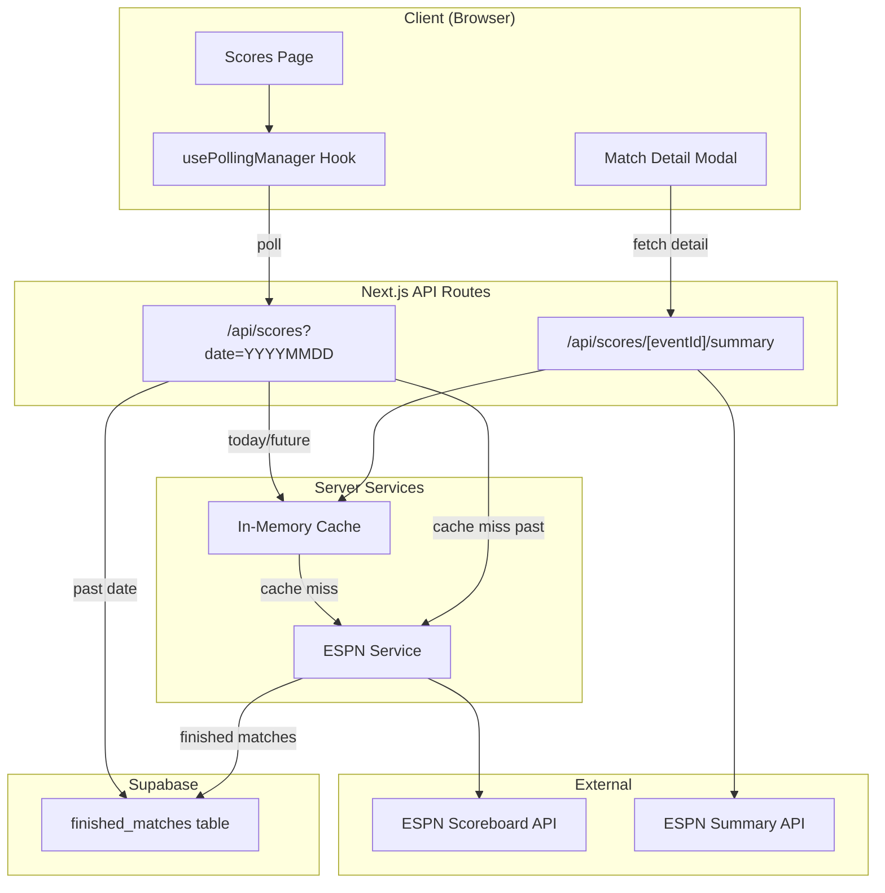
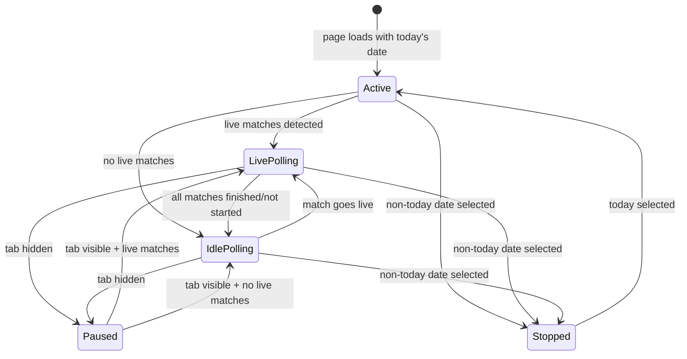

# Design Document: Live Scores App

## Overview

This design describes a dedicated, SofaScore-style live scores experience for the betroom platform. It replaces the basic score cards on the explore page with a full-featured `/scores` page featuring team logos, date navigation, smart polling, match detail modals, and a Supabase-backed cache for finished matches.

The system extends the existing ESPN integration (`lib/services/espn.ts`) by enriching the `LiveMatch` type with logo URLs, team colors, venue, and event IDs. A new polling manager on the client adapts its frequency based on match state and tab visibility. Finished matches are persisted to a `finished_matches` Supabase table so historical dates load instantly without ESPN calls.

### Key Design Decisions

1. **ESPN as single source of truth** — ESPN's public API provides logos, colors, venue, and summary data. No additional API keys needed for core functionality.
2. **Supabase for historical cache only** — Live data always comes from ESPN via the in-memory cache. Supabase stores only finished matches to avoid stale live data.
3. **Client-side polling manager** — A custom React hook manages adaptive polling intervals, visibility detection, and retry logic. No WebSocket/SSE needed since ESPN data updates every ~10s anyway.
4. **Modal for match details** — Avoids full page navigation. The modal fetches from ESPN's summary endpoint on demand, keeping the initial page load lightweight.

## Architecture



### Data Flow

1. **Today's scores**: Client polls `/api/scores` → in-memory cache (10s TTL) → ESPN scoreboard API
2. **Past dates**: Client requests `/api/scores?date=20250101` → Supabase `finished_matches` → fallback to ESPN if cache miss
3. **Future dates**: Client requests `/api/scores?date=20250120` → ESPN with date param (scheduled matches)
4. **Match detail**: Client clicks card → modal fetches `/api/scores/[eventId]/summary` → ESPN summary endpoint (30s in-memory cache)
5. **Cache write**: When ESPN returns finished matches, the scores API inserts them into `finished_matches` (INSERT ON CONFLICT DO NOTHING)

## Components and Interfaces

### Extended LiveMatch Type

```typescript
// types/index.ts - extended fields (all optional for backward compat)
export type LiveMatch = {
  id: string
  homeTeam: string
  awayTeam: string
  homeScore: number
  awayScore: number
  clock?: string
  status: MatchStatus
  league: string
  sport: string
  // New fields
  homeLogo?: string    // ESPN CDN URL
  awayLogo?: string    // ESPN CDN URL
  homeColor?: string   // hex without # (e.g. "1d428a")
  awayColor?: string   // hex without # (e.g. "ce1141")
  venue?: string       // arena/stadium name
  eventId?: string     // ESPN event ID for detail lookup
}
```

### React Components

| Component | Path | Responsibility |
|-----------|------|----------------|
| `ScoresPage` | `app/(app)/scores/page.tsx` | Page shell with sport tabs, date nav, match grid |
| `DateNavigator` | `components/scores/DateNavigator.tsx` | ±7 day date picker with Yesterday/Today/Tomorrow shortcuts |
| `ScoreCard` | `components/scores/ScoreCard.tsx` | Single match card with logos, scores, status |
| `MatchDetailModal` | `components/scores/MatchDetailModal.tsx` | Modal overlay with extended match info |
| `LeagueGroup` | `components/scores/LeagueGroup.tsx` | League header + list of ScoreCards |

### Hooks

| Hook | Path | Responsibility |
|------|------|----------------|
| `usePollingManager` | `hooks/usePollingManager.ts` | Adaptive polling with visibility detection, retry logic |
| `useMatchDetail` | `hooks/useMatchDetail.ts` | Fetch and cache match summary data |

### API Routes

| Route | Method | Description |
|-------|--------|-------------|
| `/api/scores` | GET | Enhanced: accepts `?date=YYYYMMDD`, serves cached past data |
| `/api/scores/[eventId]/summary` | GET | New: fetches ESPN summary for match detail |

### ESPN Service Enhancements

```typescript
// lib/services/espn.ts - new/modified exports
export async function fetchESPNScores(date?: string): Promise<LiveMatch[]>
export async function fetchESPNSummary(
  sportPath: string, 
  eventId: string
): Promise<MatchSummary>
```

### Match Summary Type

```typescript
// types/index.ts
export type MatchSummary = {
  eventId: string
  venue?: string
  broadcasts?: string[]
  odds?: {
    homeMoneyline?: string
    awayMoneyline?: string
    spread?: string
    overUnder?: string
  }
  leaders?: Array<{
    team: string
    name: string
    stat: string
    value: string
  }>
  headline?: string
}
```

## Data Models

### Supabase `finished_matches` Table

```sql
CREATE TABLE finished_matches (
  id TEXT PRIMARY KEY,           -- matches LiveMatch.id (e.g. "espn-nba-401584721")
  event_id TEXT NOT NULL,        -- ESPN event ID for summary lookups
  home_team TEXT NOT NULL,       -- max 200 chars
  away_team TEXT NOT NULL,       -- max 200 chars
  home_score INTEGER NOT NULL DEFAULT 0 CHECK (home_score >= 0 AND home_score <= 999),
  away_score INTEGER NOT NULL DEFAULT 0 CHECK (away_score >= 0 AND away_score <= 999),
  home_logo TEXT,                -- ESPN CDN URL
  away_logo TEXT,                -- ESPN CDN URL
  home_color TEXT,               -- hex without #
  away_color TEXT,               -- hex without #
  venue TEXT,                    -- max 200 chars
  league TEXT NOT NULL,
  sport TEXT NOT NULL,
  status TEXT NOT NULL DEFAULT 'Finished',
  clock TEXT,                    -- final clock value (e.g. "FT", "Final")
  match_date DATE NOT NULL,      -- UTC date of the match
  cached_at TIMESTAMPTZ NOT NULL DEFAULT NOW()
);

-- Index for date-based queries
CREATE INDEX idx_finished_matches_date ON finished_matches (match_date);

-- Index for league filtering
CREATE INDEX idx_finished_matches_league ON finished_matches (match_date, league);
```

### Scores API Response Shape

```typescript
// GET /api/scores?date=YYYYMMDD&sport=Football
{
  success: boolean
  data: LiveMatch[]
  meta?: {
    date: string        // YYYYMMDD
    source: "live" | "cache" | "espn_fallback"
    cachedAt?: string   // ISO timestamp if from cache
  }
}

// GET /api/scores/[eventId]/summary
{
  success: boolean
  data: MatchSummary
}
```

### Polling Manager State Machine



| State | Interval | Behavior |
|-------|----------|----------|
| LivePolling | 12s | Active polling, live matches exist |
| IdlePolling | 60s | Reduced polling, no live matches |
| Paused | — | No polling, tab hidden |
| Stopped | — | No polling, viewing non-today date |

## Correctness Properties

*A property is a characteristic or behavior that should hold true across all valid executions of a system — essentially, a formal statement about what the system should do. Properties serve as the bridge between human-readable specifications and machine-verifiable correctness guarantees.*

### Property 1: ESPN event mapping preserves team metadata

*For any* valid ESPN event object containing team logo, color, venue, and event ID fields, the `mapESPNEvent` function SHALL produce a LiveMatch where `homeLogo` equals the home competitor's `team.logo`, `awayLogo` equals the away competitor's `team.logo`, `homeColor` equals the home competitor's `team.color`, `awayColor` equals the away competitor's `team.color`, `venue` equals `competitions[0].venue.fullName`, and `eventId` equals the event's `id`. When any of these source fields are absent, the corresponding output field SHALL be `undefined`.

**Validates: Requirements 1.2, 1.3, 1.4, 1.5**

### Property 2: Match grouping by league is a partition

*For any* array of LiveMatch objects, the `groupByLeague` function SHALL produce groups where: (a) every input match appears in exactly one group, (b) all matches within a group share the same `league` value, and (c) the total count of matches across all groups equals the input array length.

**Validates: Requirements 3.2**

### Property 3: Sport filter correctness

*For any* array of LiveMatch objects and any selected sport string, filtering by that sport SHALL return only matches whose `sport` field equals the selected sport. When "All" is selected, all matches SHALL be returned unfiltered.

**Validates: Requirements 3.4**

### Property 4: Match sort ordering within league groups

*For any* array of LiveMatch objects within a single league group, after sorting: all matches with status "In Progress" or "Halftime" SHALL appear before all matches with status "Finished", and all "Finished" matches SHALL appear before all matches with status "Not Started". Upcoming matches SHALL be sorted in ascending order by start time.

**Validates: Requirements 3.6**

### Property 5: Date parameter URL construction

*For any* valid date string in YYYYMMDD format, the ESPN service SHALL construct a URL that includes `?dates={dateString}` as a query parameter appended to the base scoreboard URL. When no date is provided, the URL SHALL not contain a dates query parameter.

**Validates: Requirements 4.6**

### Property 6: Exponential backoff delay calculation

*For any* retry attempt number N (where 1 ≤ N ≤ 3), the polling manager's backoff delay SHALL equal 2^N seconds (2s for attempt 1, 4s for attempt 2, 8s for attempt 3).

**Validates: Requirements 5.6**

### Property 7: Finished match cache insertion is idempotent

*For any* LiveMatch with status "Finished", inserting it into the `finished_matches` table multiple times SHALL result in exactly one row for that match ID, and the row's data SHALL match the first insertion (subsequent inserts are no-ops).

**Validates: Requirements 6.2**

### Property 8: Past date routing queries cache first

*For any* date string representing a date strictly before the current UTC date, the Scores API SHALL query the `finished_matches` table before making any ESPN API call. If the cache returns results, no ESPN call SHALL be made.

**Validates: Requirements 6.3, 8.2**

### Property 9: Cache row to LiveMatch mapping round-trip

*For any* valid `finished_matches` database row, mapping it to a LiveMatch object SHALL produce a valid LiveMatch where `id` matches the row's `id`, `homeTeam` matches `home_team`, `awayTeam` matches `away_team`, `homeScore` matches `home_score`, `awayScore` matches `away_score`, and all optional fields (logos, colors, venue) are correctly transferred.

**Validates: Requirements 6.6**

### Property 10: Invalid date parameter rejection

*For any* string that does not match the pattern of exactly 8 digits representing a valid calendar date (YYYYMMDD), the Scores API SHALL return a 400 status code with `success: false`.

**Validates: Requirements 8.5**

### Property 11: ESPN summary mapping extracts available fields

*For any* ESPN summary API response object, the mapping function SHALL extract `venue` from `gameInfo.venue.fullName`, `odds` from `pickcenter`, `broadcasts` from `header.competitions[0].broadcasts`, and `leaders` from `leaders` arrays when these fields are present, and SHALL set them to `undefined` when absent.

**Validates: Requirements 9.3**

## Error Handling

### API Layer Errors

| Scenario | Response | Client Behavior |
|----------|----------|-----------------|
| ESPN scoreboard timeout (5s) | Serve stale cache if available, else 500 | Show error toast with retry button |
| ESPN summary timeout (5s) | 502 with error message | Modal shows "Details unavailable" |
| Invalid date param | 400 with validation message | Client-side validation prevents this |
| Supabase query failure | Fall back to ESPN for past dates | Transparent to user |
| Network offline | Fetch throws, caught by polling manager | Show offline indicator, pause polling |

### Polling Manager Error Handling

1. **Single failure**: Retry with exponential backoff (2s, 4s, 8s)
2. **3 consecutive failures**: Show non-blocking error indicator (small banner), resume normal polling on next cycle
3. **Request timeout (10s)**: Abort via AbortController, count as failure, enter retry logic
4. **Tab hidden during retry**: Cancel pending retries, reset retry count on tab visible

### Data Integrity

- `INSERT ON CONFLICT DO NOTHING` prevents duplicate/stale writes to `finished_matches`
- Score values constrained to 0-999 via CHECK constraint
- Team names constrained to 200 chars at DB level
- Client validates date range (±7 days) before sending to API

## Testing Strategy

### Property-Based Tests (using fast-check + vitest)

Property-based testing is appropriate for this feature because it contains multiple pure functions with clear input/output behavior (mapping functions, filtering, sorting, URL construction, validation) where universal properties hold across a wide input space.

**Configuration:**
- Library: `fast-check` (already in devDependencies)
- Runner: `vitest` (already in devDependencies)
- Minimum iterations: 100 per property
- Each test tagged with: `Feature: live-scores-app, Property {N}: {description}`

**Property tests to implement:**
1. ESPN event mapping (Property 1)
2. League grouping partition (Property 2)
3. Sport filter correctness (Property 3)
4. Sort ordering invariant (Property 4)
5. Date URL construction (Property 5)
6. Backoff delay calculation (Property 6)
7. Cache insertion idempotence (Property 7) — with mocked Supabase
8. Past date cache-first routing (Property 8) — with mocked services
9. Cache row → LiveMatch mapping (Property 9)
10. Invalid date rejection (Property 10)
11. ESPN summary mapping (Property 11)

### Unit Tests (example-based)

- ScoreCard renders logos when present, fallback when absent
- DateNavigator shows correct date range and highlights today
- Polling manager state transitions (tab hidden/visible, date change)
- Match detail modal opens/closes correctly
- Error states render appropriate UI

### Integration Tests

- `/api/scores` returns correct shape with and without date param
- `/api/scores/[eventId]/summary` returns summary data
- Supabase finished_matches insert and query flow
- Polling manager fetches at correct intervals (timer mocks)

### E2E Smoke Tests

- Navigate to `/scores`, verify page loads with matches
- Click date navigation, verify content changes
- Click a match card, verify modal opens with details
- Verify team logos load from ESPN CDN

