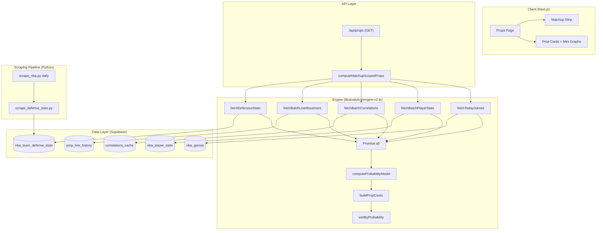
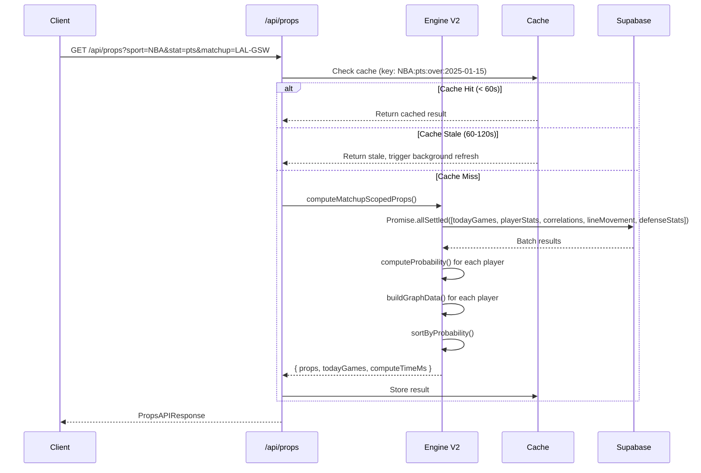

# Design Document: NBA Props Analytics

## Overview

This design overhauls the NBA props analytics pipeline from a global, sequential-fetch model to a matchup-scoped, batch-optimized, probability-based system. The current engine (`lib/analytics/engine.ts`) fetches all player stats globally and issues per-player queries for correlations and line movement, resulting in slow page loads. The new system:

1. Scopes all computation to today's games only (via `nba_games.game_date = today`)
2. Fetches all data in parallel batch queries (no per-player loops)
3. Integrates team defensive stats by position from Basketball Reference
4. Computes a multi-factor probability model (40% recent form + 35% defensive matchup + 25% pace)
5. Adds per-prop mini graphs showing last 6 games relative to the computed line
6. Provides a today's games matchup strip for filtering

The refactored engine replaces `computeEnhancedProps()` with a new `computeMatchupScopedProps()` function that accepts today's date and optional matchup filter, returning the enhanced response structure.

## Architecture



### Key Architectural Decisions

1. **Engine V2 alongside V1**: Create `lib/analytics/engine-v2.ts` rather than modifying the existing engine. The existing `/api/props` route will switch to the new engine. This allows rollback if issues arise.

2. **Batch-first data access**: All Supabase queries use `IN` clauses on team abbreviations or player names. No loops over individual players.

3. **Parallel execution with graceful degradation**: `Promise.allSettled` wraps the parallel queries so that a failure in one (e.g., correlations) doesn't block the entire response.

4. **Scraper as separate script**: The defensive stats scraper is a new Python script (`scripts/scrape_defense_stats.py`) that runs after the existing NBA scraper in the GitHub Actions workflow.

5. **Cache key includes date**: The cache key incorporates today's UTC date so stale yesterday's data is never served.

## Components and Interfaces

### 1. Props API Route (`app/api/props/route.ts`)

Updated to accept the new `matchup` query parameter and return the enhanced response structure including `todayGames` and `defensiveMatchup` data.

```typescript
// New query parameters
interface PropsQueryParams {
  sport: "NBA" | "Tennis"
  stat: string
  matchup?: string        // e.g., "LAL-GSW"
  search?: string
  limit?: number          // 1-100, default 50
  direction: "over" | "under"
}

// Enhanced response
interface PropsAPIResponse {
  props: MatchupScopedProp[]
  todayGames: TodayGame[]
  meta: {
    sport: string
    stat: string
    total: number
    timestamp: string     // ISO 8601
    computeTimeMs: number // wall-clock ms
    gamesCount: number
  }
}
```

### 2. Engine V2 (`lib/analytics/engine-v2.ts`)

The core computation module. Exports a single entry point:

```typescript
export async function computeMatchupScopedProps(
  sport: "NBA" | "Tennis",
  stat: string,
  options: {
    direction: "over" | "under"
    matchup?: string       // "LAL-GSW"
    todayDate?: string     // ISO date, defaults to UTC today
  }
): Promise<{ props: MatchupScopedProp[]; todayGames: TodayGame[]; computeTimeMs: number }>
```

Internal functions:
- `fetchTodayGames(date: string)` — single query to `nba_games`
- `fetchBatchPlayerStats(teams: string[], stat: string)` — batch query with `IN` clause
- `fetchBatchCorrelations(playerStatIds: string[])` — batch correlations lookup
- `fetchBatchLineMovement(playerStats: {name: string, stat: string}[])` — batch line history
- `fetchPositionalDefense(teams: string[], stat: string)` — query `nba_team_defense_stats`
- `computeProbability(recentForm: number, defensiveMatchup: number | null, pace: number | null)` — weighted model
- `buildGraphData(games: GameValue[], propLine: number)` — last 6 games array
- `parsePosition(positionStr: string | null)` — extract primary position

### 3. Probability Model (`lib/analytics/probability.ts`)

Pure computation module with no side effects:

```typescript
export interface ProbabilityInput {
  recentGames: number[]       // stat values, most recent first
  propLine: number
  defensiveStatAllowed: number | null  // opposing team's positional stat
  leagueDefensiveValues: number[]      // all teams' values for normalization
  opponentPace: number | null
  leaguePaceValues: number[]           // all teams' pace for normalization
}

export interface ProbabilityOutput {
  probability: number         // 0-100, 1 decimal
  recentFormFactor: number    // 0-1
  defensiveMatchupFactor: number | null  // 0-1 or null
  paceAdjustmentFactor: number | null    // 0-1 or null
  factorsUsed: "full" | "no-defense" | "no-pace" | "form-only"
}

export function computeProbability(input: ProbabilityInput): ProbabilityOutput
export function computeRecentForm(games: number[], propLine: number): number
export function minMaxNormalize(value: number, allValues: number[]): number
export function computePropLine(games: number[]): number
export function computeL5Average(games: number[]): number
export function computeL10Average(games: number[]): number
```

### 4. Defensive Stats Scraper (`scripts/scrape_defense_stats.py`)

Python script using Scrapling to collect positional defensive data:

```python
class DefenseStatsScraper:
    """Scrapes team defensive stats by position from Basketball Reference."""
    
    def scrape_all_teams(self) -> list[dict]:
        """Scrape defensive stats for all 30 teams."""
        
    def parse_positional_stats(self, page, team: str) -> list[dict]:
        """Parse position-based defensive stats from a team page."""
        
    def upsert_defense_stats(self, stats: list[dict]) -> int:
        """Upsert stats using (team, position, stat_category, season) key."""
```

### 5. Position Parser (`lib/analytics/position.ts`)

```typescript
export type Position = "PG" | "SG" | "SF" | "PF" | "C"

export function parsePosition(raw: string | null): Position | null
export function isValidPosition(pos: string): pos is Position
```

### 6. Today's Games Types (`lib/props/types.ts` — extended)

```typescript
export interface TodayGame {
  homeTeam: string          // 3-letter abbreviation
  awayTeam: string          // 3-letter abbreviation
  gameTime: string          // ISO 8601
  status: "scheduled" | "live" | "final"
}

export interface MatchupScopedProp extends PropCardData {
  position: string
  probability: number       // 0-1
  graphData: GraphDataPoint[]
  defensiveMatchup: DefensiveMatchupInfo | null
}

export interface GraphDataPoint {
  value: number
  date: string              // YYYY-MM-DD
  opponent: string          // 3-letter abbreviation
  overLine: boolean
}

export interface DefensiveMatchupInfo {
  opponentTeam: string      // 3-letter abbreviation
  statAllowedPerGame: number
  leagueAverage: number
  grade: "A" | "B" | "C" | "D" | "F"
  paceRating: "fast" | "average" | "slow"
}
```

### 7. Mini Graph Component (`components/props/MiniGraph.tsx`)

React component rendering the last 6 games as vertical bars:

```typescript
interface MiniGraphProps {
  graphData: GraphDataPoint[]
  propLine: number
  height?: number           // default 64px
}
```

### 8. Matchup Strip Component (`components/props/MatchupStrip.tsx`)

Horizontally scrollable strip of today's matchup cards:

```typescript
interface MatchupStripProps {
  games: TodayGame[]
  selectedMatchup: string | null  // e.g., "LAL-GSW"
  onSelectMatchup: (matchup: string | null) => void
}
```

## Data Models

### Database Schema

#### New Table: `nba_team_defense_stats`

| Column | Type | Constraints |
|--------|------|-------------|
| id | UUID | PK, default uuid_generate_v4() |
| team | TEXT | NOT NULL |
| position | TEXT | NOT NULL, CHECK IN ('PG','SG','SF','PF','C','TEAM') |
| stat_category | TEXT | NOT NULL |
| value_per_game | NUMERIC | |
| value_per_36 | NUMERIC | |
| value_per_100_poss | NUMERIC | |
| pace | NUMERIC | |
| games_played | INTEGER | |
| season | TEXT | NOT NULL (format: '2025-26') |
| scraped_at | TIMESTAMPTZ | NOT NULL, default now() |

**Unique constraint**: `(team, position, stat_category, season)`
**Index**: `(team, position, stat_category)` for efficient lookups
**RLS**: Public SELECT access

#### Modified Table: `nba_player_stats`

| Column | Type | Notes |
|--------|------|-------|
| position | TEXT | Nullable, added if not exists |

### Migration SQL

```sql
-- Create nba_team_defense_stats table
CREATE TABLE IF NOT EXISTS nba_team_defense_stats (
  id UUID PRIMARY KEY DEFAULT uuid_generate_v4(),
  team TEXT NOT NULL,
  position TEXT NOT NULL CHECK (position IN ('PG', 'SG', 'SF', 'PF', 'C', 'TEAM')),
  stat_category TEXT NOT NULL,
  value_per_game NUMERIC,
  value_per_36 NUMERIC,
  value_per_100_poss NUMERIC,
  pace NUMERIC,
  games_played INTEGER,
  season TEXT NOT NULL,
  scraped_at TIMESTAMPTZ NOT NULL DEFAULT now()
);

-- Unique constraint for upsert
ALTER TABLE nba_team_defense_stats
  ADD CONSTRAINT uq_team_pos_stat_season
  UNIQUE (team, position, stat_category, season);

-- Index for prop computation lookups
CREATE INDEX IF NOT EXISTS idx_defense_team_pos_stat
  ON nba_team_defense_stats (team, position, stat_category);

-- RLS
ALTER TABLE nba_team_defense_stats ENABLE ROW LEVEL SECURITY;
CREATE POLICY "Public read access" ON nba_team_defense_stats
  FOR SELECT USING (true);

-- Add position column to nba_player_stats if not exists
DO $$
BEGIN
  IF NOT EXISTS (
    SELECT 1 FROM information_schema.columns
    WHERE table_name = 'nba_player_stats' AND column_name = 'position'
  ) THEN
    ALTER TABLE nba_player_stats ADD COLUMN position TEXT;
  END IF;
END $$;
```

### Data Flow



## Correctness Properties

*A property is a characteristic or behavior that should hold true across all valid executions of a system — essentially, a formal statement about what the system should do. Properties serve as the bridge between human-readable specifications and machine-verifiable correctness guarantees.*

### Property 1: Today's Games Filter

*For any* set of NBA games with varying dates and statuses, the today's games filter SHALL return only games where `game_date` equals the current UTC date AND `status` is one of "scheduled" or "in_progress", and no other games.

**Validates: Requirements 1.1, 7.1**

### Property 2: Team-Scoped Player Filtering

*For any* set of today's games and any set of player stats, the engine SHALL return props only for players whose `team` column matches one of the `home_team` or `away_team` values from today's games, and no players from non-playing teams shall appear in the output.

**Validates: Requirements 1.2**

### Property 3: Matchup Filter Composition

*For any* valid matchup parameter (two team abbreviations) and any set of active filters (stat type, search query, direction), the filtered props SHALL contain only players from the two specified teams AND satisfy all other active filter conditions simultaneously.

**Validates: Requirements 1.5, 7.3**

### Property 4: Invalid Input Rejection

*For any* string that does not match the pattern of exactly two valid 3-letter NBA team abbreviations separated by a single hyphen, the endpoint SHALL return a 400 status code. Similarly, *for any* sport value not in {"NBA", "Tennis"} or stat value not in the supported set for the given sport, the endpoint SHALL return a 400 status code.

**Validates: Requirements 1.6, 9.6, 9.7**

### Property 5: Graceful Degradation on Partial Query Failure

*For any* combination of query successes and failures within the parallel execution, the engine SHALL return props computed from all successful queries, with fields corresponding to failed queries set to null, and the response SHALL never be an error if at least the player stats query succeeds.

**Validates: Requirements 2.4**

### Property 6: Probability Formula Correctness

*For any* valid inputs where recentForm ∈ [0,1], defensiveMatchup ∈ [0,1], and paceAdjustment ∈ [0,1], the computed probability SHALL equal `(recentForm * 0.40 + defensiveMatchup * 0.35 + paceAdjustment * 0.25) * 100` rounded to one decimal place, and the output SHALL always be in the range [0, 100].

**Validates: Requirements 4.1, 4.5**

### Property 7: Recent Form Factor Computation

*For any* array of game values (length ≥ 3) and any prop line > 0, the recent form factor SHALL equal the count of values that meet or exceed the prop line divided by the total number of values (using at most the last 10 games), producing a value in [0, 1].

**Validates: Requirements 4.2**

### Property 8: Min-Max Normalization Bounds

*For any* numeric value and any array of all team values (length ≥ 2) where max ≠ min, the min-max normalized result SHALL be in [0, 1] and SHALL equal `(value - min) / (max - min)`. If max equals min, the result SHALL be 0.5.

**Validates: Requirements 4.3, 4.4**

### Property 9: Probability Sort Order

*For any* array of props with computed probabilities, the output SHALL be sorted by probability descending. *For any* two props with equal probability, they SHALL be sorted alphabetically by player name ascending.

**Validates: Requirements 4.6**

### Property 10: Fallback Without Defensive Stats

*For any* prop where defensive stats are unavailable (null), the probability SHALL equal `recentForm * 100` rounded to one decimal place (recent form weighted at 100%).

**Validates: Requirements 4.7**

### Property 11: Fallback Without Pace Data

*For any* prop where pace data is unavailable but defensive stats are available, the probability SHALL equal `(recentForm * 0.57 + defensiveMatchup * 0.43) * 100` rounded to one decimal place.

**Validates: Requirements 4.8**

### Property 12: Prop Line Computation

*For any* array of game values with length ≥ 3, the prop line SHALL equal the arithmetic mean of the last min(10, length) values, rounded to the nearest 0.5 (with 0.25 rounding up to 0.5).

**Validates: Requirements 5.1, 5.2**

### Property 13: Minimum Games Exclusion

*For any* player-stat combination with fewer than 3 games of data, that combination SHALL never appear in the props output array.

**Validates: Requirements 5.3**

### Property 14: L5 and L10 Average Computation

*For any* array of game values with length ≥ 3, the L5 average SHALL equal the arithmetic mean of the last min(5, length) values rounded to 1 decimal place, and the L10 average SHALL equal the arithmetic mean of the last min(10, length) values rounded to 1 decimal place.

**Validates: Requirements 5.5, 5.6**

### Property 15: GraphData Construction

*For any* player with at least 3 games of data, the `graphData` array SHALL contain the last min(6, gamesPlayed) game entries in chronological order (oldest to newest), where each entry's `overLine` boolean correctly reflects whether `value >= propLine`.

**Validates: Requirements 6.1**

### Property 16: Position Parsing

*For any* position string (including multi-position formats like "PG-SG" or "SF-PF"), the parser SHALL return the first listed position. The result SHALL always be one of {"PG", "SG", "SF", "PF", "C"} or null if the input is null/empty.

**Validates: Requirements 8.1, 8.2**

### Property 17: Position Fallback Mean

*For any* team's defensive stats across all 5 positions (PG, SG, SF, PF, C) for a given stat category, when a player's position is unknown, the defensive matchup input SHALL equal the arithmetic mean of the team's `value_per_game` across all five positions.

**Validates: Requirements 8.4**

### Property 18: API Response Structure Completeness

*For any* valid API request with sport="NBA", every prop object in the response SHALL contain all required fields (id, player, team, position, statCategory, propLine, l5Avg, l10Avg, probability, matchup, graphData, hitRate, trend, trendPct, defensiveMatchup) with correct types, and the response SHALL always contain `props` (array), `todayGames` (array), and `meta` (object with all required fields).

**Validates: Requirements 9.1, 9.2, 9.3, 9.4**

### Property 19: Defensive Stats Upsert Idempotency

*For any* set of defensive stat records including duplicates on the composite key (team, position, stat_category, season), upserting the full set SHALL result in exactly one record per unique key, with the most recently scraped values preserved.

**Validates: Requirements 3.5**

## Error Handling

### API Layer

| Error Condition | Response | Behavior |
|----------------|----------|----------|
| Invalid `matchup` format | 400 + error message | Return immediately, no computation |
| Invalid `sport` or `stat` | 400 + error message | Return immediately |
| No games today | 200 + empty props, gamesCount: 0 | Normal response, empty data |
| Player stats query fails | 500 + error message | Cannot compute any props |
| Correlations query fails | 200 + correlations: null on each prop | Graceful degradation |
| Line movement query fails | 200 + lineMovement: null on each prop | Graceful degradation |
| Defensive stats query fails | 200 + probability uses form-only fallback | Graceful degradation |
| Cache read error | Proceed without cache | Log warning, compute fresh |

### Scraper Layer

| Error Condition | Behavior |
|----------------|----------|
| HTTP 429 from Basketball Reference | Wait 60s, retry up to 3 times |
| HTTP 4xx/5xx (non-429) | Log error with URL + status, skip page |
| Expected table not found on page | Log warning, skip page |
| Fewer than 15 teams parsed | Log warning, exit non-zero, preserve existing data |
| Supabase upsert failure | Log error, continue with remaining teams |
| Network timeout (>30s) | Treat as HTTP error, skip page |

### Probability Model

| Edge Case | Behavior |
|-----------|----------|
| All teams have same defensive value (max = min) | Assign factor = 0.5 |
| All teams have same pace (max = min) | Assign factor = 0.5 |
| No defensive stats for opponent | Use form-only (100% weight) |
| No pace data for opponent | Use form (57%) + defense (43%) |
| Player has no position | Use team-wide defensive average |

## Testing Strategy

### Property-Based Tests (fast-check)

The probability model and data transformation functions are pure computations ideal for property-based testing. We will use **fast-check** as the PBT library (already compatible with the project's Jest/Vitest setup).

**Configuration:**
- Minimum 100 iterations per property test
- Each test tagged with: `Feature: nba-props-analytics, Property {N}: {title}`
- Tests located in `__tests__/analytics/probability.property.test.ts` and `__tests__/analytics/engine-v2.property.test.ts`

**Properties to implement as PBT:**
- Property 6: Probability formula correctness
- Property 7: Recent form factor computation
- Property 8: Min-max normalization bounds
- Property 9: Probability sort order
- Property 10: Fallback without defensive stats
- Property 11: Fallback without pace data
- Property 12: Prop line computation
- Property 13: Minimum games exclusion
- Property 14: L5/L10 average computation
- Property 15: GraphData construction
- Property 16: Position parsing
- Property 17: Position fallback mean

### Unit Tests (Example-Based)

- API route parameter validation (Properties 4)
- Cache behavior (stale-while-revalidate timing)
- Response structure validation (Property 18)
- Mini graph component rendering
- Matchup strip component interaction
- Defensive matchup grade assignment

### Integration Tests

- Full API request → response cycle with Supabase test data
- Batch query verification (single query vs loop)
- Parallel execution timing
- Graceful degradation with simulated failures (Property 5)
- Scraper → database → engine pipeline
- Defensive stats upsert idempotency (Property 19)

### Smoke Tests

- Database migration runs without error (idempotent)
- RLS policies allow public SELECT
- GitHub Actions workflow YAML is valid
- Scraper connects to Supabase successfully
