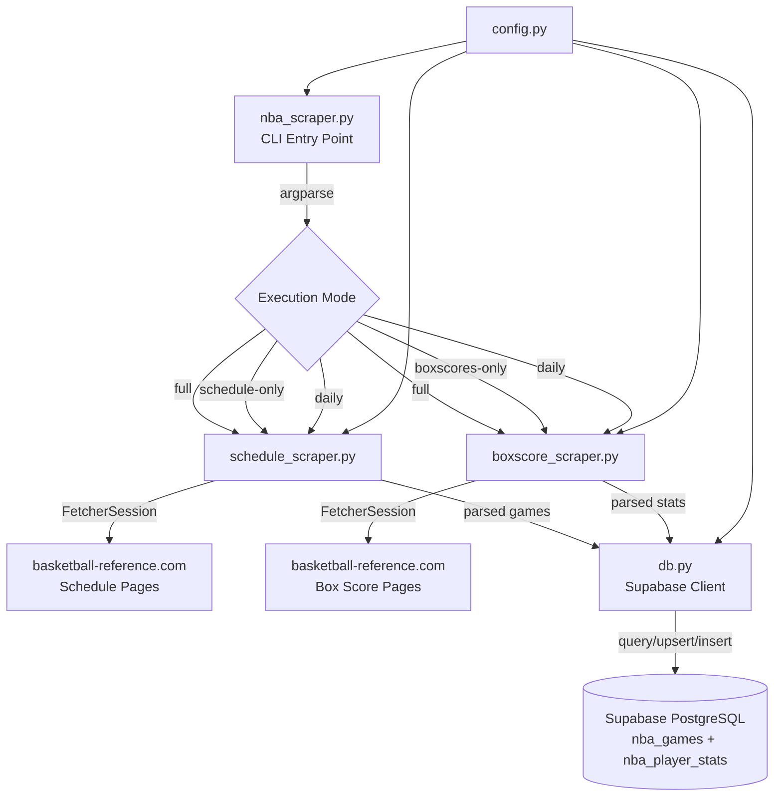

# Design Document: NBA Scraper

## Overview

The NBA Scraper is a standalone Python CLI application that collects NBA game schedules and player box score statistics from basketball-reference.com and persists them to a Supabase PostgreSQL database. It uses the Scrapling library's `FetcherSession` for HTTP requests (no browser/stealth needed since basketball-reference.com serves static HTML) and the `supabase-py` client for database operations.

The scraper supports four execution modes (`full`, `schedule-only`, `boxscores-only`, `daily`) to enable both initial bulk imports and incremental daily updates. It implements polite scraping practices with configurable delays, retry logic with exponential backoff for rate-limited responses, and comprehensive logging via Python's `logging` module with rotating file handlers.

### Key Design Decisions

1. **Scrapling FetcherSession over raw requests**: Provides session persistence, TLS fingerprint impersonation, and built-in header management while remaining lightweight (no browser overhead).
2. **Supabase-py client over raw psycopg2**: Matches the existing project's Supabase integration pattern and provides built-in connection pooling and RLS-aware operations via the service role key.
3. **Module-per-concern structure**: Separates schedule scraping, box score scraping, database operations, and configuration into distinct modules for testability and maintainability.
4. **Upsert-based game persistence**: Uses `game_url` as the conflict key to safely re-run schedule scraping without creating duplicates.
5. **Delete-and-reinsert for player stats**: Ensures data consistency when re-scraping box scores by replacing all stats for a game atomically.

## Architecture



### Data Flow

1. **Schedule scraping**: Fetch month pages → parse HTML tables → extract game records → upsert to `nba_games`
2. **Box score scraping**: Query `nba_games` for targets → fetch box score pages → parse player stat tables → insert to `nba_player_stats`

## Components and Interfaces

### `scraper/nba_scraper.py` — Main Entry Point

Responsibilities:
- Parse CLI arguments via `argparse`
- Configure logging (stdout + rotating file)
- Load environment variables via `python-dotenv`
- Orchestrate execution based on mode
- Log run summary on completion

```python
def main() -> int:
    """Entry point. Returns exit code (0=success, 1=error)."""
    ...

def parse_args() -> argparse.Namespace:
    """Parse and validate CLI arguments."""
    ...

def setup_logging(log_level: str = "INFO") -> logging.Logger:
    """Configure dual-output logging with rotation."""
    ...
```

CLI interface:
```
python scraper/nba_scraper.py <mode> [--start-date YYYY-MM-DD] [--end-date YYYY-MM-DD] [--delay SECONDS]
```

### `scraper/schedule_scraper.py` — Schedule Page Fetching & Parsing

Responsibilities:
- Construct schedule URLs for each season month
- Fetch pages using FetcherSession with rate limiting
- Parse the schedule table HTML into game records
- Handle HTTP errors and retries

```python
@dataclass
class GameRecord:
    game_date: date
    game_url: str
    home_team: str
    away_team: str
    home_score: Optional[int]
    away_score: Optional[int]
    status: str  # "completed" | "scheduled"
    season: str  # "2025-26"

def scrape_schedule(
    months: list[str],
    session: FetcherSession,
    config: ScraperConfig,
) -> list[GameRecord]:
    """Scrape schedule pages for given months. Returns parsed game records."""
    ...

def parse_schedule_page(html_response) -> list[GameRecord]:
    """Parse a single schedule page HTML into GameRecord list."""
    ...

def build_schedule_url(month: str) -> str:
    """Construct basketball-reference schedule URL for a month."""
    ...
```

### `scraper/boxscore_scraper.py` — Box Score Page Fetching & Parsing

Responsibilities:
- Fetch individual box score pages
- Parse home and away team stat tables
- Extract player statistics from table rows
- Identify starters vs reserves

```python
@dataclass
class PlayerStatRecord:
    player_name: str
    team: str
    opponent: str
    is_starter: bool
    minutes: Optional[str]
    fg: Optional[int]
    fga: Optional[int]
    fg_pct: Optional[float]
    tp: Optional[int]
    tpa: Optional[int]
    tp_pct: Optional[float]
    ft: Optional[int]
    fta: Optional[int]
    ft_pct: Optional[float]
    orb: Optional[int]
    drb: Optional[int]
    trb: Optional[int]
    ast: Optional[int]
    stl: Optional[int]
    blk: Optional[int]
    tov: Optional[int]
    pf: Optional[int]
    pts: Optional[int]
    plus_minus: Optional[int]
    game_score: Optional[float]

def scrape_boxscores(
    games: list[dict],
    session: FetcherSession,
    config: ScraperConfig,
) -> dict[str, list[PlayerStatRecord]]:
    """Scrape box score pages for given games. Returns {game_url: [stats]}."""
    ...

def parse_boxscore_page(html_response, home_team: str, away_team: str) -> list[PlayerStatRecord]:
    """Parse a box score page into PlayerStatRecord list."""
    ...

def parse_team_table(table_element, team: str, opponent: str) -> list[PlayerStatRecord]:
    """Parse a single team's box score table."""
    ...

def parse_stat_value(cell_text: str, stat_type: str) -> Optional[int | float]:
    """Parse a stat cell value, returning None for empty/dash/non-numeric."""
    ...
```

### `scraper/db.py` — Supabase Database Operations

Responsibilities:
- Initialize Supabase client from environment variables
- Upsert game records (conflict on `game_url`)
- Insert player stat records (with delete-and-reinsert for existing games)
- Query games for box score collection targets

```python
class NBADatabase:
    def __init__(self, supabase_url: str, supabase_key: str):
        """Initialize Supabase client."""
        ...

    def upsert_games(self, games: list[GameRecord]) -> int:
        """Upsert game records. Returns count of rows affected."""
        ...

    def get_completed_games(
        self,
        start_date: Optional[date] = None,
        end_date: Optional[date] = None,
        unscraped_only: bool = False,
        limit: int = 500,
    ) -> list[dict]:
        """Query completed games matching filters."""
        ...

    def get_game_by_url(self, game_url: str) -> Optional[dict]:
        """Look up a single game by game_url."""
        ...

    def insert_player_stats(self, game_id: str, stats: list[PlayerStatRecord]) -> int:
        """Delete existing stats for game_id and insert new batch. Returns count inserted."""
        ...

    def game_has_stats(self, game_id: str) -> bool:
        """Check if player stats exist for a game."""
        ...
```

### `scraper/config.py` — Configuration

Responsibilities:
- Define default configuration values
- Validate configuration ranges
- Provide team name-to-abbreviation mapping

```python
@dataclass
class ScraperConfig:
    request_delay: float = 3.0          # seconds between requests (1-30)
    backoff_delay: float = 60.0         # seconds to wait on 429/5xx (10-300)
    max_retries: int = 3                # max retry attempts per URL
    request_timeout: int = 30           # HTTP timeout in seconds
    max_games_per_run: int = 500        # max box scores per invocation
    user_agent: str = "BetRoom-NBA-Scraper/1.0"
    season: str = "2025-26"
    season_months: list[str] = field(default_factory=lambda: [
        "october", "november", "december",
        "january", "february", "march", "april", "may"
    ])
    log_file: str = "scraper/nba_scraper.log"
    log_max_bytes: int = 10 * 1024 * 1024  # 10 MB
    log_backup_count: int = 5

    def validate(self) -> None:
        """Validate config ranges. Raises ValueError if invalid."""
        ...

# Team name to 3-letter abbreviation mapping
TEAM_ABBREVIATIONS: dict[str, str] = {
    "Atlanta Hawks": "ATL",
    "Boston Celtics": "BOS",
    "Brooklyn Nets": "BKN",
    # ... all 30 NBA teams
}

BASE_URL = "https://www.basketball-reference.com"
SCHEDULE_URL_TEMPLATE = f"{BASE_URL}/leagues/NBA_2026_games-{{month}}.html"
BOXSCORE_URL_TEMPLATE = f"{BASE_URL}/boxscores/{{game_url}}.html"
```

### `scraper/requirements.txt` — Dependencies

```
scrapling[all]>=0.4.8
supabase>=2.0.0
python-dotenv>=1.0.0
```

## Data Models

### Database Schema (existing)

The scraper writes to two existing tables:

**`nba_games`**
| Column | Type | Constraints | Description |
|--------|------|-------------|-------------|
| id | UUID | PK, auto-generated | Game identifier |
| game_date | DATE | NOT NULL | Date of the game |
| game_url | TEXT | UNIQUE, NOT NULL | Basketball-reference box score URL slug |
| home_team | TEXT | NOT NULL | Home team name |
| away_team | TEXT | NOT NULL | Away team name |
| home_score | INTEGER | nullable | Home team final score |
| away_score | INTEGER | nullable | Away team final score |
| status | TEXT | CHECK constraint | "scheduled", "completed", or "postponed" |
| season | TEXT | NOT NULL, default "2025-26" | Season identifier |
| created_at | TIMESTAMPTZ | NOT NULL, auto | Record creation time |

**`nba_player_stats`**
| Column | Type | Constraints | Description |
|--------|------|-------------|-------------|
| id | UUID | PK, auto-generated | Stat record identifier |
| game_id | UUID | FK → nba_games(id), NOT NULL | Associated game |
| player_name | TEXT | NOT NULL | Player full name |
| team | TEXT | NOT NULL | Player's team (3-char abbreviation) |
| opponent | TEXT | NOT NULL | Opposing team (3-char abbreviation) |
| is_starter | BOOLEAN | default false | Whether player started |
| minutes | TEXT | nullable | Minutes played (MM:SS format) |
| fg | INTEGER | default 0 | Field goals made |
| fga | INTEGER | default 0 | Field goals attempted |
| fg_pct | NUMERIC | nullable | Field goal percentage |
| tp | INTEGER | default 0 | Three-pointers made |
| tpa | INTEGER | default 0 | Three-pointers attempted |
| tp_pct | NUMERIC | nullable | Three-point percentage |
| ft | INTEGER | default 0 | Free throws made |
| fta | INTEGER | default 0 | Free throws attempted |
| ft_pct | NUMERIC | nullable | Free throw percentage |
| orb | INTEGER | default 0 | Offensive rebounds |
| drb | INTEGER | default 0 | Defensive rebounds |
| trb | INTEGER | default 0 | Total rebounds |
| ast | INTEGER | default 0 | Assists |
| stl | INTEGER | default 0 | Steals |
| blk | INTEGER | default 0 | Blocks |
| tov | INTEGER | default 0 | Turnovers |
| pf | INTEGER | default 0 | Personal fouls |
| pts | INTEGER | default 0 | Points |
| plus_minus | INTEGER | nullable | Plus/minus |
| game_score | NUMERIC | nullable | Game score efficiency metric |
| created_at | TIMESTAMPTZ | NOT NULL, auto | Record creation time |

### Internal Data Models

**`GameRecord` dataclass** — Intermediate representation between HTML parsing and database insertion. Maps 1:1 with `nba_games` table columns (excluding `id` and `created_at`).

**`PlayerStatRecord` dataclass** — Intermediate representation for player statistics. Maps 1:1 with `nba_player_stats` columns (excluding `id`, `game_id`, and `created_at`). The `game_id` is resolved at insertion time by looking up the game via `game_url`.

### Data Transformation Flow

```mermaid
flowchart LR
    HTML_SCHED[Schedule HTML Table Row] --> |parse_schedule_page| GR[GameRecord]
    GR --> |upsert_games| DB_GAME[nba_games row]
    
    HTML_BOX[Box Score HTML Table Row] --> |parse_team_table| PSR[PlayerStatRecord]
    PSR --> |insert_player_stats| DB_STAT[nba_player_stats row]
    
    DB_GAME --> |get_completed_games| QUERY[Game dict with id + game_url]
    QUERY --> |scrape_boxscores| HTML_BOX
```



## Correctness Properties

*A property is a characteristic or behavior that should hold true across all valid executions of a system — essentially, a formal statement about what the system should do. Properties serve as the bridge between human-readable specifications and machine-verifiable correctness guarantees.*

### Property 1: Schedule parsing extracts all fields correctly

*For any* valid schedule HTML table containing game rows with dates, team names, scores, and box score links, parsing the table SHALL produce GameRecords where each record's `game_date`, `home_team`, `away_team`, `home_score`, `away_score`, and `game_url` match the corresponding values in the source HTML row.

**Validates: Requirements 1.2, 1.3**

### Property 2: Game status determination from scores

*For any* game row data, if both home_score and away_score are non-null integers then status SHALL be "completed"; if both are null then status SHALL be "scheduled"; if only one is present then status SHALL be "scheduled" and both score fields SHALL be null in the resulting GameRecord.

**Validates: Requirements 1.6, 2.3, 2.4, 2.5**

### Property 3: Game record validation rejects incomplete records

*For any* parsed game data missing one or more of the required fields (game_date, game_url, home_team, away_team), the validation function SHALL reject the record (return False or raise), and for any parsed game data containing all required fields, validation SHALL accept the record.

**Validates: Requirements 2.7**

### Property 4: Fallback game_url generation is deterministic

*For any* game date and pair of team names, the generated fallback game_url SHALL be identical across multiple invocations with the same inputs, and SHALL be a non-empty string that uniquely encodes the date and teams.

**Validates: Requirements 1.4**

### Property 5: Box score parsing produces correct player stat records

*For any* valid box score HTML containing two team tables with player rows and stat columns, parsing SHALL produce PlayerStatRecords where each record's `team` matches the table's team, `opponent` matches the other team, and all numeric stat fields match the source cell values. For cells containing empty strings, dashes, or non-numeric text, the corresponding field SHALL be None.

**Validates: Requirements 4.1, 4.2, 4.3**

### Property 6: Starter detection based on row position

*For any* team box score table with N player rows (N ≥ 5), exactly the first 5 players SHALL have `is_starter=True` and all remaining players SHALL have `is_starter=False`.

**Validates: Requirements 4.4**

### Property 7: DNP and no-minutes players are excluded

*For any* team box score table containing player rows, rows where the minutes column contains "Did Not Play", "Did Not Dress", "Not With Team", or is empty SHALL NOT produce a PlayerStatRecord in the output.

**Validates: Requirements 4.5, 5.1**

### Property 8: Team name to abbreviation mapping

*For any* valid NBA team name in the mapping, the abbreviation function SHALL return a 3-character uppercase string. For any team name not in the mapping, the function SHALL raise an error or return a recognizable fallback.

**Validates: Requirements 5.2**

### Property 9: Date range filtering correctness

*For any* date range [start_date, end_date] where start_date ≤ end_date, and any set of game dates, the filter SHALL include exactly those games whose game_date falls within the inclusive range. For any range where start_date > end_date, the filter SHALL raise a validation error.

**Validates: Requirements 3.3, 3.4**

### Property 10: Configuration delay validation

*For any* numeric delay value, if the value is in [1, 30] the configuration SHALL be accepted; if the value is outside [1, 30] the configuration SHALL be rejected with a validation error.

**Validates: Requirements 6.1, 6.6**

### Property 11: Daily mode date window calculation

*For any* UTC date representing "now", the daily mode SHALL identify the correct current month name and SHALL produce a date range covering exactly the last 2 calendar days (inclusive of today and yesterday).

**Validates: Requirements 7.4**

## Error Handling

### HTTP Request Errors

| Error Type | Behavior | Retry? | Max Retries |
|-----------|----------|--------|-------------|
| HTTP 429 (Rate Limited) | Wait for Retry-After header value or 60s default | Yes | 3 |
| HTTP 5xx (Server Error) | Wait for configured backoff (60s default) | Yes | 3 |
| HTTP 4xx (Client Error, non-429) | Log error, skip URL | No | — |
| Connection timeout (30s) | Log timeout, skip URL | No | — |
| Network error | Log error, skip URL | No | — |

### Database Errors

| Operation | Error Behavior |
|-----------|---------------|
| Game upsert fails | Log error with game_url, continue with remaining games |
| Player stats insert fails | Log error with game_url, continue with remaining games |
| Initial query fails (boxscores-only) | Terminate run with error (cannot proceed without game list) |
| Game lookup by game_url fails | Skip stat insertion for that game, log error, continue |

### Validation Errors

| Condition | Behavior |
|-----------|----------|
| Invalid mode argument | Exit with code 1, print valid options |
| start_date > end_date | Exit with code 1, print validation error |
| Delay outside [1, 30] | Exit with code 1, print valid range |
| Missing required game fields | Skip row, log warning, continue |

### Error Propagation Strategy

The scraper follows a "fail-forward" pattern for data processing errors:
- Individual record failures do NOT halt the run
- Each failure is logged at ERROR level with identifying context
- A run summary reports total errors at completion
- Only infrastructure-level failures (DB unreachable for initial query) terminate the run

## Testing Strategy

### Property-Based Tests (using Hypothesis)

The scraper's pure parsing and validation functions are well-suited for property-based testing. We'll use the **Hypothesis** library for Python PBT.

Configuration:
- Minimum 100 iterations per property test
- Each test tagged with: `# Feature: nba-scraper, Property {N}: {description}`

**Target functions for PBT:**
- `parse_schedule_page()` — Properties 1, 2
- `validate_game_record()` — Property 3
- `generate_fallback_url()` — Property 4
- `parse_boxscore_page()` / `parse_team_table()` — Properties 5, 6, 7
- `parse_stat_value()` — Property 5 (null handling)
- `get_team_abbreviation()` — Property 8
- `filter_games_by_date()` — Property 9
- `ScraperConfig.validate()` — Property 10
- `calculate_daily_window()` — Property 11

**Custom Hypothesis strategies needed:**
- `schedule_html()` — generates valid schedule page HTML with random game rows
- `boxscore_html()` — generates valid box score page HTML with two team tables
- `player_row()` — generates a single player stat row with random values
- `game_record()` — generates random GameRecord instances

### Unit Tests (using pytest)

Example-based tests for:
- URL construction (schedule and box score patterns)
- CLI argument parsing (valid modes, invalid modes, missing args)
- Log message format verification
- Specific edge cases (partial scores, empty tables, malformed HTML)

### Integration Tests (using pytest + mocks)

- Mocked FetcherSession for HTTP behavior (429 retries, 5xx handling, timeouts)
- Mocked Supabase client for DB operations (upsert, insert, query)
- Mode orchestration (full, schedule-only, boxscores-only, daily)
- End-to-end flow with mocked external dependencies

### Test File Structure

```
scraper/
├── tests/
│   ├── __init__.py
│   ├── conftest.py              # Shared fixtures, Hypothesis strategies
│   ├── test_schedule_parser.py  # Properties 1, 2, 3, 4 + unit tests
│   ├── test_boxscore_parser.py  # Properties 5, 6, 7 + unit tests
│   ├── test_config.py           # Property 10 + unit tests
│   ├── test_db.py               # Integration tests with mocked Supabase
│   ├── test_cli.py              # CLI parsing unit tests
│   └── test_daily_mode.py       # Property 11 + unit tests
└── ...
```

### Test Dependencies

Add to `requirements.txt` (dev section) or separate `requirements-dev.txt`:
```
pytest>=7.0
hypothesis>=6.0
pytest-mock>=3.0
```

