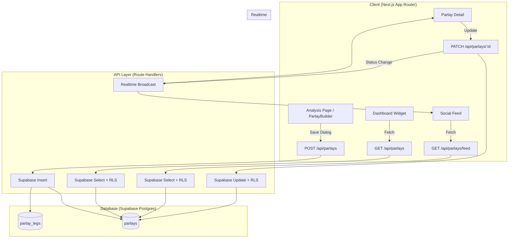

# Design Document: Parlay Builder & Tracker

## Overview

This feature extends the existing ParlayBuilder bottom sheet on the analysis page to support saving, tracking, and sharing multi-leg parlays. It introduces two new database tables (`parlays` and `parlay_legs`), CRUD API endpoints, a reusable `ParlayBetslipCard` component for the social feed and rooms, and a dashboard widget for personal parlay performance tracking.

The design integrates with existing infrastructure:
- **ParlayBuilder component** — currently shows a "not available yet" toast on save; will be extended with a save dialog
- **`/api/props/parlay` endpoint** — already computes combined hit rates; results stored at save time
- **Dashboard** — adds a new "My Parlays" widget section
- **Social feed / Rooms** — public parlays appear as styled betslip cards
- **Supabase Realtime** — broadcasts status changes to feed subscribers

### Key Design Decisions

1. **Cursor-based pagination for feed** — avoids offset drift when new parlays are inserted; uses `created_at` + `id` as cursor for deterministic ordering.
2. **Denormalized `combined_hit_rate` on parlays table** — computed at save time via existing `/api/props/parlay` endpoint; avoids re-computation on every feed render.
3. **RLS-first access control** — all privacy enforcement happens at the database layer; API routes don't need to manually filter by visibility.
4. **Supabase Realtime Broadcast** (not `postgres_changes`) — matches the existing pattern in ChatPanel; lighter weight and doesn't require DB triggers.
5. **Single `ParlayBetslipCard` component** — reusable across feed, rooms, dashboard, and profile pages with a `variant` prop for compact vs. expanded rendering.

---

## Architecture



### Data Flow: Save Parlay

1. User builds parlay on analysis page (existing flow)
2. User taps "Save Parlay" → save dialog opens
3. User fills optional fields (visibility, odds, stake, note) → confirms
4. Client calls `POST /api/parlays` with legs + metadata
5. Server validates, inserts into `parlays` + `parlay_legs`, returns created object
6. If visibility = "public", server broadcasts to `parlays-feed` channel
7. Client closes dialog, clears parlay state, shows success toast

### Data Flow: Status Update

1. User taps "Won" or "Lost" on a pending parlay (dashboard or expanded card)
2. Client calls `PATCH /api/parlays/:id` with `{ status: "won" }`
3. Server updates status + sets `resolved_at`, returns updated parlay
4. Server broadcasts status change to `parlays-feed` channel
5. Feed subscribers receive update, re-render affected card with new badge
6. Client shows undo toast (60-second window)

---

## Components and Interfaces

### 1. SaveParlayDialog

New component rendered inside ParlayBuilder when save is triggered.

```typescript
interface SaveParlayDialogProps {
  legs: ParlayLeg[]
  combinedHitRate: number | null
  onSave: (data: SaveParlayPayload) => Promise<void>
  onClose: () => void
  isSubmitting: boolean
  error: string | null
}

interface SaveParlayPayload {
  legs: ParlayLegInput[]
  visibility: "public" | "private"
  odds: number | null
  stake: number | null
  custom_note: string | null
  combined_hit_rate: number | null
}

interface ParlayLegInput {
  player_name: string
  stat_category: string
  prop_line: number
  direction: "over" | "under"
  l10_hit_rate: number
  sport: string
}
```

### 2. ParlayBetslipCard

Reusable card component for displaying parlays across the app.

```typescript
interface ParlayBetslipCardProps {
  parlay: ParlayWithLegs
  variant: "compact" | "expanded" | "feed"
  onStatusChange?: (status: "won" | "lost" | "pending") => void
  onToggleExpand?: () => void
  showActions?: boolean // hide for non-owners
  currentUserId?: string
}

interface ParlayWithLegs {
  id: string
  user_id: string
  status: "pending" | "won" | "lost"
  visibility: "public" | "private"
  odds: number | null
  stake: number | null
  custom_note: string | null
  combined_hit_rate: number | null
  created_at: string
  resolved_at: string | null
  legs: ParlayLegRow[]
  user?: {
    display_name: string
    username: string
    avatar_url: string
    is_verified: boolean
  }
}

interface ParlayLegRow {
  id: string
  player_name: string
  stat_category: string
  prop_line: number
  direction: "over" | "under"
  l10_hit_rate: number | null
  leg_order: number
  sport: string
}
```

### 3. DashboardParlayWidget

New section added to DashboardClient.

```typescript
interface DashboardParlayWidgetProps {
  initialParlays: ParlayWithLegs[]
  initialStats: ParlayStats
}

interface ParlayStats {
  total: number
  won: number
  lost: number
  pending: number
  win_rate: number | null // null when won+lost = 0
  net_profit_loss: number
  avg_legs: number | null
  most_common_sport: string | null
  best_streak: number
  current_streak: { count: number; type: "won" | "lost" | null }
  by_leg_count: {
    "2-leg": { won: number; total: number; win_rate: number | null }
    "3-leg": { won: number; total: number; win_rate: number | null }
    "4+-leg": { won: number; total: number; win_rate: number | null }
  }
}
```

### 4. useParlayFeed Hook

Custom hook for the social feed with Realtime subscription.

```typescript
function useParlayFeed(options?: { limit?: number }) {
  // Returns paginated public parlays with Realtime status updates
  return {
    parlays: ParlayWithLegs[]
    isLoading: boolean
    error: string | null
    hasMore: boolean
    loadMore: () => void
    refresh: () => void
  }
}
```

---

## Data Models

### Database Schema

#### `parlays` table

| Column | Type | Constraints |
|--------|------|-------------|
| id | UUID | PK, default `gen_random_uuid()` |
| user_id | UUID | NOT NULL, FK → auth.users(id) ON DELETE CASCADE |
| status | TEXT | NOT NULL, CHECK IN ('pending','won','lost'), default 'pending' |
| visibility | TEXT | NOT NULL, CHECK IN ('public','private') |
| odds | NUMERIC(10,2) | nullable |
| stake | NUMERIC(10,2) | nullable |
| custom_note | TEXT | nullable, CHECK length ≤ 280 |
| combined_hit_rate | NUMERIC(4,1) | nullable, CHECK 0.0–100.0 |
| created_at | TIMESTAMPTZ | NOT NULL, default now() |
| resolved_at | TIMESTAMPTZ | nullable |

#### `parlay_legs` table

| Column | Type | Constraints |
|--------|------|-------------|
| id | UUID | PK, default `gen_random_uuid()` |
| parlay_id | UUID | NOT NULL, FK → parlays(id) ON DELETE CASCADE |
| player_name | TEXT | NOT NULL, CHECK length ≤ 200 |
| stat_category | TEXT | NOT NULL, CHECK length ≤ 100 |
| prop_line | NUMERIC(10,2) | NOT NULL |
| direction | TEXT | NOT NULL, CHECK IN ('over','under') |
| l10_hit_rate | NUMERIC(4,1) | nullable, CHECK 0.0–100.0 |
| leg_order | INTEGER | NOT NULL, CHECK 1–20 |
| sport | TEXT | NOT NULL |

#### Indexes

- `idx_parlays_user_status` on `parlays(user_id, status)` — dashboard queries
- `idx_parlays_feed` on `parlays(visibility, created_at DESC)` — feed queries
- `idx_parlay_legs_parlay` on `parlay_legs(parlay_id)` — leg lookups

#### Row Level Security Policies

**parlays:**
- `select_own`: Users can SELECT where `user_id = auth.uid()`
- `select_public`: All authenticated users can SELECT where `visibility = 'public'`
- `insert_own`: Users can INSERT where `user_id = auth.uid()`
- `update_own`: Users can UPDATE `status`, `resolved_at`, `visibility` where `user_id = auth.uid()`
- `delete_own_pending`: Users can DELETE where `user_id = auth.uid()` AND `status = 'pending'`

**parlay_legs:**
- `select_via_parlay`: Users can SELECT legs where the parent parlay is accessible (own or public)
- `insert_via_parlay`: Users can INSERT legs for their own parlays
- No direct UPDATE or DELETE (managed via CASCADE from parlays)

### TypeScript Types (shared)

```typescript
// lib/types/parlay.ts
export type ParlayStatus = "pending" | "won" | "lost"
export type ParlayVisibility = "public" | "private"

export interface Parlay {
  id: string
  user_id: string
  status: ParlayStatus
  visibility: ParlayVisibility
  odds: number | null
  stake: number | null
  custom_note: string | null
  combined_hit_rate: number | null
  created_at: string
  resolved_at: string | null
}

export interface ParlayLeg {
  id: string
  parlay_id: string
  player_name: string
  stat_category: string
  prop_line: number
  direction: "over" | "under"
  l10_hit_rate: number | null
  leg_order: number
  sport: string
}
```

---

## Correctness Properties

*A property is a characteristic or behavior that should hold true across all valid executions of a system — essentially, a formal statement about what the system should do. Properties serve as the bridge between human-readable specifications and machine-verifiable correctness guarantees.*

### Property 1: Leg Count Validation

*For any* parlay creation request, the system SHALL accept the request if and only if the legs array contains between 2 and 10 elements (inclusive). Requests with fewer than 2 or more than 10 legs SHALL be rejected with a 400 status.

**Validates: Requirements 1.4, 10.2**

### Property 2: Parlay Data Round-Trip

*For any* valid parlay with valid legs, saving the parlay via POST and then retrieving it via GET SHALL return an object containing all originally submitted field values (legs with player_name, stat_category, prop_line, direction, l10_hit_rate, sport; plus visibility, odds, stake, custom_note, combined_hit_rate) unchanged.

**Validates: Requirements 1.6, 10.1, 10.3**

### Property 3: Unique Parlay Identifiers

*For any* set of N parlays created by any combination of users, all N parlay IDs SHALL be distinct valid UUIDs, and all created_at timestamps SHALL be valid ISO 8601 UTC timestamps.

**Validates: Requirements 1.7**

### Property 4: Odds and Stake Range Validation

*For any* parlay creation request where odds is provided outside the range [-10000, 10000] or stake is provided outside the range [0.01, 99999.99], or any leg is missing a required field (player_name, stat_category, prop_line, direction, l10_hit_rate, sport) or has an invalid direction value, the system SHALL reject the request with a 400 status.

**Validates: Requirements 1.9, 10.10**

### Property 5: Performance Stats Computation

*For any* set of user parlays with known statuses, stakes, and odds values, the system SHALL compute: win_rate = (won_count / (won_count + lost_count)) × 100 rounded to 1 decimal (or null when both are zero), and net_profit_loss = sum of (stake × (odds - 1)) for won parlays minus sum of stake for lost parlays, rounded to 2 decimal places, considering only parlays where both stake and odds are defined.

**Validates: Requirements 2.4, 5.2, 5.6, 5.7**

### Property 6: Payout Computation

*For any* stake and odds combination, the potential payout SHALL be computed as: stake × odds for decimal odds (odds > 0 and not in American format), stake × (odds / 100) for positive American odds, or stake × (100 / |odds|) for negative American odds. The result SHALL be a positive number greater than zero.

**Validates: Requirements 3.3**

### Property 7: Odds Formatting

*For any* odds value, the formatted display SHALL show a "+" prefix for positive American odds greater than zero, a "-" prefix for negative American odds, or the raw decimal value with an "x" suffix for decimal multipliers.

**Validates: Requirements 3.2**

### Property 8: Pagination Invariant

*For any* collection of N parlays queried with a page size of P, the system SHALL return at most P items per page, the union of all pages SHALL equal the full result set, no item SHALL appear in more than one page, and items SHALL be ordered by created_at descending within and across pages.

**Validates: Requirements 4.5, 5.1, 10.4, 10.7**

### Property 9: Private Parlay Exclusion from Feed

*For any* feed query by any authenticated user, the result set SHALL contain zero parlays where visibility = 'private', regardless of filter parameters or pagination cursor.

**Validates: Requirements 9.2**

### Property 10: Blocked User Exclusion

*For any* feed query by a user who has blocked one or more other users, the result set SHALL contain zero parlays where user_id matches any blocked user's ID.

**Validates: Requirements 4.6**

### Property 11: Duplicate Prop Rejection

*For any* parlay state containing N legs and any new prop where the (player_name, stat_category) pair matches an existing leg, the add operation SHALL be rejected and the parlay state SHALL remain unchanged with N legs.

**Validates: Requirements 7.2**

### Property 12: Streak Computation

*For any* ordered sequence of resolved parlays (ordered by resolved_at ascending), the best streak SHALL equal the length of the longest consecutive subsequence of parlays with status "won", and the current streak SHALL equal the count of consecutive parlays with the same status counting backwards from the most recently resolved parlay.

**Validates: Requirements 8.4, 8.5**

### Property 13: Win Rate by Leg Bucket

*For any* set of resolved parlays, the win rate for each bucket ("2-leg", "3-leg", "4+-leg") SHALL equal the count of "won" parlays in that bucket divided by the total resolved parlays in that bucket, expressed as a percentage rounded to the nearest integer.

**Validates: Requirements 8.2**

### Property 14: Resolved_at Timestamp Management

*For any* parlay status transition, when status changes to "won" or "lost" the resolved_at field SHALL be set to a valid UTC timestamp, and when status reverts to "pending" the resolved_at field SHALL be set to null.

**Validates: Requirements 10.6**

### Property 15: Betslip Card Completeness

*For any* valid parlay object with legs, the rendered ParlayBetslipCard SHALL contain: all leg player names, all leg stat categories, all leg prop lines, all leg directions, the combined hit rate (when non-null), the user display name, and the parlay status badge text.

**Validates: Requirements 3.1**

### Property 16: Compact Card Display

*For any* parlay with N legs (2 ≤ N ≤ 10), the compact card SHALL display the first two player names, and when N > 2, SHALL display "+{N-2} more". When N = 2, the "+N more" indicator SHALL be omitted.

**Validates: Requirements 5.4**

---

## Error Handling

### API Error Responses

All API routes use the existing `withSecurity` wrapper and return structured error responses:

| Scenario | Status | Response |
|----------|--------|----------|
| Unauthenticated request | 401 | `{ error: "Authentication required." }` |
| Validation failure (bad body) | 400 | `{ error: "...", code: "VALIDATION_ERROR", details: [...] }` |
| Parlay not found / not owned | 404 | `{ error: "Parlay not found." }` |
| Database insert/update failure | 500 | `{ error: "Failed to save parlay." }` |
| Payload too large | 413 | `{ error: "...", code: "PAYLOAD_TOO_LARGE" }` |

### Client-Side Error Handling

- **Save dialog**: On API error, retain all field values, show inline error message, keep dialog open
- **Status update**: On failure, revert optimistic UI update, show error toast
- **Feed loading**: Show error state with retry button; maintain previously loaded items
- **Realtime disconnection**: Graceful degradation — feed still works via polling on next interaction

### Edge Cases

- **Concurrent status updates**: Last-write-wins at DB level; UI shows latest state from Realtime
- **Undo after 60 seconds**: Client hides undo button after timeout; server rejects late undo attempts
- **Null combined_hit_rate**: Omit from card display; don't show 0% or error state
- **User deletes account**: CASCADE deletes all parlays and legs via FK constraint

---

## Testing Strategy

### Property-Based Tests (fast-check)

The feature is well-suited for property-based testing due to its pure computation logic (stats, formatting, validation) and data integrity requirements.

**Library**: `fast-check` (already available in the project's test ecosystem via vitest)
**Configuration**: Minimum 100 iterations per property test
**Tag format**: `Feature: parlay-builder-tracker, Property {N}: {title}`

Property tests will cover:
- Validation logic (leg count, odds/stake ranges, required fields)
- Computation functions (win rate, net P/L, streaks, payout, odds formatting)
- Data integrity (round-trip, uniqueness, pagination ordering)
- Filtering invariants (private exclusion, blocked user exclusion)
- UI rendering completeness (card contains all required fields)

### Unit Tests (vitest)

Example-based tests for:
- Save dialog renders correct fields (1.1)
- Unauthenticated save redirects to login (1.5)
- Save error retains dialog state (1.8)
- Status badges render correctly for each status (3.6, 3.7, 3.8)
- Null hit rate omits section (3.9)
- Empty state messages (5.3, 8.3, 8.7)
- Undo within/after 60-second window (2.5, 2.6)
- Authorization rejection for non-owners (2.7, 9.6, 9.7, 10.9)

### Integration Tests

- Full save flow: build parlay → save → verify in DB → verify in feed (if public)
- Status update flow: mark won → verify resolved_at → verify stats update
- Visibility change: private → public → verify appears in feed
- RLS enforcement: query as non-owner → verify private parlays excluded
- Realtime: status change → verify broadcast received by subscriber

### Test File Structure

```
__tests__/
  parlays/
    validation.test.ts          # Property tests for validation logic
    computation.test.ts         # Property tests for stats/formatting
    pagination.test.ts          # Property tests for pagination invariants
    api-parlays.test.ts         # Integration tests for CRUD endpoints
    api-parlays-feed.test.ts    # Integration tests for feed endpoint
  components/
    ParlayBetslipCard.test.tsx  # Property + example tests for card rendering
    SaveParlayDialog.test.tsx   # Example tests for dialog behavior
    DashboardParlayWidget.test.tsx # Property + example tests for widget
```
