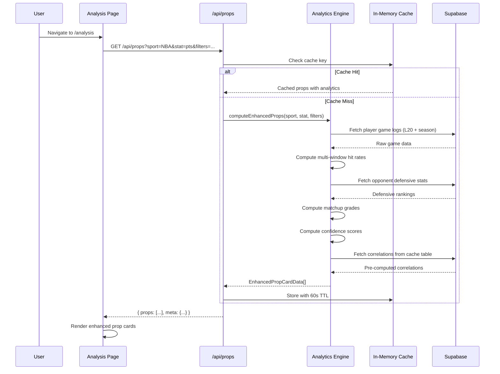
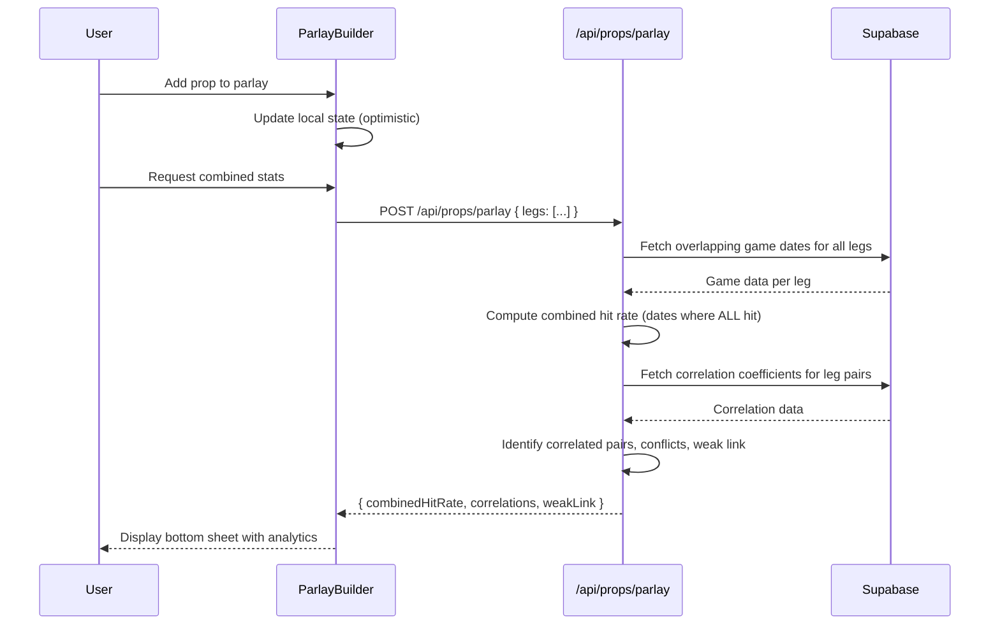

# Design Document: Props Advanced Analytics

## Overview

This feature adds a comprehensive analytics layer on top of the existing prop card UI (from `props-ui-overhaul`). It introduces multi-window hit rate visualization, matchup grading, confidence scoring, player correlations, a parlay builder, bet tracking, line movement monitoring, community sentiment voting, and AI-generated analysis writeups.

The system is architected as a set of computation modules (Analytics Engine, Correlation Engine, Line Movement Monitor, Sentiment System, AI Analyst) that run server-side, backed by new Supabase tables for persistence. The client layer extends the existing `PropCard` component with new visual elements and introduces new views (Parlay Builder bottom sheet, Bet Tracker page).

Key design decisions:
- **Computation at API time with aggressive caching** — hit rates, matchup grades, and confidence scores are computed server-side and cached in-memory (existing `cached()` pattern) with 60s TTL for hot paths.
- **Daily batch for correlations** — Pearson correlations are expensive O(n²) computations run once daily via a cron job, results stored in a `correlations_cache` table.
- **Line history as append-only log** — every scraper run appends a row to `prop_line_history`, enabling line movement charts without modifying existing tables.
- **AI writeups via edge function** — OpenAI calls are made through a Supabase Edge Function with 6-hour caching in a `ai_writeup_cache` table.
- **Supabase RLS for user data** — bet tracker and votes are user-scoped with row-level security policies.

## Architecture

```mermaid
graph TD
    subgraph Client ["Client (Next.js App Router)"]
        A[Analysis Page] --> B[PropCard Enhanced]
        B --> B1[HitRateBars Component]
        B --> B2[MatchupBadge Component]
        B --> B3[ConfidenceStars Component]
        B --> B4[CorrelationsSection Component]
        B --> B5[LineMovementIndicator Component]
        B --> B6[SentimentBar Component]
        B --> B7[AIWriteup Component]
        A --> C[AdvancedFilters Panel]
        A --> D[ParlayBuilder BottomSheet]
        A --> E[BetTracker Page]
    end

    subgraph API ["API Routes"]
        F["/api/props" - Enhanced]
        G["/api/props/correlations"]
        H["/api/props/parlay"]
        I["/api/props/votes"]
        J["/api/props/line-history"]
        K["/api/bets"]
        L["/api/props/ai-writeup"]
    end

    subgraph Compute ["Computation Modules"]
        M[Analytics Engine]
        N[Correlation Engine]
        O[Line Movement Monitor]
        P[Confidence Scorer]
    end

    subgraph DB ["Supabase"]
        Q[nba_player_stats]
        R[nba_games]
        S[tennis_serve_stats]
        T[prop_line_history]
        U[prop_votes]
        V[bet_tracker]
        W[correlations_cache]
        X[ai_writeup_cache]
    end

    subgraph External ["External"]
        Y[OpenAI API]
    end

    A -->|fetch enhanced props| F
    A -->|fetch correlations| G
    A -->|compute parlay| H
    A -->|vote| I
    A -->|line chart data| J
    E -->|CRUD bets| K
    B -->|request writeup| L

    F --> M
    M --> Q
    M --> R
    M --> S
    G --> W
    H --> W
    H --> Q
    I --> U
    J --> T
    K --> V
    L --> X
    L --> Y

    O -->|scraper hook| T
    N -->|daily cron| W
```



### Data Flow: Enhanced Props Load



### Data Flow: Parlay Builder



## Components and Interfaces

### Component 1: HitRateBars

**Purpose**: Renders multi-window hit rate visualization (L5, L10, L15, L20, Season, vs Opponent).

```typescript
interface HitRateWindow {
  window: "L5" | "L10" | "L15" | "L20" | "Season" | "vsOpp"
  hitRate: number          // 0-100 integer percentage
  over: number             // games over line
  total: number            // total games in window
  available: boolean       // false if < 3 games
}

interface HitRateBarsProps {
  windows: HitRateWindow[]
  onWindowHover?: (window: HitRateWindow) => void
}
```

**Behavior**:
- Renders bars in fixed order: L5, L10, L15, L20, Season, vsOpp
- Color bands: red (0-30%), yellow (31-60%), green (61-100%)
- Shows "N/A" for windows with `available: false`
- Tooltip on hover/tap shows "{over}/{total} over"

### Component 2: MatchupBadge

**Purpose**: Displays the letter grade for defensive matchup quality.

```typescript
interface MatchupBadgeProps {
  grade: "A" | "B" | "C" | "D" | "F" | null
  opponent: string
}
```

**Behavior**:
- Green badge for A/B, yellow for C, red for D/F
- Null grade = badge not rendered (insufficient data)

### Component 3: ConfidenceStars

**Purpose**: Displays 1-5 star confidence rating with breakdown tooltip.

```typescript
interface ConfidenceBreakdown {
  l5HitRate: number        // normalized 0-1
  l10HitRate: number       // normalized 0-1
  matchupGrade: number     // normalized 0-1
  sampleSize: number       // normalized 0-1
  finalScore: number       // weighted sum 0-1
  stars: number            // 1-5
}

interface ConfidenceStarsProps {
  breakdown: ConfidenceBreakdown | null  // null = insufficient data
  onTap?: () => void
}
```

### Component 4: CorrelationsSection

**Purpose**: Shows top correlated props for a given prop.

```typescript
interface CorrelatedProp {
  propId: string
  player: string
  statCategory: string
  coefficient: number      // 0.50 - 1.00
}

interface CorrelationsSectionProps {
  correlations: CorrelatedProp[]
  onCorrelationTap?: (propId: string) => void
}
```

### Component 5: ParlayBuilder (Bottom Sheet)

**Purpose**: Persistent bottom sheet for building and analyzing parlays.

```typescript
interface ParlayLeg {
  propId: string
  player: string
  statCategory: string
  propLine: number
  direction: "over" | "under"
  l10HitRate: number
  isWeakLink: boolean
  correlationFlag?: "correlated" | "conflict"
}

interface ParlayState {
  legs: ParlayLeg[]
  combinedHitRate: number | null   // null if insufficient data
  overlappingDates: number
  isVisible: boolean
}

interface ParlayBuilderProps {
  state: ParlayState
  onRemoveLeg: (propId: string) => void
  onClear: () => void
}
```

### Component 6: SentimentBar

**Purpose**: Displays community over/under vote percentages.

```typescript
interface SentimentData {
  overPct: number          // 0-100
  underPct: number         // 0-100
  totalVotes: number
  userVote: "over" | "under" | null
  hasMinVotes: boolean     // true if >= 5 votes
}

interface SentimentBarProps {
  data: SentimentData
  onVote: (direction: "over" | "under") => void
  isAuthenticated: boolean
}
```

### Component 7: LineMovementIndicator

**Purpose**: Shows line change arrow and expandable chart.

```typescript
interface LineMovementData {
  currentLine: number
  previousLine: number     // 24h ago
  change: number           // absolute difference
  direction: "up" | "down"
  hasSignificantMove: boolean  // >= 10% move
  history: { timestamp: string; value: number }[]
}

interface LineMovementIndicatorProps {
  data: LineMovementData | null
  onExpand?: () => void
}
```

### Component 8: AIWriteup

**Purpose**: Expandable AI-generated analysis text.

```typescript
interface AIWriteupProps {
  propId: string
  writeup: string | null
  loading: boolean
  error: boolean
  retryCount: number
  onRetry: () => void
  onExpand: () => void
}
```

### Component 9: AdvancedFilters

**Purpose**: Filter panel with all advanced filtering options.

```typescript
interface AdvancedFilterState {
  withoutPlayer: string          // NBA only, teammate name
  homeAway: "all" | "home" | "away"
  opposingTeam: string | null
  minConfidence: number          // 1-5
  direction: "over" | "under"
  hitRateMin: number             // 0-100, step 5
  hitRateMax: number             // 0-100, step 5
}

interface AdvancedFiltersProps {
  filters: AdvancedFilterState
  sport: "NBA" | "Tennis"
  teams: string[]                // available teams for dropdown
  activeCount: number
  onChange: (filters: AdvancedFilterState) => void
  onClear: () => void
}
```

### Component 10: BetTrackerView

**Purpose**: Full page view for bet tracking with ROI analytics.

```typescript
interface BetRecord {
  id: string
  player: string
  statCategory: string
  propLine: number
  direction: "over" | "under"
  confidenceScore: number
  matchupGrade: string
  odds: number                   // American odds
  stake: number
  status: "pending" | "won" | "lost" | "push"
  createdAt: string
  resolvedAt?: string
}

interface BetTrackerStats {
  totalPicks: number
  wins: number
  losses: number
  pushes: number
  winRate: number
  roi: number
  netProfit: number
  bestSignals: { confidence: number; grade: string; winRate: number; count: number }[]
}

interface BetTrackerViewProps {
  bets: BetRecord[]
  stats: BetTrackerStats
  filters: { sport?: string; stat?: string; minConfidence?: number }
}
```

## Data Models

### New Table: `prop_line_history`

Append-only log of prop line values recorded each scraper run.

```sql
CREATE TABLE IF NOT EXISTS public.prop_line_history (
  id UUID DEFAULT uuid_generate_v4() PRIMARY KEY,
  player_name TEXT NOT NULL,
  sport TEXT NOT NULL CHECK (sport IN ('NBA', 'Tennis')),
  stat_category TEXT NOT NULL,
  line_value NUMERIC NOT NULL,
  recorded_at TIMESTAMP WITH TIME ZONE DEFAULT timezone('utc'::text, now()) NOT NULL,
  created_at TIMESTAMP WITH TIME ZONE DEFAULT timezone('utc'::text, now()) NOT NULL
);

CREATE INDEX idx_line_history_player_stat 
  ON public.prop_line_history (player_name, stat_category, recorded_at DESC);
CREATE INDEX idx_line_history_recorded 
  ON public.prop_line_history (recorded_at DESC);

ALTER TABLE public.prop_line_history ENABLE ROW LEVEL SECURITY;
CREATE POLICY "Line history is viewable by everyone."
  ON public.prop_line_history FOR SELECT USING (true);
```

### New Table: `prop_votes`

User sentiment votes on props.

```sql
CREATE TABLE IF NOT EXISTS public.prop_votes (
  id UUID DEFAULT uuid_generate_v4() PRIMARY KEY,
  user_id UUID NOT NULL REFERENCES auth.users(id) ON DELETE CASCADE,
  prop_identifier TEXT NOT NULL,        -- "{player}-{stat}" composite key
  sport TEXT NOT NULL CHECK (sport IN ('NBA', 'Tennis')),
  direction TEXT NOT NULL CHECK (direction IN ('over', 'under')),
  vote_date DATE NOT NULL DEFAULT CURRENT_DATE,
  created_at TIMESTAMP WITH TIME ZONE DEFAULT timezone('utc'::text, now()) NOT NULL,
  updated_at TIMESTAMP WITH TIME ZONE DEFAULT timezone('utc'::text, now()) NOT NULL,
  UNIQUE(user_id, prop_identifier, vote_date)
);

CREATE INDEX idx_votes_prop ON public.prop_votes (prop_identifier, vote_date);
CREATE INDEX idx_votes_user ON public.prop_votes (user_id);

ALTER TABLE public.prop_votes ENABLE ROW LEVEL SECURITY;
CREATE POLICY "Users can view all votes."
  ON public.prop_votes FOR SELECT USING (true);
CREATE POLICY "Users can insert their own votes."
  ON public.prop_votes FOR INSERT WITH CHECK (auth.uid() = user_id);
CREATE POLICY "Users can update their own votes."
  ON public.prop_votes FOR UPDATE USING (auth.uid() = user_id);
```

### New Table: `bet_tracker`

User bet/pick records.

```sql
CREATE TABLE IF NOT EXISTS public.bet_tracker (
  id UUID DEFAULT uuid_generate_v4() PRIMARY KEY,
  user_id UUID NOT NULL REFERENCES auth.users(id) ON DELETE CASCADE,
  player_name TEXT NOT NULL,
  sport TEXT NOT NULL CHECK (sport IN ('NBA', 'Tennis')),
  stat_category TEXT NOT NULL,
  prop_line NUMERIC NOT NULL,
  direction TEXT NOT NULL CHECK (direction IN ('over', 'under')),
  confidence_score INTEGER CHECK (confidence_score BETWEEN 1 AND 5),
  matchup_grade TEXT CHECK (matchup_grade IN ('A', 'B', 'C', 'D', 'F')),
  odds INTEGER NOT NULL CHECK (odds BETWEEN -10000 AND 10000),
  stake NUMERIC(8,2) NOT NULL CHECK (stake BETWEEN 0.01 AND 99999.99),
  status TEXT NOT NULL DEFAULT 'pending' CHECK (status IN ('pending', 'won', 'lost', 'push')),
  created_at TIMESTAMP WITH TIME ZONE DEFAULT timezone('utc'::text, now()) NOT NULL,
  resolved_at TIMESTAMP WITH TIME ZONE
);

CREATE INDEX idx_bets_user ON public.bet_tracker (user_id, created_at DESC);
CREATE INDEX idx_bets_status ON public.bet_tracker (user_id, status);

ALTER TABLE public.bet_tracker ENABLE ROW LEVEL SECURITY;
CREATE POLICY "Users can view their own bets."
  ON public.bet_tracker FOR SELECT USING (auth.uid() = user_id);
CREATE POLICY "Users can insert their own bets."
  ON public.bet_tracker FOR INSERT WITH CHECK (auth.uid() = user_id);
CREATE POLICY "Users can update their own bets."
  ON public.bet_tracker FOR UPDATE USING (auth.uid() = user_id);
```

### New Table: `correlations_cache`

Pre-computed pairwise correlations (refreshed daily).

```sql
CREATE TABLE IF NOT EXISTS public.correlations_cache (
  id UUID DEFAULT uuid_generate_v4() PRIMARY KEY,
  sport TEXT NOT NULL CHECK (sport IN ('NBA', 'Tennis')),
  prop_a TEXT NOT NULL,              -- "{player}-{stat}" identifier
  prop_b TEXT NOT NULL,              -- "{player}-{stat}" identifier
  coefficient NUMERIC(5,4) NOT NULL, -- Pearson r, -1.0 to 1.0
  overlapping_games INTEGER NOT NULL,
  computed_at TIMESTAMP WITH TIME ZONE DEFAULT timezone('utc'::text, now()) NOT NULL,
  UNIQUE(sport, prop_a, prop_b)
);

CREATE INDEX idx_correlations_prop_a ON public.correlations_cache (prop_a, coefficient DESC);
CREATE INDEX idx_correlations_prop_b ON public.correlations_cache (prop_b, coefficient DESC);
CREATE INDEX idx_correlations_sport ON public.correlations_cache (sport);

ALTER TABLE public.correlations_cache ENABLE ROW LEVEL SECURITY;
CREATE POLICY "Correlations are viewable by everyone."
  ON public.correlations_cache FOR SELECT USING (true);
```

### New Table: `ai_writeup_cache`

Cached AI-generated writeups.

```sql
CREATE TABLE IF NOT EXISTS public.ai_writeup_cache (
  id UUID DEFAULT uuid_generate_v4() PRIMARY KEY,
  prop_identifier TEXT NOT NULL,     -- "{player}-{stat}" composite key
  sport TEXT NOT NULL CHECK (sport IN ('NBA', 'Tennis')),
  writeup TEXT NOT NULL,
  prop_line_at_generation NUMERIC NOT NULL,
  generated_at TIMESTAMP WITH TIME ZONE DEFAULT timezone('utc'::text, now()) NOT NULL,
  expires_at TIMESTAMP WITH TIME ZONE NOT NULL,
  UNIQUE(prop_identifier, sport)
);

CREATE INDEX idx_writeup_cache_prop ON public.ai_writeup_cache (prop_identifier, sport);
CREATE INDEX idx_writeup_cache_expires ON public.ai_writeup_cache (expires_at);

ALTER TABLE public.ai_writeup_cache ENABLE ROW LEVEL SECURITY;
CREATE POLICY "Writeups are viewable by everyone."
  ON public.ai_writeup_cache FOR SELECT USING (true);
```

### Enhanced Type: `EnhancedPropCardData`

Extends the existing `PropCardData` with analytics fields.

```typescript
interface EnhancedPropCardData extends PropCardData {
  // Multi-window hit rates
  hitRateWindows: HitRateWindow[]
  
  // Matchup grade
  matchupGrade: "A" | "B" | "C" | "D" | "F" | null
  
  // Confidence score
  confidence: ConfidenceBreakdown | null
  
  // Correlations (top 3)
  correlations: CorrelatedProp[]
  
  // Line movement
  lineMovement: LineMovementData | null
  
  // Sentiment
  sentiment: SentimentData | null
}
```

### API Endpoint Designs

#### `GET /api/props` (Enhanced)

Extends existing endpoint with analytics data.

**Query Parameters** (new):
| Param | Type | Default | Description |
|-------|------|---------|-------------|
| `withoutPlayer` | string | "" | NBA: exclude games where teammate played |
| `homeAway` | "all"\|"home"\|"away" | "all" | Filter by venue |
| `opponent` | string | "" | Filter by upcoming opponent |
| `minConfidence` | 1-5 | 1 | Minimum confidence stars |
| `direction` | "over"\|"under" | "over" | Hit rate direction |
| `hitRateMin` | 0-100 | 0 | Min L10 hit rate |
| `hitRateMax` | 0-100 | 100 | Max L10 hit rate |

**Response**: `{ props: EnhancedPropCardData[], meta: { ... } }`

#### `GET /api/props/correlations?propId={id}`

Returns correlations for a specific prop.

**Response**:
```typescript
{
  correlations: CorrelatedProp[]
  meta: { propId: string, computedAt: string }
}
```

#### `POST /api/props/parlay`

Computes combined analytics for a set of parlay legs.

**Request Body**:
```typescript
{
  legs: { propId: string; direction: "over" | "under" }[]
}
```

**Response**:
```typescript
{
  combinedHitRate: number | null
  overlappingDates: number
  legs: {
    propId: string
    l10HitRate: number
    isWeakLink: boolean
    correlationFlag?: "correlated" | "conflict"
  }[]
  correlationPairs: { propA: string; propB: string; coefficient: number }[]
}
```

#### `POST /api/props/votes`

Cast or update a vote.

**Request Body**: `{ propIdentifier: string; direction: "over" | "under" }`

**Response**: `{ success: boolean; totals: { over: number; under: number } }`

#### `GET /api/props/votes?propId={id}`

Get vote totals for a prop.

**Response**: `{ over: number; under: number; total: number; userVote: "over" | "under" | null }`

#### `GET /api/props/line-history?player={name}&stat={stat}&days=7`

Returns line history for chart rendering.

**Response**:
```typescript
{
  history: { timestamp: string; value: number }[]
  currentLine: number
  change24h: number | null
}
```

#### `POST /api/bets`

Log a new bet.

**Request Body**:
```typescript
{
  playerName: string
  sport: "NBA" | "Tennis"
  statCategory: string
  propLine: number
  direction: "over" | "under"
  confidenceScore: number
  matchupGrade: string
  odds: number
  stake: number
}
```

#### `PATCH /api/bets/[betId]`

Update bet status.

**Request Body**: `{ status: "won" | "lost" | "push" }`

#### `GET /api/bets?sport={sport}&stat={stat}&minConfidence={n}`

Get user's bets with optional filters.

**Response**: `{ bets: BetRecord[], stats: BetTrackerStats }`

#### `GET /api/props/ai-writeup?propId={id}`

Get or generate AI writeup for a prop.

**Response**: `{ writeup: string | null; cached: boolean; error?: string }`

### Caching Strategy

| Data | Cache Location | TTL | Invalidation |
|------|---------------|-----|--------------|
| Enhanced props (hit rates, grades, confidence) | In-memory (`cached()`) | 60s | Time-based expiry |
| Correlations | Supabase `correlations_cache` table | 24h | Daily cron recompute |
| Line history | Supabase `prop_line_history` (append-only) | 30 days retention | Cleanup cron |
| AI writeups | Supabase `ai_writeup_cache` table | 6h | Line change > 5% invalidates |
| Vote totals | In-memory (`cached()`) | 10s | Vote submission invalidates key |
| Parlay computation | No cache (user-specific) | — | — |
| Bet tracker | No cache (user-specific, real-time) | — | — |

### AI Integration Approach

The AI Analyst uses OpenAI's `gpt-4o-mini` model via a server-side API route:

1. **Input Context Construction**: For each prop, assemble:
   - Player's last 10 game stat values
   - L5 and L10 hit rates
   - Matchup grade and opponent name
   - Current prop line
   - Line movement (if any)

2. **Prompt Template**:
```
You are a sports betting analyst. Write a 3-5 sentence analysis (max 500 chars) for this prop:
Player: {player}, Stat: {stat}, Line: {line}
Last 10 games: {values}
L5 hit rate: {l5}%, L10 hit rate: {l10}%
Matchup grade: {grade} vs {opponent}
Line movement: {movement}

Cover: recent form trend, matchup quality, and whether the line offers value.
Be concise and actionable. No disclaimers.
```

3. **Caching**: Store in `ai_writeup_cache` with 6h expiry. Invalidate when line moves > 5%.

4. **Fallback**: If OpenAI fails or times out (15s), return "Analysis unavailable" with retry option (max 3 retries).


## Correctness Properties

*A property is a characteristic or behavior that should hold true across all valid executions of a system — essentially, a formal statement about what the system should do. Properties serve as the bridge between human-readable specifications and machine-verifiable correctness guarantees.*

### Property 1: Hit rate computation correctness

*For any* array of game stat values, any prop line > 0, and any window size W, the computed hit rate for that window equals the count of values (from the most recent W games) that are greater than or equal to the prop line, divided by min(total games available, W). If fewer than 3 games exist for a window, the result is marked unavailable.

**Validates: Requirements 1.1, 1.4, 1.6, 1.7**

### Property 2: Hit rate color band assignment

*For any* hit rate percentage P (integer 0-100), the assigned color band is: red when P is in [0, 30], yellow when P is in [31, 60], and green when P is in [61, 100]. Boundary values 30 and 60 belong to the lower band (red and yellow respectively).

**Validates: Requirements 1.3**

### Property 3: Matchup grade percentile mapping

*For any* set of N >= 5 defensive stat values and a target value within that set, the assigned matchup grade corresponds to the target's percentile rank: A for top 20%, B for 21st-40th percentile, C for 41st-60th, D for 61st-80th, F for bottom 20%. If N < 5 or the target has fewer than 3 games, no grade is assigned.

**Validates: Requirements 2.1, 2.2, 2.3, 2.6, 2.7**

### Property 4: Confidence score formula

*For any* valid normalized inputs (L5 hit rate in [0,1], L10 hit rate in [0,1], matchup grade mapped to [0,1], sample size factor in [0,1]), the confidence score equals the weighted sum (0.30×L5 + 0.20×L10 + 0.25×matchup + 0.25×sampleSize) mapped to stars: [0, 0.39]→1★, [0.40, 0.54]→2★, [0.55, 0.69]→3★, [0.70, 0.84]→4★, [0.85, 1.0]→5★.

**Validates: Requirements 3.1, 3.2**

### Property 5: Confidence score business rule overrides

*For any* input where L5 hit rate >= 80% and matchup grade is A or B, the confidence score is at least 4 stars — UNLESS sample size is fewer than 5 games, in which case the score is capped at 3 stars. The cap always takes precedence over the minimum-4-star rule.

**Validates: Requirements 3.4, 3.5, 3.6**

### Property 6: Filter correctness (all returned props satisfy filter conditions)

*For any* set of props and any combination of active filters (withoutPlayer, homeAway, opposingTeam, minConfidence, hitRateMin, hitRateMax), every prop in the filtered result satisfies ALL active filter conditions simultaneously, and no prop satisfying all conditions is excluded from the result.

**Validates: Requirements 4.1, 4.2, 4.3, 4.4, 4.6, 4.7**

### Property 7: Over/Under hit rate complementarity

*For any* array of game stat values and a prop line, the "over" hit rate (games >= line) plus the "under" hit rate (games < line) equals the total number of games in the window. They are complementary partitions.

**Validates: Requirements 4.5**

### Property 8: Pearson correlation bounds and same-sport constraint

*For any* two prop stat value arrays with at least 10 overlapping games from the same sport, the computed Pearson correlation coefficient is in the range [-1, 1]. Pairs from different sports or with fewer than 10 overlapping games produce no correlation result.

**Validates: Requirements 5.1, 5.5, 5.6**

### Property 9: Parlay state transitions

*For any* parlay with N legs (0 <= N <= 10) and a candidate prop, adding the prop succeeds if and only if N < 10 AND the prop is not already in the parlay. Adding a duplicate prop leaves the parlay state unchanged. The leg count after a successful add equals N + 1.

**Validates: Requirements 6.1, 6.2, 6.3**

### Property 10: Combined parlay hit rate

*For any* set of 2+ parlay legs with at least 5 overlapping game dates, the combined hit rate equals the count of overlapping dates where ALL legs simultaneously hit (stat >= line for "over" direction) divided by the total overlapping dates, expressed as a percentage. If fewer than 5 overlapping dates exist, the result is "Insufficient data."

**Validates: Requirements 6.5, 6.11**

### Property 11: Parlay correlation flags

*For any* pair of parlay legs with a pre-computed correlation coefficient, a "Correlated" flag is assigned if and only if the coefficient > 0.5, and a "Conflict" flag is assigned if and only if the coefficient < -0.3. These flags are mutually exclusive per pair.

**Validates: Requirements 6.6, 6.7**

### Property 12: Weak link identification

*For any* parlay with 2+ legs, the "Weak Link" label is assigned to the leg(s) with the minimum L10 hit rate. If multiple legs share the same minimum, all are labeled as Weak Link.

**Validates: Requirements 6.8**

### Property 13: Bet tracker ROI computation

*For any* set of resolved bets, ROI = ((total_winnings - total_staked) / total_staked) × 100, where total_winnings = sum(stake × decimal_odds) for won bets + sum(stake) for push bets, and total_staked = sum(stake) for all resolved bets. If total_staked = 0, ROI = 0%.

**Validates: Requirements 7.3, 7.4**

### Property 14: Bet logging round trip

*For any* valid bet input (player, stat, line, direction, confidence 1-5, grade A-F, odds in [-10000, 10000], stake in [0.01, 99999.99]), logging the bet and then fetching it returns all fields unchanged.

**Validates: Requirements 7.1**

### Property 15: Bet input validation

*For any* odds value outside [-10000, 10000] or stake value outside [0.01, 99999.99], the bet submission is rejected with a validation error. Valid inputs within these ranges are accepted.

**Validates: Requirements 7.9**

### Property 16: Line movement detection

*For any* two line values (current and 24h-ago), the line movement indicator shows: direction = "up" if current > previous, "down" if current < previous; absolute change = |current - previous| rounded to 1 decimal; significant movement flag is set if and only if |current - earliest_in_24h| / earliest_in_24h >= 0.10.

**Validates: Requirements 8.2, 8.3**

### Property 17: Vote percentage invariant

*For any* prop with total votes >= 5, the displayed over percentage + under percentage = 100%, where each percentage = round((votes_for_direction / total_votes) × 100). With < 5 votes, percentages are not displayed.

**Validates: Requirements 9.3, 9.5**

### Property 18: One vote per user per prop per day

*For any* sequence of votes by the same user on the same prop within the same UTC day, exactly one vote record exists. The direction reflects the most recent vote cast. A user cannot retract a vote entirely, only switch direction.

**Validates: Requirements 9.4**

### Property 19: AI writeup cache invalidation

*For any* cached writeup generated at prop line L_gen, if the current prop line L_cur satisfies |L_cur - L_gen| / L_gen > 0.05, the cache is invalidated and a new writeup is generated on the next request.

**Validates: Requirements 10.6**

## Error Handling

### Error Scenario 1: Analytics Engine Database Failure

**Condition**: Supabase query fails during hit rate or matchup grade computation.
**Response**: Return props with available data only — omit analytics fields that couldn't be computed. Set `matchupGrade: null`, `confidence: null`, empty `hitRateWindows`. Never block the entire response.
**Recovery**: In-memory cache serves stale data for up to 120s (2× TTL). Client shows partial cards with "Some analytics unavailable" indicator.

### Error Scenario 2: Correlation Engine Failure

**Condition**: Daily correlation cron fails or `correlations_cache` table is empty/stale.
**Response**: Props render without the "Correlates with" section. Parlay builder omits correlation flags but still computes combined hit rate.
**Recovery**: Next daily cron run repopulates. Manual trigger available via admin endpoint.

### Error Scenario 3: AI Writeup Generation Failure

**Condition**: OpenAI API returns error or times out (> 15s).
**Response**: Display "Analysis unavailable" placeholder with retry button. Allow up to 3 retries per session. After 3 failures, disable button and show "Try again later."
**Recovery**: Subsequent requests may succeed. Cached writeups for other props remain available.

### Error Scenario 4: Vote Submission Failure

**Condition**: Network error or Supabase write fails when casting a vote.
**Response**: Display error toast. Do NOT update local vote state or displayed percentages (optimistic update is rolled back).
**Recovery**: User can retry manually. No data corruption since local state wasn't committed.

### Error Scenario 5: Parlay Computation with Missing Data

**Condition**: One or more parlay legs have insufficient game data for combined hit rate.
**Response**: If < 5 overlapping dates exist, display "Insufficient data" instead of combined hit rate. Individual leg stats still shown.
**Recovery**: As more games are scraped, overlapping dates increase naturally.

### Error Scenario 6: Bet Tracker Unauthenticated Access

**Condition**: User attempts to log a pick without being authenticated.
**Response**: Display sign-in prompt modal. Do not persist any data.
**Recovery**: After sign-in, user can retry the action.

### Error Scenario 7: Invalid Filter Parameters

**Condition**: Client sends malformed filter values (e.g., hitRateMin > hitRateMax, negative confidence).
**Response**: API clamps values to valid ranges (hitRateMin clamped to [0, 100], confidence to [1, 5]). Log warning but don't reject request.
**Recovery**: N/A — graceful fallback.

### Error Scenario 8: Line History Data Gap

**Condition**: No line history exists for a prop (new player or scraper gap).
**Response**: Omit line movement indicator entirely. No error shown to user.
**Recovery**: Next scraper run begins recording history.

## Testing Strategy

### Property-Based Testing

**Library**: `fast-check` (already compatible with the project's Jest/Vitest setup)

**Configuration**: Minimum 100 iterations per property test. Each test tagged with:
```
// Feature: props-advanced-analytics, Property {N}: {title}
```

**Properties to implement as PBT**:
- Property 1: Hit rate computation (generate random game arrays + lines)
- Property 2: Color band assignment (generate random percentages 0-100)
- Property 3: Matchup grade percentile mapping (generate random stat arrays)
- Property 4: Confidence score formula (generate random normalized inputs)
- Property 5: Business rule overrides (generate edge-case inputs)
- Property 6: Filter correctness (generate random prop sets + filter combos)
- Property 7: Over/Under complementarity (generate random game arrays)
- Property 8: Pearson correlation bounds (generate random value pairs)
- Property 9: Parlay state transitions (generate random parlay states)
- Property 10: Combined parlay hit rate (generate random multi-leg game data)
- Property 11: Correlation flags (generate random coefficients)
- Property 12: Weak link identification (generate random leg hit rates)
- Property 13: ROI computation (generate random bet outcomes)
- Property 14: Bet logging round trip (generate random valid bet inputs)
- Property 15: Bet input validation (generate random invalid inputs)
- Property 16: Line movement detection (generate random line pairs)
- Property 17: Vote percentage invariant (generate random vote counts)
- Property 18: One vote per user per day (generate random vote sequences)
- Property 19: Cache invalidation threshold (generate random line pairs)

### Unit Testing (Example-Based)

Focus on specific scenarios and UI behavior:
- HitRateBars renders in correct order (L5 → vsOpp)
- MatchupBadge shows correct colors for each grade
- ConfidenceStars tooltip shows breakdown on tap
- ParlayBuilder bottom sheet visibility logic
- BetTracker status transitions (pending → won/lost/push)
- AI writeup retry counter and button disable logic
- SentimentBar read-only mode for unauthenticated users
- Empty state messages for zero-result filters
- Active filter count computation

### Integration Testing

- Full API route tests with seeded Supabase data
- Correlation cron job execution and table population
- Line history append during scraper run
- Vote persistence and uniqueness constraint
- Bet tracker CRUD operations with RLS verification
- AI writeup caching and invalidation flow
- Filter combinations producing correct result sets
- Parlay endpoint with real correlation data

### Performance Testing

- Props endpoint response time < 500ms with cache miss (60+ props)
- Correlation computation completes within 5 minutes for 500 props per sport
- Vote endpoint response time < 200ms
- AI writeup cache hit response < 100ms
- Parlay computation < 1s for 10 legs
