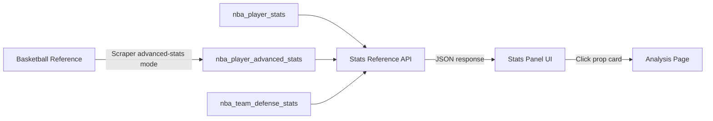
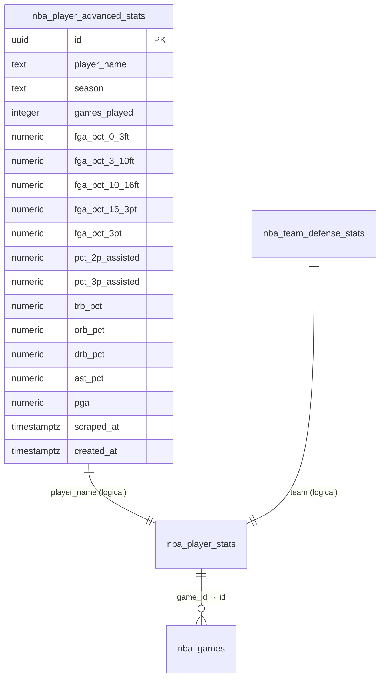

# Design Document: Props Stats Reference

## Overview

The Props Stats Reference feature adds a detailed stats panel that opens when a user clicks a prop card on the analysis page. It provides full analytical transparency by displaying raw Basketball Reference stats, derived/calculated metrics, source table mappings, and prop-specific cheat sheets.

The system consists of four main components:
1. **Stats Panel UI** — A slide-out panel (desktop) / full-screen modal (mobile) with collapsible sections
2. **Stats Reference API** — A `GET /api/props/stats-reference` endpoint that fetches and computes stats
3. **Derived Stats Engine** — Pure computation logic for advanced metrics (ePPS, self-created FGA, etc.)
4. **Extended Scraper** — A new `advanced-stats` mode for the NBA scraper to collect shooting distribution and advanced metrics

### Data Flow



---

## Architecture

### System Architecture

```mermaid
graph TD
    subgraph "Client (Browser)"
        UI[Analysis Page]
        SP[StatsPanel Component]
        UI -->|onClick prop card| SP
    end

    subgraph "Next.js Server"
        API[GET /api/props/stats-reference]
        CACHE[cached() utility - 5min TTL]
        DERIVE[Derived Stats Computation]
        API --> CACHE
        CACHE --> DERIVE
    end

    subgraph "Supabase"
        PS[nba_player_stats]
        AS[nba_player_advanced_stats]
        DS[nba_team_defense_stats]
    end

    subgraph "Python Scraper"
        SCR[scrape_nba.py]
        ADV[advanced-stats mode]
    end

    SP -->|fetch| API
    DERIVE --> PS
    DERIVE --> AS
    DERIVE --> DS
    SCR -->|upsert| PS
    ADV -->|upsert| AS
```

### Design Decisions

1. **Server-side computation**: All derived stats are computed on the server to avoid shipping complex formulas to the client and to enable caching. The `cached()` utility with 5-minute TTL reduces DB load.

2. **Separate API endpoint**: Stats reference data is fetched on-demand (not bundled with the main props response) to keep the analysis page fast. The panel only loads data when opened.

3. **Separate database table**: Advanced stats (shooting distribution, rebound percentages, PGA) live in `nba_player_advanced_stats` rather than extending `nba_player_stats` because they are season-level aggregates (not per-game) and are scraped from different Basketball Reference pages.

4. **Scraper as separate mode**: The `advanced-stats` mode runs independently to avoid slowing down daily box score scraping. It can also run as part of `full` mode.

---

## Components and Interfaces

### UI Components

#### StatsPanel (new)

```typescript
// components/props/StatsPanel.tsx
interface StatsPanelProps {
  /** Whether the panel is open */
  isOpen: boolean
  /** Player name to display stats for */
  playerName: string | null
  /** Stat category being viewed */
  statCategory: string | null
  /** Callback when panel should close */
  onClose: () => void
  /** Ref to the trigger element for focus return */
  triggerRef: React.RefObject<HTMLElement | null>
}
```

The StatsPanel is a client component that:
- Renders as a slide-out from the right on desktop (≥1024px) using `fixed inset-y-0 right-0 w-[480px]`
- Renders as a full-screen modal on mobile (<1024px) using `fixed inset-0`
- Uses `role="dialog"` with `aria-labelledby` pointing to the player name header
- Traps focus within the panel when open
- Animates open/close with a 300ms slide transition (CSS `transition-transform`)
- Manages its own data fetching via `useEffect` when `playerName` changes

#### StatsPanelHeader (new)

```typescript
interface StatsPanelHeaderProps {
  playerName: string
  teamAbbr: string
  position: string
  statCategory: string
  onClose: () => void
}
```

#### CollapsibleSection (new)

```typescript
interface CollapsibleSectionProps {
  title: string
  defaultExpanded?: boolean
  children: React.ReactNode
}
```

A reusable collapsible section with `aria-expanded` on the header button and Enter key support.

#### RawStatsSection (new)

Displays shooting, rebounding, and playmaking stats with color-coding and league average comparison.

#### DerivedStatsSection (new)

Displays computed metrics with formula breakdowns.

#### SourceTableSection (new)

Displays the source table reference with collapsible groups (collapsed by default).

#### CheatSheetSection (new)

Displays prop-specific stat relevance grouped by primary/secondary/context.

### API Endpoint

#### GET /api/props/stats-reference

```typescript
// app/api/props/stats-reference/route.ts

// Request
interface StatsReferenceRequest {
  player: string   // query param, max 100 chars
  stat: string     // query param, one of: pts, trb, ast, tp, stl, blk, pra
}

// Response (200 OK)
interface StatsReferenceResponse {
  player: string
  team: string
  position: string | null
  statCategory: string
  insufficientData: boolean
  rawStats: RawStatsData
  derivedStats: DerivedStatsData | null  // null when insufficientData=true
  leagueAverages: LeagueAverageData
  cheatSheet: CheatSheetData | null      // null for unsupported prop types
}

interface RawStatsData {
  // Per-game averages (last 20 games)
  shooting: {
    fgaPerGame: number
    ftaPerGame: number
    ftmPerGame: number
    ftPct: number
    tpaPerGame: number
    tpmPerGame: number
    tpPct: number
    ptsPerGame: number
  }
  // From nba_player_advanced_stats
  shotDistribution: {
    fgaPct0_3ft: number | null
    fgaPct3_10ft: number | null
    fgaPct10_16ft: number | null
    fgaPct16_3pt: number | null
    fgaPct3pt: number | null
    pct2pAssisted: number | null
    pct3pAssisted: number | null
  }
  rebounding: {
    trbPct: number | null
    orbPct: number | null
    drbPct: number | null
  }
  playmaking: {
    astPct: number | null
    astPerGame: number
    tovPerGame: number
    astTovRatio: number | null
    pgaPerGame: number | null
  }
  defense: {
    stlPerGame: number
    blkPerGame: number
  }
}

interface DerivedStatsData {
  midRangeAttemptsPerGame: DerivedStat | null
  rimAttemptsPerGame: DerivedStat | null
  ePPS: DerivedStat | null
  selfCreatedFGAPerGame: DerivedStat | null
  astTovRatio: DerivedStat | null
  pgaConversionRate: DerivedStat | null
  projectedReboundsPerGame: DerivedStat | null
  stocksPerGame: DerivedStat | null
  foulsDrawnPerGame: DerivedStat | null
}

interface DerivedStat {
  value: number
  formula: string          // e.g., "18.5 / (16.2 + 0.44 × 8.1)"
  formulaResult: string    // e.g., "= 0.92"
  missingInputs: string[]  // empty if all inputs available
}

interface LeagueAverageData {
  [statKey: string]: number | null  // null if unavailable
}

interface CheatSheetData {
  propType: string
  stats: CheatSheetStat[]
}

interface CheatSheetStat {
  key: string
  label: string
  category: "primary" | "secondary" | "context"
  explanation: string      // max 120 chars
  value: number | null     // null = "No data"
}
```

### Derived Stats Computation Module

```typescript
// lib/analytics/derived-stats.ts

export interface DerivedStatsInput {
  fgaPerGame: number
  ftaPerGame: number
  ptsPerGame: number
  astPerGame: number
  tovPerGame: number
  stlPerGame: number
  blkPerGame: number
  // From advanced stats (nullable)
  fgaPct0_3ft: number | null      // percentage 0-100
  fgaPctMidRange: number | null   // computed as sum of mid-range zones
  pct2pAssisted: number | null    // percentage 0-100
  pct3pAssisted: number | null    // percentage 0-100
  fgaPct3pt: number | null        // percentage 0-100
  trbPct: number | null           // percentage 0-100
  pgaPerGame: number | null
  teamTotalRebPerGame: number | null
}

export function computeDerivedStats(input: DerivedStatsInput): DerivedStatsData
export function computeEPPS(pts: number, fga: number, fta: number): number
export function computeSelfCreatedFGA(fga: number, pct2pAssisted: number, pct3pAssisted: number, fgaPct3pt: number): number
export function computePGAConversionRate(ast: number, pga: number): number | null
export function computeProjectedRebounds(trbPct: number, teamTotalReb: number): number
export function computeStocks(stl: number, blk: number): number
export function computeFoulsDrawn(fta: number): number
export function getColorCode(playerValue: number, leagueAverage: number): "green" | "red" | "default"
export function roundTo(value: number, decimals: number): number
```

### Cheat Sheet Configuration

```typescript
// lib/analytics/cheat-sheet.ts

export interface CheatSheetConfig {
  propType: string
  stats: {
    key: string
    label: string
    category: "primary" | "secondary" | "context"
    explanation: string
  }[]
}

export function getCheatSheet(propType: string): CheatSheetConfig | null
```

Static configuration mapping each prop type to its relevant stats. Returns `null` for unsupported prop types.

---

## Data Models

### New Table: nba_player_advanced_stats

```sql
CREATE TABLE IF NOT EXISTS public.nba_player_advanced_stats (
  id UUID DEFAULT uuid_generate_v4() PRIMARY KEY,
  player_name TEXT NOT NULL,
  season TEXT NOT NULL,
  games_played INTEGER,
  -- Shooting distribution (% of FGA by distance)
  fga_pct_0_3ft NUMERIC,       -- 0-100
  fga_pct_3_10ft NUMERIC,      -- 0-100
  fga_pct_10_16ft NUMERIC,     -- 0-100
  fga_pct_16_3pt NUMERIC,      -- 0-100
  fga_pct_3pt NUMERIC,         -- 0-100
  -- Assisted percentages
  pct_2p_assisted NUMERIC,     -- 0-100
  pct_3p_assisted NUMERIC,     -- 0-100
  -- Rebounding percentages
  trb_pct NUMERIC,             -- 0-100
  orb_pct NUMERIC,             -- 0-100
  drb_pct NUMERIC,             -- 0-100
  -- Playmaking
  ast_pct NUMERIC,             -- 0-100
  pga NUMERIC,                 -- raw count per game
  -- Metadata
  scraped_at TIMESTAMPTZ NOT NULL DEFAULT now(),
  created_at TIMESTAMPTZ NOT NULL DEFAULT now()
);

-- Unique constraint for upsert
ALTER TABLE public.nba_player_advanced_stats
  ADD CONSTRAINT uq_player_advanced_stats_player_season
  UNIQUE (player_name, season);

-- Index for efficient lookups
CREATE INDEX IF NOT EXISTS idx_advanced_stats_player_name
  ON public.nba_player_advanced_stats (player_name);

-- RLS with public SELECT
ALTER TABLE public.nba_player_advanced_stats ENABLE ROW LEVEL SECURITY;
CREATE POLICY "Advanced stats are viewable by everyone."
  ON public.nba_player_advanced_stats FOR SELECT USING (true);
```

### Existing Tables Used

- **nba_player_stats**: Per-game box score stats (pts, trb, ast, tp, stl, blk, fg, fga, ft, fta, etc.)
- **nba_team_defense_stats**: Team defensive stats by position (value_per_game, pace)
- **nba_games**: Game schedule with dates (used for ordering player stats by game date)

### Data Relationships



---

## Correctness Properties

*A property is a characteristic or behavior that should hold true across all valid executions of a system — essentially, a formal statement about what the system should do. Properties serve as the bridge between human-readable specifications and machine-verifiable correctness guarantees.*

### Property 1: Stat Display Rounding Correctness

*For any* numeric stat value (shooting, rebounding, playmaking, or shot distribution), the displayed value SHALL equal the input value rounded to the specified number of decimal places (1dp for per-game stats and percentages, 2dp for AST/TOV ratio and ePPS), such that `roundTo(value, decimals) === parseFloat(displayed)`.

**Validates: Requirements 2.1, 2.2, 3.1, 3.2**

### Property 2: Color-Coding Threshold Classification

*For any* pair of (playerValue, leagueAverage) where leagueAverage > 0, the color classification SHALL be: "green" when playerValue > leagueAverage * 1.10, "red" when playerValue < leagueAverage * 0.90, and "default" otherwise. The classification function is deterministic and symmetric around the 10% threshold.

**Validates: Requirements 2.4**

### Property 3: Derived Stat Formula Correctness

*For any* valid set of input stats (all non-negative numbers), the derived stat computations SHALL satisfy:
- `midRangeAttempts = roundTo(fgaPerGame * (midRangePct / 100), 1)`
- `rimAttempts = roundTo(fgaPerGame * (rimPct / 100), 1)`
- `ePPS = roundTo(ptsPerGame / (fgaPerGame + 0.44 * ftaPerGame), 2)` (when denominator > 0)
- `selfCreatedFGA = roundTo(fgaPerGame * (1 - assistedPct), 1)` where `assistedPct = (pct2pAssisted/100 * (1 - fgaPct3pt/100)) + (pct3pAssisted/100 * fgaPct3pt/100)`
- `pgaConversion = roundTo((astPerGame / pgaPerGame) * 100, 1)` (when pgaPerGame > 0)
- `projectedReb = roundTo((trbPct / 100) * teamTotalReb, 1)`
- `stocks = roundTo(stlPerGame + blkPerGame, 1)`
- `foulsDrawn = roundTo(ftaPerGame / 1.8, 1)`

**Validates: Requirements 4.2, 4.3, 4.4, 4.5, 4.6, 4.7, 4.8, 4.9**

### Property 4: Derived Stat Formula String Representation

*For any* derived stat computation with all inputs available, the formula string SHALL contain the actual numeric input values used in the computation, and the formula result SHALL equal the computed value displayed.

**Validates: Requirements 4.10**

### Property 5: Cheat Sheet Category Ordering

*For any* supported prop type (points, rebounds, assists, PRA), the cheat sheet stats SHALL appear in strict category order: all "primary" stats before all "secondary" stats, and all "secondary" stats before all "context" stats. No stat in a later category SHALL appear before any stat in an earlier category.

**Validates: Requirements 6.1, 6.6**

### Property 6: API Input Validation

*For any* request to `/api/props/stats-reference`:
- If `player` is missing, empty, or exceeds 100 characters, the response SHALL be 400
- If `stat` is missing, empty, or not one of {pts, trb, ast, tp, stl, blk, pra}, the response SHALL be 400
- If both parameters are valid, the response SHALL NOT be 400 (it may be 200 or 404)

**Validates: Requirements 7.1, 7.2**

### Property 7: Statistical Aggregation Correctness

*For any* array of game stat values of length N (where N ≥ 1), the per-game average SHALL equal the arithmetic mean: `sum(values) / N`. *For any* array of league defensive values, the league average SHALL equal `sum(values) / count(values)`.

**Validates: Requirements 7.3, 7.4**

---

## Error Handling

### API Error Responses

| Scenario | Status | Response Body |
|----------|--------|---------------|
| Missing/invalid `player` param | 400 | `{ error: "Invalid player parameter...", code: "VALIDATION_ERROR" }` |
| Missing/invalid `stat` param | 400 | `{ error: "Invalid stat parameter...", code: "VALIDATION_ERROR" }` |
| Injection pattern detected | 400 | `{ error: "The request was rejected...", code: "INJECTION_DETECTED" }` |
| Player not found in DB | 404 | `{ error: "Player not found", code: "NOT_FOUND" }` |
| Insufficient data (<3 games) | 200 | `{ insufficientData: true, rawStats: {...}, derivedStats: null }` |
| Database query failure | 500 | `{ error: "Internal server error", code: "INTERNAL_ERROR" }` |

### UI Error States

- **Loading**: Skeleton placeholder renders within 100ms of click. If API doesn't respond within 10 seconds, transitions to error state.
- **Error**: Displays "Unable to load stats" message with a retry button. Retry re-initiates the fetch.
- **Partial data**: When `insufficientData: true`, shows available raw stats with a banner explaining limited data. Derived stats section shows "Insufficient game data (minimum 3 games required)".
- **Missing advanced stats**: Individual derived stats that can't be computed show "Insufficient data — missing [stat name]" instead of the row.

### Scraper Error Handling

- HTTP 429: Wait 60s, retry up to 3 times, then skip player and log error
- HTTP 5xx / timeout (30s): Wait 60s, retry up to 3 times, then skip player and log error
- Missing stat field on page: Store NULL for that column, continue with remaining fields
- Minimum 3s delay between requests to respect rate limits

---

## Testing Strategy

### Unit Tests (Example-Based)

- **StatsPanel rendering**: Verify panel opens as slide-out on desktop, modal on mobile
- **Loading/error states**: Mock API responses to test skeleton, error, and retry flows
- **Keyboard navigation**: Test Escape, Tab, Shift+Tab, Enter on collapsible sections
- **ARIA attributes**: Verify `role="dialog"`, `aria-labelledby`, `aria-expanded`
- **Cheat sheet configurations**: Verify correct stats for each prop type (points, rebounds, assists, PRA)
- **Source table mapping**: Verify static mapping is correct and complete
- **API 404/400 responses**: Test with invalid inputs and non-existent players

### Property-Based Tests

Property-based testing is appropriate for this feature because the derived stats computation module contains pure functions with clear input/output behavior and universal properties that hold across a wide input space.

**Library**: `fast-check` (already available in the project's test ecosystem via vitest)

**Configuration**:
- Minimum 100 iterations per property test
- Each test tagged with: `Feature: props-stats-reference, Property {N}: {title}`

**Properties to implement**:
1. Stat display rounding (generate random floats, verify rounding)
2. Color-coding threshold (generate random value pairs, verify classification)
3. Derived stat formula correctness (generate random stat inputs, verify all formulas)
4. Formula string representation (generate inputs, verify string contains values)
5. Cheat sheet ordering (for each prop type, verify category order invariant)
6. API input validation (generate valid/invalid inputs, verify status codes)
7. Statistical aggregation (generate random arrays, verify mean computation)

### Integration Tests

- **API endpoint**: Call `/api/props/stats-reference` with real DB data, verify response shape
- **Caching**: Verify second call within 5min returns cached data
- **Scraper advanced-stats mode**: Mock HTTP responses, verify correct data extraction and DB upsert

### Edge Case Tests

- Player with no advanced stats (all `nba_player_advanced_stats` fields null)
- Player with no position data (fallback to all-position league average)
- PGA = 0 (division by zero guard)
- FGA + 0.44*FTA = 0 (ePPS division by zero guard)
- Player with exactly 3 games (minimum threshold)
- Player with exactly 2 games (insufficientData flag)
- Unsupported prop type for cheat sheet (e.g., "stl")
