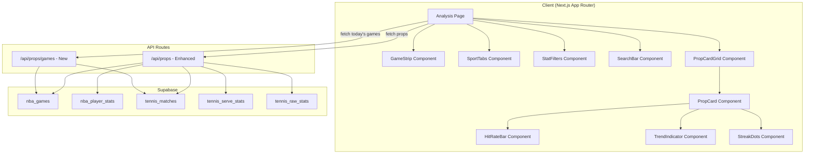
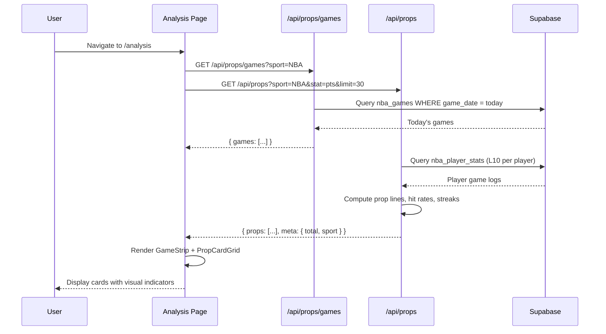
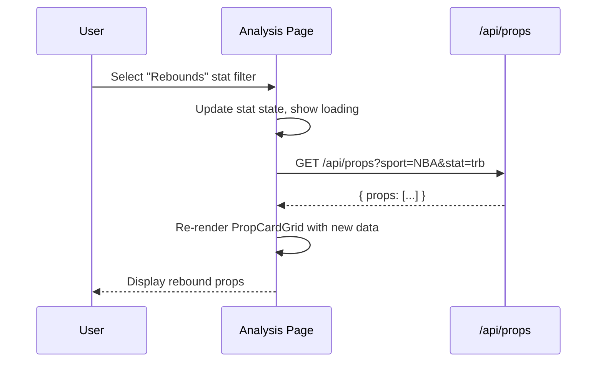

# Design Document: Props UI Overhaul

## Overview

This feature overhauls the analysis/props page from a flat data table into a PrizePicks/PropShark-style card-based interface. The new UI surfaces real scraped NBA and Tennis data through visually rich player prop cards with hit rate indicators, L5/L10 performance bars, trend arrows, and a today's games schedule strip. The API layer is enhanced to compute prop lines from historical data, return per-game breakdowns for visual indicators, and serve a dedicated games endpoint.

The design prioritizes mobile-first responsive layout (cards stack vertically), dark theme consistency with the existing app, and zero external data dependencies — all prop lines and analytics are derived from the existing `nba_player_stats`, `nba_games`, `tennis_matches`, and `tennis_serve_stats` tables in Supabase.

## Architecture



## Sequence Diagrams

### Page Load Flow



### Filter Interaction Flow



## Components and Interfaces

### Component 1: GameStrip

**Purpose**: Horizontal scrollable strip showing today's games for the selected sport.

```typescript
interface Game {
  id: string
  homeTeam: string
  awayTeam: string
  gameTime: string       // ISO string or "LIVE"
  status: "scheduled" | "live" | "completed"
  homeScore?: number
  awayScore?: number
}

interface GameStripProps {
  games: Game[]
  loading: boolean
  onGameSelect?: (gameId: string) => void
}
```

**Responsibilities**:
- Render horizontally scrollable game cards
- Highlight live games with a pulsing indicator
- Allow filtering props by clicking a specific game

### Component 2: PropCard

**Purpose**: Individual player prop card showing all analytics for one prop.

```typescript
interface PropCardData {
  id: string
  player: string
  avatar: string | null
  team: string
  position: string
  statCategory: string       // "Points", "Rebounds", "Aces", etc.
  propLine: number           // e.g., 24.5
  l5Avg: number
  l10Avg: number
  lastGames: GameResult[]    // Last 10 game values for bar chart
  hitRate: HitRate
  trend: "up" | "down" | "neutral"
  trendPct: number           // e.g., +12.5 or -8.3
  matchup: string            // "vs LAL" or "vs Djokovic"
  gameTime?: string
  sport: "NBA" | "Tennis"
}

interface GameResult {
  value: number
  overLine: boolean          // Did they go over the prop line?
  date: string
  opponent: string
}

interface HitRate {
  over: number               // Games over the line
  total: number              // Total games considered
  label: string              // "4/5 over" or "7/10 over"
}

interface PropCardProps {
  data: PropCardData
  onClick?: () => void
}
```

**Responsibilities**:
- Display player identity (name, avatar/initials, team)
- Show prop line prominently
- Render mini bar chart of last 5-10 games relative to prop line
- Display hit rate badge (e.g., "4/5 over")
- Show trend arrow with percentage
- Display matchup info

### Component 3: StatFilters

**Purpose**: Horizontal pill/tab filters for stat categories.

```typescript
interface StatFilter {
  key: string                // "pts", "trb", "ast", "tp", "pra", "aces"
  label: string              // "Points", "Rebounds", "Assists", "3PT", "PRA", "Aces"
  sport: "NBA" | "Tennis" | "all"
}

interface StatFiltersProps {
  filters: StatFilter[]
  activeStat: string
  onStatChange: (stat: string) => void
}
```

**Responsibilities**:
- Render horizontally scrollable stat pills
- Highlight active filter
- Filter list based on selected sport

### Component 4: PropCardGrid

**Purpose**: Responsive grid layout for prop cards.

```typescript
interface PropCardGridProps {
  props: PropCardData[]
  loading: boolean
  emptyMessage?: string
}
```

**Responsibilities**:
- Render cards in responsive grid (1 col mobile, 2 col tablet, 3 col desktop)
- Show skeleton loading state
- Handle empty state with helpful message

### Component 5: SportTabs

**Purpose**: Sport selection tabs (NBA, Tennis).

```typescript
interface SportTabsProps {
  activeSport: "NBA" | "Tennis"
  onSportChange: (sport: "NBA" | "Tennis") => void
}
```

**Responsibilities**:
- Render sport tabs with active indicator
- Only show sports with real data (NBA, Tennis)

## Data Models

### API Response: Enhanced Props Endpoint

```typescript
interface PropsAPIResponse {
  props: PropCardData[]
  meta: {
    sport: string
    stat: string
    total: number
    computedAt: string       // ISO timestamp
  }
}
```

### API Response: Games Endpoint

```typescript
interface GamesAPIResponse {
  games: Game[]
  meta: {
    sport: string
    date: string
  }
}
```

### Internal: Player Game Log (for computation)

```typescript
interface NBAGameLog {
  gameId: string
  gameDate: string
  opponent: string
  pts: number
  trb: number
  ast: number
  tp: number
  stl: number
  blk: number
  minutes: string
  isHome: boolean
}
```

**Validation Rules**:
- `propLine` must be > 0
- `lastGames` array length between 0 and 10
- `hitRate.over` <= `hitRate.total`
- `stat` must be one of the allowed stat keys per sport

## Key Functions with Formal Specifications

### Function 1: computePropLine()

```typescript
function computePropLine(values: number[], method: "median" | "average"): number
```

**Preconditions:**
- `values` is non-empty array of non-negative numbers
- `values.length` >= 3 (minimum games for meaningful prop)

**Postconditions:**
- Returns a positive number rounded to nearest 0.5
- Result represents the statistical center of recent performance
- If method is "median": result is the middle value (or avg of two middle)
- If method is "average": result is arithmetic mean

**Loop Invariants:** N/A

### Function 2: computeHitRate()

```typescript
function computeHitRate(values: number[], propLine: number, window: number): HitRate
```

**Preconditions:**
- `values` is sorted by date descending (most recent first)
- `propLine` > 0
- `window` is 5 or 10

**Postconditions:**
- `result.over` = count of values >= propLine in first `window` entries
- `result.total` = min(values.length, window)
- `result.label` formatted as "{over}/{total} over"
- `result.over` <= `result.total`

**Loop Invariants:**
- At iteration i: `overCount` = number of values[0..i-1] that are >= propLine

### Function 3: computeTrend()

```typescript
function computeTrend(values: number[]): { direction: "up" | "down" | "neutral", pct: number }
```

**Preconditions:**
- `values` is sorted by date descending (most recent first)
- `values.length` >= 4

**Postconditions:**
- Compares average of first 2 values (recent) vs average of values[2..4] (previous)
- `direction` = "up" if recent avg > previous avg by > 10%
- `direction` = "down" if recent avg < previous avg by > 10%
- `direction` = "neutral" otherwise
- `pct` = percentage change from previous to recent (can be negative)

**Loop Invariants:** N/A

### Function 4: buildPropCards()

```typescript
async function buildPropCards(
  sport: "NBA" | "Tennis",
  stat: string,
  limit: number
): Promise<PropCardData[]>
```

**Preconditions:**
- `sport` is "NBA" or "Tennis"
- `stat` is valid for the given sport
- `limit` > 0 and <= 100
- Database connection is available

**Postconditions:**
- Returns array of length <= `limit`
- Each card has valid `propLine` > 0
- Each card has `lastGames` with 0-10 entries
- Cards are sorted by hit rate descending (best picks first)
- All player names are non-empty strings

**Loop Invariants:**
- For each player processed: all computed fields are consistent with raw game data

## Algorithmic Pseudocode

### Main Props Computation Algorithm

```typescript
// ALGORITHM: buildNBAProps
// INPUT: stat (stat category key), limit (max results)
// OUTPUT: PropCardData[] sorted by hit rate

async function buildNBAProps(stat: StatKey, limit: number): Promise<PropCardData[]> {
  // Step 1: Fetch last 10 games per player (ordered by date desc)
  const gameLogs = await fetchRecentGameLogs(stat, gamesPerPlayer: 10)
  
  // Step 2: Group by player
  const playerMap = groupByPlayer(gameLogs)
  
  // Step 3: For each player with >= 3 games, compute prop card
  const cards: PropCardData[] = []
  
  for (const [playerName, games] of playerMap) {
    if (games.length < 3) continue
    
    const values = games.map(g => g[stat])  // Extract stat values
    
    // Compute prop line (median of L10)
    const propLine = computePropLine(values, "median")
    
    // Compute L5 and L10 averages
    const l5Avg = average(values.slice(0, 5))
    const l10Avg = average(values)
    
    // Compute hit rate over last 5 games
    const hitRate = computeHitRate(values, propLine, 5)
    
    // Compute trend
    const trend = computeTrend(values)
    
    // Build last games array for bar chart
    const lastGames = games.slice(0, 10).map(g => ({
      value: g[stat],
      overLine: g[stat] >= propLine,
      date: g.gameDate,
      opponent: g.opponent
    }))
    
    cards.push({
      id: `${playerName}-${stat}`,
      player: playerName,
      avatar: null,
      team: games[0].team,
      position: "",
      statCategory: STAT_LABELS[stat],
      propLine,
      l5Avg,
      l10Avg,
      lastGames,
      hitRate,
      trend: trend.direction,
      trendPct: trend.pct,
      matchup: `vs ${games[0].opponent}`,
      sport: "NBA"
    })
  }
  
  // Step 4: Sort by hit rate (best picks first), then by L5 avg
  cards.sort((a, b) => {
    const hitDiff = (b.hitRate.over / b.hitRate.total) - (a.hitRate.over / a.hitRate.total)
    if (hitDiff !== 0) return hitDiff
    return b.l5Avg - a.l5Avg
  })
  
  return cards.slice(0, limit)
}
```

### Today's Games Algorithm

```typescript
// ALGORITHM: fetchTodaysGames
// INPUT: sport ("NBA" | "Tennis")
// OUTPUT: Game[] for today's date

async function fetchTodaysGames(sport: "NBA" | "Tennis"): Promise<Game[]> {
  const today = new Date().toISOString().split("T")[0]  // "YYYY-MM-DD"
  
  if (sport === "NBA") {
    const { data } = await supabase
      .from("nba_games")
      .select("*")
      .eq("game_date", today)
      .order("game_date", { ascending: true })
    
    return (data ?? []).map(g => ({
      id: g.id,
      homeTeam: g.home_team,
      awayTeam: g.away_team,
      gameTime: g.game_date,
      status: g.status === "completed" ? "completed" : "scheduled",
      homeScore: g.home_score ?? undefined,
      awayScore: g.away_score ?? undefined
    }))
  }
  
  if (sport === "Tennis") {
    const { data } = await supabase
      .from("tennis_matches")
      .select("*")
      .eq("status", "upcoming")
      .limit(20)
    
    return (data ?? []).map(m => ({
      id: m.id,
      homeTeam: m.player1_name,
      awayTeam: m.player2_name,
      gameTime: m.created_at,
      status: "scheduled",
    }))
  }
  
  return []
}
```

### Tennis Props Computation

```typescript
// ALGORITHM: buildTennisProps
// INPUT: stat ("aces" | "first_serve" | "win_pct"), limit
// OUTPUT: PropCardData[] for tennis players with upcoming matches

async function buildTennisProps(stat: TennisStat, limit: number): Promise<PropCardData[]> {
  // Step 1: Get upcoming matches
  const matches = await fetchUpcomingTennisMatches()
  
  // Step 2: Get unique players from matches
  const players = extractUniquePlayers(matches)
  
  // Step 3: Fetch serve/raw stats for each player (multi-year for trend)
  const statsMap = await fetchTennisPlayerStats(players)
  
  // Step 4: Build prop cards
  const cards: PropCardData[] = []
  
  for (const player of players) {
    const stats = statsMap.get(player)
    if (!stats) continue
    
    const opponent = findOpponent(player, matches)
    const statValue = extractTennisStat(stats, stat)
    
    // Tennis prop line from historical average
    const propLine = Math.round(statValue * 2) / 2
    
    // Trend from year-over-year comparison
    const trend = computeTennisTrend(stats)
    
    cards.push({
      id: `${player}-tennis-${stat}`,
      player,
      avatar: null,
      team: stats.surface,
      position: "",
      statCategory: TENNIS_STAT_LABELS[stat],
      propLine,
      l5Avg: statValue,
      l10Avg: statValue,
      lastGames: [],  // No per-match granularity yet
      hitRate: { over: 0, total: 0, label: "—" },
      trend: trend.direction,
      trendPct: trend.pct,
      matchup: `vs ${opponent}`,
      sport: "Tennis"
    })
  }
  
  cards.sort((a, b) => b.propLine - a.propLine)
  return cards.slice(0, limit)
}
```

## Example Usage

```typescript
// Example 1: Page component fetching props
const [props, setProps] = useState<PropCardData[]>([])
const [games, setGames] = useState<Game[]>([])

useEffect(() => {
  Promise.all([
    fetch(`/api/props?sport=${sport}&stat=${stat}&limit=30`).then(r => r.json()),
    fetch(`/api/props/games?sport=${sport}`).then(r => r.json())
  ]).then(([propsData, gamesData]) => {
    setProps(propsData.props)
    setGames(gamesData.games)
  })
}, [sport, stat])

// Example 2: Rendering a prop card's hit rate bar
function HitRateBar({ lastGames, propLine }: { lastGames: GameResult[], propLine: number }) {
  return (
    <div className="flex gap-0.5 items-end h-8">
      {lastGames.map((game, i) => (
        <div
          key={i}
          className={cn(
            "w-2 rounded-t transition-all",
            game.overLine ? "bg-[var(--color-lime)]" : "bg-white/20"
          )}
          style={{ height: `${Math.min((game.value / (propLine * 1.5)) * 100, 100)}%` }}
          title={`${game.value} vs ${game.opponent} (${game.date})`}
        />
      ))}
    </div>
  )
}

// Example 3: Stat filter interaction
<StatFilters
  filters={NBA_STAT_FILTERS}
  activeStat={stat}
  onStatChange={(newStat) => {
    setStat(newStat)
    // Triggers re-fetch via useEffect dependency
  }}
/>
```

## Correctness Properties

The following properties must hold for the props computation:

1. **Hit rate consistency**: For any prop card, `hitRate.over` must equal the count of `lastGames` entries where `value >= propLine` within the hit rate window.

2. **Prop line bounds**: For NBA props, `propLine` must be within the range `[min(lastGames.values), max(lastGames.values)]` — the line should never be outside the player's recent performance range.

3. **Sort stability**: Props returned from the API must be sorted by hit rate descending. If two players have equal hit rates, the one with higher L5 average appears first.

4. **Game count invariant**: `lastGames.length` <= 10 for all prop cards. `hitRate.total` <= `lastGames.length`.

5. **Sport-stat validity**: NBA props only use NBA stat keys (`pts`, `trb`, `ast`, `tp`, `stl`, `blk`, `pra`). Tennis props only use tennis stat keys (`aces`, `first_serve`, `win_pct`).

6. **Trend calculation correctness**: `trend.direction` = "up" if and only if `trendPct` > 10. `trend.direction` = "down" if and only if `trendPct` < -10.

7. **No duplicate players**: For a given sport + stat combination, each player appears at most once in the response.

8. **Responsive layout**: On viewport width < 768px, cards render in a single column. On >= 768px and < 1024px, two columns. On >= 1024px, three columns.

## Error Handling

### Error Scenario 1: Database Query Failure

**Condition**: Supabase query returns an error (network timeout, RLS issue)
**Response**: Return empty props array with error flag in meta; UI shows "Unable to load props" with retry button
**Recovery**: Client retries after 5 seconds; cached data served if available

### Error Scenario 2: Insufficient Data for Player

**Condition**: Player has fewer than 3 games in the database
**Response**: Skip player entirely — do not show a prop card with unreliable data
**Recovery**: Player will appear once more games are scraped

### Error Scenario 3: No Games Today

**Condition**: No games found for today's date
**Response**: GameStrip shows "No games scheduled today" message; props still load from recent data
**Recovery**: N/A — informational only

### Error Scenario 4: Invalid Stat Parameter

**Condition**: Client sends unrecognized stat key
**Response**: API defaults to "pts" for NBA, "aces" for Tennis; logs warning
**Recovery**: N/A — graceful fallback

## Testing Strategy

### Unit Testing Approach

- Test `computePropLine()` with known value arrays (verify median/average correctness)
- Test `computeHitRate()` with edge cases (all over, all under, exactly on line)
- Test `computeTrend()` with ascending, descending, and flat sequences
- Test stat filter mapping (ensure each sport only shows valid stats)

### Property-Based Testing Approach

**Property Test Library**: fast-check

- For any array of positive numbers, `computePropLine` result is between min and max of the array
- For any prop line and values array, `hitRate.over + hitRate.under = hitRate.total`
- For any sorted values array, trend direction is consistent with trend percentage sign
- Prop cards array never contains duplicate player IDs

### Integration Testing Approach

- Test full API route with seeded Supabase data
- Verify response shape matches `PropsAPIResponse` interface
- Test search filtering returns only matching players
- Test sport switching returns different data sets

## Performance Considerations

- **Caching**: Props computation is cached for 60 seconds (existing `CACHE_TTL.scores`). Games endpoint cached for 30 seconds.
- **Query optimization**: Fetch only last 10 games per player using window functions or limit + group. Current approach fetches 5000 rows — should be optimized with a player-level aggregation query.
- **Client-side**: Use `React.memo` on PropCard to prevent unnecessary re-renders during search filtering. Virtualize the grid if > 50 cards.
- **Image loading**: Player avatars (when added) should use `next/image` with lazy loading and blur placeholder.
- **Bundle size**: No new heavy dependencies — bar charts are pure CSS/Tailwind, no charting library needed.

## Security Considerations

- All database queries use the admin client (server-side only) — no client-side Supabase access
- Search input is sanitized (Supabase parameterized queries prevent SQL injection)
- API responses are rate-limited by Next.js middleware (existing)
- No user-specific data exposed — all props are public read-only

## Dependencies

- **Existing**: Next.js 16, React 19, Supabase, Tailwind CSS 4, Lucide React, Framer Motion, date-fns
- **No new dependencies required** — all UI components built with Tailwind + existing primitives
- **Database**: Existing `nba_games`, `nba_player_stats`, `tennis_matches`, `tennis_serve_stats`, `tennis_raw_stats` tables
