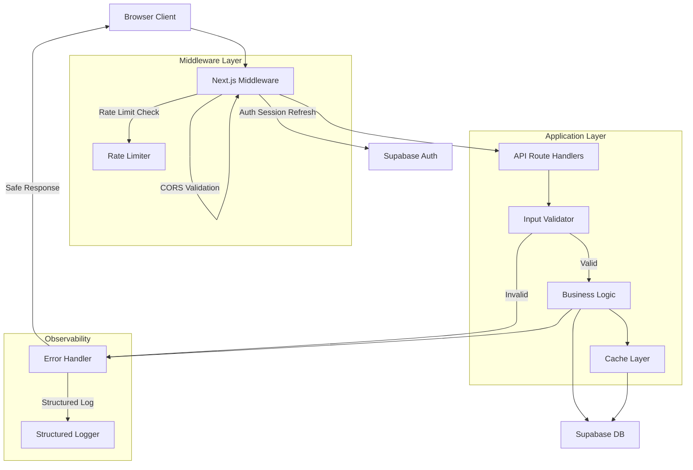

# Design Document: Security Hardening

## Overview

This design covers a comprehensive security hardening pass across the Betroom platform — a Next.js 16 betting/social application backed by Supabase. The platform currently has basic security measures (some input validation, rudimentary rate limiting, partial security headers) but lacks production-grade protections against cache poisoning, race conditions, injection attacks, session hijacking, and supply chain threats.

The hardening effort introduces or upgrades eleven security subsystems that operate as layered defenses. Each layer is independent but composable — the middleware injects headers and enforces rate limits, the cache layer protects against thundering herd and data leakage, the input validator rejects malformed data before it reaches business logic, and the error handler ensures no internal details leak to clients.

### Key Design Decisions

1. **In-process architecture**: Rate limiting, caching, and validation remain in-process (no Redis dependency) for single-instance deployment simplicity. The interfaces are designed for future extraction to distributed stores (Upstash, Vercel KV).
2. **Middleware-first security**: Security headers, CORS, and rate limiting are enforced at the middleware layer so no route can accidentally bypass them.
3. **Zod for validation**: Adopt Zod as the single validation library for all API input schemas — it provides type inference, composable schemas, and clear error messages.
4. **Supabase-native auth**: Leverage Supabase's built-in session management (token rotation, PKCE) rather than building custom auth flows. Configure Supabase project settings to enforce short-lived tokens.
5. **No custom crypto**: Use Node.js `crypto` module for CSPRNG and standard algorithms. Password hashing is delegated to Supabase Auth (which uses bcrypt; Argon2id is configured at the Supabase project level or via a custom hook).

## Architecture



### Request Lifecycle

1. **Middleware** intercepts every non-static request:
   - Injects all security headers (CSP, HSTS, X-Frame-Options, etc.)
   - Validates CORS origin
   - Checks rate limit (sliding window per IP/user)
   - Refreshes Supabase session
   - Strips `X-Powered-By` / `Server` headers

2. **Route Handler** receives the request:
   - Parses body with size limit enforcement
   - Runs Zod schema validation
   - Checks for injection patterns
   - Executes business logic with concurrency-safe queries

3. **Cache Layer** (if applicable):
   - Validates cache key against allowlist patterns
   - Applies thundering herd protection (single-flight)
   - Serves stale-while-revalidate with bounded staleness
   - Applies TTL jitter

4. **Error Handler** catches all failures:
   - Assigns correlation ID
   - Logs full details server-side (JSON structured)
   - Returns sanitized response to client

## Components and Interfaces

### 1. Security Headers Module (`lib/security/headers.ts`)

```typescript
interface SecurityHeadersConfig {
  trustedDomains: string[]       // CSP script-src allowlist
  allowedOrigins: string[]       // CORS origins (max 20)
  hstsMaxAge: number             // Default: 31536000
  cspReportUri?: string          // Optional CSP violation reporting
}

function applySecurityHeaders(response: NextResponse, config: SecurityHeadersConfig): void
function validateOrigin(origin: string | null, config: SecurityHeadersConfig): boolean
```

### 2. Rate Limiter (`lib/security/rateLimiter.ts`)

```typescript
interface RateLimitConfig {
  maxRequests: number
  windowMs: number
}

interface RateLimitResult {
  allowed: boolean
  remaining: number
  limit: number
  retryAfterSeconds: number
  resetAtSeconds: number
}

interface IPBlockEntry {
  blockedUntil: number
  reason: string
}

function checkRateLimit(key: string, config: RateLimitConfig): RateLimitResult
function checkIPBlock(ip: string): { blocked: boolean; retryAfterSeconds: number }
function blockIP(ip: string, durationMs: number, reason: string): void
function applyRateLimitHeaders(response: NextResponse, result: RateLimitResult): void
```

### 3. Input Validator (`lib/security/inputValidator.ts`)

```typescript
import { z } from "zod"

interface ValidationResult<T> {
  success: true; data: T
} | {
  success: false; error: { field: string; constraint: string }[]
}

function validateBody<T>(body: unknown, schema: z.ZodSchema<T>): ValidationResult<T>
function rejectInjectionPatterns(value: string): boolean
function rejectPathTraversal(path: string): boolean
function rejectHTMLContent(value: string, fieldName: string): boolean
function enforceBodySize(request: Request, maxBytes: number): Promise<boolean>
```

### 4. Cache Layer (`lib/security/cache.ts`)

```typescript
interface CacheConfig {
  ttlMs: number
  jitterPercent: number          // 0-20, default 20
  staleWindowMs: number          // Default: 60000
  thunderingHerdTimeoutMs: number // Default: 5000
}

interface CacheKeyPattern {
  pattern: RegExp
  description: string
}

function cachedSecure<T>(key: string, fetcher: () => Promise<T>, config: CacheConfig): Promise<T>
function validateCacheKey(key: string, allowedPatterns: CacheKeyPattern[]): boolean
function containsSensitiveData(key: string): boolean
function invalidateCache(key: string): void
function invalidateCachePrefix(prefix: string): void
```

### 5. Error Handler (`lib/security/errorHandler.ts`)

```typescript
interface SafeErrorResponse {
  error: string          // Max 200 chars, no internal details
  code: string           // UPPER_SNAKE_CASE, max 50 chars
  correlationId: string  // UUID v4
}

interface SecurityEvent {
  timestamp: string      // ISO 8601
  sourceIp: string
  userId?: string
  eventType: string
  correlationId: string
  severity: "security"
}

function handleError(error: unknown, context: RequestContext): NextResponse<SafeErrorResponse>
function logSecurityEvent(event: SecurityEvent): void
function generateCorrelationId(): string
```

### 6. Concurrency Guards (`lib/security/concurrency.ts`)

```typescript
function buildOptimisticUpdate(
  table: string,
  updates: Record<string, unknown>,
  conditions: Record<string, unknown>,
  versionField: string,
  currentVersion: string | number
): SupabaseQuery

function handleConflict(affectedRows: number, resourceType: string): NextResponse | null
```

### 7. Hotkey Registry (`lib/hotkeys/registry.ts`)

```typescript
interface HotkeyBinding {
  keys: string[]              // Max 4 keys per combination
  context: string             // UI context identifier
  handler: () => void
  description?: string
}

interface HotkeyRegistry {
  register(binding: HotkeyBinding): { success: boolean; error?: string }
  unregister(keys: string[], context: string): boolean
  setActiveContext(context: string): void
  getActiveContext(): string
  handleKeyEvent(event: KeyboardEvent): boolean
  getBindingsForContext(context: string): HotkeyBinding[]
  size(): number
}

const ALLOWED_KEYS: Set<string>  // alphanumeric, modifiers, F1-F12, arrows, Escape, Tab, Space
const MAX_BINDINGS = 500
const MAX_KEYS_PER_COMBO = 4
```

### 8. Crypto Module (`lib/security/crypto.ts`)

```typescript
function generateSecureToken(bits?: number): string   // Default 256 bits
function encryptAES256GCM(plaintext: Buffer, key: Buffer): { ciphertext: Buffer; iv: Buffer; tag: Buffer }
function decryptAES256GCM(ciphertext: Buffer, key: Buffer, iv: Buffer, tag: Buffer): Buffer
function hashArgon2id(password: string, options?: Argon2Options): Promise<string>
function verifyArgon2id(password: string, hash: string): Promise<boolean>
function secureRandom(bytes: number): Buffer
```

### 9. Dependency Auditor (CI configuration)

```yaml
# .github/workflows/security-audit.yml
# Runs npm audit, checks lockfile for ranges, validates SRI hashes
```

## Data Models

### Rate Limit Store (In-Memory)

```typescript
// Sliding window entries per key
Map<string, { timestamps: number[] }>

// IP block list
Map<string, { blockedUntil: number; reason: string; triggerCount: number }>
```

### Cache Store (In-Memory)

```typescript
interface CacheEntry<T> {
  data: T
  timestamp: number
  ttlMs: number
  jitteredTtlMs: number        // Actual TTL with jitter applied
  refreshing: boolean          // Thundering herd lock
  refreshPromise?: Promise<T>  // Shared promise for waiting callers
}

Map<string, CacheEntry<unknown>>
```

### Hotkey Registry Store (In-Memory, Client-Side)

```typescript
// Bindings indexed by normalized key combo string
Map<string, Map<string, HotkeyBinding>>  // combo -> context -> binding

// Active context stack (for modal overlays)
string[]  // Stack of context identifiers, top = active
```

### Structured Log Entry

```typescript
interface LogEntry {
  timestamp: string           // ISO 8601
  level: "info" | "warn" | "error" | "security"
  correlationId: string
  method: string
  path: string
  userId?: string
  sourceIp?: string
  eventType?: string
  error?: {
    message: string
    stack: string
    name: string
  }
  metadata?: Record<string, unknown>
}
```

### Security Headers Configuration

```typescript
interface PlatformSecurityConfig {
  trustedDomains: string[]     // For CSP script-src
  allowedOrigins: string[]     // For CORS (max 20)
  rateLimits: {
    auth: RateLimitConfig
    standard: RateLimitConfig
    unauthenticated: RateLimitConfig
  }
  cacheKeyPatterns: CacheKeyPattern[]
  bodyLimits: {
    standard: number           // 1MB
    upload: number             // 10MB
  }
}
```

## Correctness Properties

*A property is a characteristic or behavior that should hold true across all valid executions of a system — essentially, a formal statement about what the system should do. Properties serve as the bridge between human-readable specifications and machine-verifiable correctness guarantees.*

### Property 1: Hotkey registry capacity and uniqueness

*For any* sequence of register operations on the Hotkey_Registry, the registry size SHALL never exceed 500 entries, and each key combination within a given context SHALL map to exactly one handler.

**Validates: Requirements 1.1, 1.5**

### Property 2: Context-scoped shortcut execution

*For any* keyboard event and any set of registered shortcuts across multiple contexts, the handler SHALL execute if and only if the event's key combination matches a registered shortcut whose context equals the currently active context.

**Validates: Requirements 1.2, 1.4, 1.6**

### Property 3: Hotkey key combination validation

*For any* key combination string, the Hotkey_Registry SHALL accept the configuration if and only if all keys are within the allowed set (alphanumeric, Ctrl, Shift, Alt, Meta, F1–F12, arrows, Escape, Tab, Space) AND the combination contains at most 4 keys.

**Validates: Requirements 1.3**

### Property 4: Cache key allowlist validation

*For any* cache key string, the Cache_Layer SHALL accept the key if and only if it matches at least one pattern in the configured allowlist of key patterns.

**Validates: Requirements 2.1**

### Property 5: Thundering herd single-flight execution

*For any* N concurrent requests (N ≥ 2) arriving for the same expired cache key, the Cache_Layer SHALL invoke the fetcher function exactly once, and all N callers SHALL receive the same result (or the same error if the fetcher fails).

**Validates: Requirements 2.2, 2.8**

### Property 6: TTL jitter bounds

*For any* configured TTL value T, the actual expiration time applied to a cache entry SHALL fall within the range [T, T × 1.2] (i.e., jitter adds 0–20% to the base TTL).

**Validates: Requirements 2.3**

### Property 7: Sensitive cache key rejection

*For any* cache key that contains both a user identifier pattern and a sensitive data marker (token, password, secret, session), the Cache_Layer SHALL reject the storage operation.

**Validates: Requirements 2.5**

### Property 8: NoSQL injection pattern rejection

*For any* user-supplied string value, the Input_Validator SHALL reject the value if and only if it contains a NoSQL operator pattern ($gt, $lt, $ne, $regex, $where, $in, $nin, $exists, $or, $and, $not), and the rejection error message SHALL NOT disclose which specific pattern was matched.

**Validates: Requirements 4.2, 4.7**

### Property 9: HTML entity encoding completeness

*For any* arbitrary string, after applying HTML entity encoding, the output SHALL contain no unencoded instances of the characters &, <, >, ", or ' — and decoding the encoded output SHALL produce the original string (round-trip).

**Validates: Requirements 4.5, 4.6, 6.3**

### Property 10: Path traversal rejection

*For any* file path string, the Input_Validator SHALL reject the path if it contains any directory traversal sequence (../, ..\, %2e%2e, %2e%2E, %2E%2e, %2E%2E, or null bytes), and SHALL accept paths that contain none of these sequences and have filenames of 255 characters or fewer.

**Validates: Requirements 6.4**

### Property 11: Filename character validation

*For any* filename string, the Input_Validator SHALL accept the filename if and only if it contains exclusively alphanumeric characters, hyphens, underscores, periods, and spaces, and does not exceed 255 characters.

**Validates: Requirements 6.8**

### Property 12: HTML content rejection in text fields

*For any* string containing HTML tags or script elements, the Input_Validator SHALL reject the input when the target field is designated as text-only.

**Validates: Requirements 6.7**

### Property 13: Sliding window rate limit enforcement

*For any* sequence of timestamped requests from a single client within a configured window, the Rate_Limiter SHALL allow at most `maxRequests` within any sliding window of `windowMs` milliseconds — regardless of how requests are distributed within the window (no burst abuse at boundaries).

**Validates: Requirements 10.1, 10.2, 10.3, 10.5**

### Property 14: IP blocking threshold

*For any* IP address, if the number of requests within a 1-minute window exceeds 5 times the standard rate limit (5 × 60 = 300 requests), the Rate_Limiter SHALL block all subsequent requests from that IP for 15 minutes.

**Validates: Requirements 10.6**

### Property 15: Error response sanitization

*For any* error (including those with stack traces, internal file paths, database error messages, and environment variable names), the Error_Handler's client response SHALL contain none of these internal details — only the three permitted fields: error (≤200 chars), code (UPPER_SNAKE_CASE, ≤50 chars), and correlationId (valid UUID v4).

**Validates: Requirements 11.1, 11.6**

### Property 16: Structured log completeness

*For any* handled error, the Error_Handler SHALL produce a JSON log entry containing all required fields: stack trace, request method, request path, user ID (if authenticated), and a correlation ID matching the one in the client response.

**Validates: Requirements 11.2, 11.3**

### Property 17: Security event logging

*For any* security-relevant event (failed login, rate limit exceeded, invalid token, permission denied), the Error_Handler SHALL produce a JSON log entry with severity "security" containing ISO 8601 timestamp, source IP, user ID (if available), event type, and correlation ID.

**Validates: Requirements 11.4**

### Property 18: CSP header construction

*For any* list of trusted domains (0 to N), the Security_Headers_Module SHALL produce a Content-Security-Policy header where script-src contains exactly 'self' plus the listed domains, does NOT contain 'unsafe-inline' or 'unsafe-eval', and object-src is set to 'none'.

**Validates: Requirements 9.1**

### Property 19: CORS origin validation

*For any* request origin string, the Middleware SHALL include CORS response headers if and only if the origin matches the platform's own origin or is present in the allowed-origins list (limited to 20 entries). For all other origins, CORS headers SHALL be omitted.

**Validates: Requirements 9.7, 9.8**

### Property 20: Security headers universality

*For any* HTTP response regardless of status code (2xx, 3xx, 4xx, 5xx), the Security_Headers_Module SHALL include all security headers (CSP, HSTS, X-Content-Type-Options, X-Frame-Options, Referrer-Policy, Permissions-Policy).

**Validates: Requirements 9.10**

### Property 21: Token entropy minimum

*For any* generated session token or API key, the Crypto_Module SHALL produce a value with at least 256 bits (32 bytes) of entropy from a CSPRNG source.

**Validates: Requirements 7.7, 7.5**

## Error Handling

### Strategy

All errors flow through a centralized `handleError` function that:

1. **Generates a correlation ID** (UUID v4) for tracing
2. **Classifies the error** into a safe category (VALIDATION_ERROR, AUTH_ERROR, RATE_LIMITED, CONFLICT, INTERNAL_ERROR, etc.)
3. **Logs full details** server-side in structured JSON format
4. **Returns sanitized response** with only `error`, `code`, and `correlationId`

### Error Categories

| Code | HTTP Status | Description |
|------|-------------|-------------|
| VALIDATION_ERROR | 400 | Input failed schema validation |
| INJECTION_DETECTED | 400 | Input contains disallowed patterns |
| UNAUTHORIZED | 401 | Missing or invalid authentication |
| FORBIDDEN | 403 | Authenticated but insufficient permissions |
| NOT_FOUND | 404 | Resource does not exist |
| CONFLICT | 409 | Concurrent modification or duplicate |
| PAYLOAD_TOO_LARGE | 413 | Request body exceeds size limit |
| RATE_LIMITED | 429 | Rate limit exceeded |
| INTERNAL_ERROR | 500 | Unhandled server error |

### Graceful Degradation

- If the logging system fails, the error response is still returned to the client
- If the cache refresh fails, stale data continues to be served (within staleness window)
- If rate limit store is corrupted, requests are allowed through (fail-open for availability, log the anomaly)

## Testing Strategy

### Property-Based Testing

This feature is well-suited for property-based testing because it contains significant pure logic:
- Input validation (pattern matching, format checking)
- Rate limiting (sliding window algorithm)
- Cache key validation (regex matching)
- Hotkey registry (state machine with clear invariants)
- HTML encoding (round-trip property)
- Error response formatting (structural constraints)

**Library**: [fast-check](https://github.com/dubzzz/fast-check) (TypeScript PBT library)

**Configuration**:
- Minimum 100 iterations per property test
- Each test tagged with: `Feature: security-hardening, Property {N}: {title}`

### Unit Tests (Example-Based)

- Cookie attribute verification (httpOnly, Secure, SameSite)
- Specific security header values (HSTS, X-Frame-Options, etc.)
- Cache-Control header values for sensitive vs public responses
- Optimistic locking query construction
- Conflict error response format

### Integration Tests

- Supabase unique constraint enforcement (concurrent room joins)
- Token rotation on authentication
- Session invalidation on logout
- End-to-end rate limiting with real HTTP requests

### Smoke Tests

- CI vulnerability scanning runs and fails on high-severity CVEs
- Lockfile contains no range operators
- No banned crypto algorithms in codebase (static analysis)
- TLS 1.2+ enforcement at infrastructure level
- PKCE enabled in Supabase OAuth config
- No mutable module-level shared state (linting rule)

