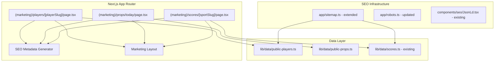

# Design Document: SEO Public Pages

## Overview

This feature creates public, SEO-optimized pages for player analysis, today's props, and live scores by sport. These pages live in the existing `(marketing)` route group (sharing its header/footer layout) and are fully server-rendered so search engine crawlers receive complete HTML. The pages expose read-only views of data already collected by the platform's scrapers and analytics engines, driving organic traffic for queries like "Victor Wembanyama props today" or "NBA live scores."

Key design goals:
- **Zero auth required** — pages are publicly accessible
- **Lightweight** — no app shell, no real-time subscriptions, no client-side data fetching for initial render
- **SEO-first** — dynamic metadata, JSON-LD structured data, canonical URLs, sitemap/robots integration
- **Reuse existing infrastructure** — same Supabase data, same analytics engines, same `(marketing)` layout

## Architecture



All three page types are **server components** using ISR (Incremental Static Regeneration) with appropriate revalidation intervals. They call data-layer functions directly (no API round-trip) following the pattern established by the existing `(app)/scores/page.tsx`.

## Components and Interfaces

### Route Structure

```
app/(marketing)/
├── players/
│   └── [playerSlug]/
│       └── page.tsx          # Public player analysis (ISR, revalidate: 300)
├── props/
│   └── today/
│       └── page.tsx          # Today's props listing (ISR, revalidate: 3600)
└── scores/
    └── [sportSlug]/
        └── page.tsx          # Sport-specific scores (ISR, revalidate: 30 when live)
```

### Data Layer Functions

#### `lib/data/public-players.ts`

```typescript
import "server-only"

export interface PublicPlayerData {
  slug: string
  name: string
  team: string
  sport: string
  position?: string
  propLine: number | null
  statCategory: string | null
  hitRate: { l5: number; l10: number; season: number } | null
  matchupGrade: string | null  // A-F
  trend: "up" | "down" | "neutral" | null
  trendPct: number | null
  streak: ("over" | "under")[]  // last 10 games
}

/** Fetch a single player's public data by slug */
export async function getPublicPlayerBySlug(slug: string): Promise<PublicPlayerData | null>

/** Fetch all player slugs for sitemap generation */
export async function getAllPlayerSlugs(): Promise<{ slug: string; lastGameDate: string }[]>
```

#### `lib/data/public-props.ts`

```typescript
import "server-only"

export interface PublicPropEntry {
  playerSlug: string
  playerName: string
  team: string
  sport: string
  game: { homeTeam: string; awayTeam: string; startTime: string }
  statCategory: string
  propLine: number
  l10HitRate: number
  matchupGrade: string  // A-F
}

/** Fetch all props for today, grouped by sport then game */
export async function getTodaysPublicProps(): Promise<{
  props: PublicPropEntry[]
  totalCount: number
  sports: string[]
}>
```

### SEO Metadata Utilities

#### `lib/seo/metadata.ts`

```typescript
/** Generate player page title (max 60 chars) */
export function generatePlayerTitle(playerName: string): string

/** Generate player page meta description (120-160 chars) */
export function generatePlayerDescription(
  playerName: string,
  statCategory: string,
  propLine: number,
  hitRate: number,
  matchupGrade: string
): string

/** Generate today's props page title with date */
export function generatePropsTitle(date: Date): string

/** Generate today's props description (max 160 chars) */
export function generatePropsDescription(propCount: number, sports: string[]): string

/** Generate scores page title */
export function generateScoresTitle(sportName: string, date: Date): string

/** Generate scores page description (max 160 chars) */
export function generateScoresDescription(
  sportName: string,
  matchCount: number,
  liveCount: number,
  upcomingCount: number
): string
```

### Sport Slug Mapping

```typescript
export const SPORT_SLUG_MAP: Record<string, { name: string; dbSport: string }> = {
  "nba": { name: "NBA", dbSport: "Basketball" },
  "nfl": { name: "NFL", dbSport: "American Football" },
  "nhl": { name: "NHL", dbSport: "Hockey" },
  "mlb": { name: "MLB", dbSport: "Baseball" },
  "premier-league": { name: "Premier League", dbSport: "Football" },
  "champions-league": { name: "Champions League", dbSport: "Football" },
  "mls": { name: "MLS", dbSport: "Football" },
  "atp": { name: "ATP Tennis", dbSport: "Tennis" },
  "wta": { name: "WTA Tennis", dbSport: "Tennis" },
  "ufc": { name: "UFC", dbSport: "MMA" },
  "f1": { name: "Formula 1", dbSport: "F1" },
  "cricket": { name: "Cricket", dbSport: "Cricket" },
}
```

### Player Slug Generation

```typescript
/** Convert player name to URL-safe slug */
export function playerNameToSlug(name: string): string {
  return name
    .toLowerCase()
    .normalize("NFD")
    .replace(/[\u0300-\u036f]/g, "")  // strip diacritics
    .replace(/[^a-z0-9]+/g, "-")
    .replace(/^-|-$/g, "")
}

/** Reverse lookup: find player by slug (query DB) */
export async function resolvePlayerSlug(slug: string): Promise<string | null>
```

## Data Models

### Existing Tables Used

- **`prop_lines`** — current and historical prop lines per player/stat
- **`nba_game_logs`** — NBA player game-by-game stats
- **`espn_scores`** / match storage — live and historical scores
- **`espn_teams`** — team metadata and logos

### New Index (Migration)

```sql
-- Index for fast player slug lookups on prop_lines
CREATE INDEX IF NOT EXISTS idx_prop_lines_player_slug
  ON prop_lines (lower(replace(replace(player_name, ' ', '-'), '.', '')));

-- Index for sitemap: players with recent activity
CREATE INDEX IF NOT EXISTS idx_prop_lines_recent_players
  ON prop_lines (player_name, updated_at DESC)
  WHERE prop_line IS NOT NULL;
```

### Data Flow

1. **Player page**: `getPublicPlayerBySlug(slug)` → queries `prop_lines` + `nba_game_logs` (or ESPN equivalent) → returns `PublicPlayerData`
2. **Props today**: `getTodaysPublicProps()` → calls existing `computeMatchupScopedProps` / `computeESPNProps` engines with caching → returns grouped props
3. **Scores page**: `getScoresForDate(today, sportFilter)` → existing data layer (DB-first with ESPN fallback)

## Correctness Properties

*A property is a characteristic or behavior that should hold true across all valid executions of a system — essentially, a formal statement about what the system should do. Properties serve as the bridge between human-readable specifications and machine-verifiable correctness guarantees.*

### Property 1: Player metadata respects length constraints

*For any* valid player name (1-50 characters), the generated title SHALL be at most 60 characters, and *for any* valid player prop data (name, stat category, prop line, hit rate 0-100, grade A-F), the generated meta description SHALL be between 120 and 160 characters inclusive.

**Validates: Requirements 1.3, 1.4**

### Property 2: Player structured data completeness

*For any* valid `PublicPlayerData` object with non-null prop data, the generated JSON-LD output SHALL be valid JSON containing `@context`, `@type`, player name, stat category, and a date field, AND the generated Open Graph metadata SHALL contain non-empty `og:title`, `og:description`, `og:type`, and `og:url` fields.

**Validates: Requirements 1.5, 1.6**

### Property 3: Props ordering invariant

*For any* list of `PublicPropEntry` objects spanning multiple sports and games, after applying the grouping/sorting logic, the output SHALL be ordered such that all entries for sport A appear before sport B if A < B alphabetically, and within each sport group, entries for game X appear before game Y if X.startTime < Y.startTime.

**Validates: Requirements 2.2**

### Property 4: Description length constraint

*For any* valid inputs to `generatePropsDescription(count, sports)` or `generateScoresDescription(sport, matchCount, liveCount, upcomingCount)`, the output string SHALL be at most 160 characters and at least 1 character.

**Validates: Requirements 2.4, 3.4**

### Property 5: Props listing contains all required fields with player links

*For any* `PublicPropEntry`, the rendered prop card SHALL contain the player name, stat category, prop line (as a number), L10 hit rate (as a percentage), matchup grade (A-F), and a link whose href matches the pattern `/players/{playerSlug}` where playerSlug is derived from the player name.

**Validates: Requirements 2.7, 2.8**

### Property 6: Scores JSON-LD SportsEvent validity

*For any* non-empty list of `LiveMatch` objects, the generated JSON-LD SHALL contain one `SportsEvent` entry per match, and each entry SHALL include non-empty `name`, `startDate` (ISO 8601), `homeTeam`, `awayTeam`, and `eventStatus` fields.

**Validates: Requirements 3.5**

### Property 7: Player slug round-trip

*For any* player name consisting of alphabetic characters and spaces (1-60 chars), `playerNameToSlug(name)` SHALL produce a non-empty string containing only lowercase letters, digits, and hyphens, and SHALL NOT start or end with a hyphen.

**Validates: Requirements 1.1, 5.1**

### Property 8: Sitemap lastModified correctness

*For any* player with a non-empty list of game dates, the sitemap entry's `lastModified` value SHALL equal the maximum (most recent) date in that player's game date list.

**Validates: Requirements 5.5**

## Error Handling

| Scenario | Behavior |
|----------|----------|
| Player slug not found in DB | Return 404 via `notFound()` — renders not-found page with homepage link |
| Player found but no active props | Render page with player name/team + "No active prop lines" message; omit hit rate/grade/streak sections |
| Sport slug not in `SPORT_SLUG_MAP` | Return 404 via `notFound()` — renders not-found page |
| Data fetch fails during SSR (DB timeout, network error) | Catch error, render page layout with "Data temporarily unavailable" inline message, return 200 status |
| Props today returns empty (no games scheduled) | Render empty state with message + links to next 3 dates with games |
| Props count > 200 | Server renders first 200; client component provides "Load more" button that fetches remaining via API |
| Sitemap DB unreachable | Return static entries (props/today, sport scores pages) without dynamic player entries |

## Testing Strategy

### Unit Tests (example-based)

- Robots.txt output contains correct allow/disallow paths (Requirements 4.1-4.6)
- Sitemap includes `/props/today` and all sport score page entries (Requirements 5.3, 5.4)
- Sport slug validation accepts all 12 supported slugs and rejects invalid ones
- Player page renders CTA and analysis link (Requirement 1.9)
- 404 behavior for invalid slugs (Requirements 1.10, 3.9)
- Empty state rendering for no-props and no-matches scenarios (Requirements 1.11, 2.9, 3.11)
- Canonical URL generation for player and scores pages (Requirements 1.7, 3.8)

### Property-Based Tests (fast-check)

Each correctness property above will be implemented as a property-based test using `fast-check` with a minimum of 100 iterations per property.

Tag format: **Feature: seo-public-pages, Property {number}: {property_text}**

Test file: `__tests__/seo/public-pages.property.test.ts`

Properties to implement:
1. Metadata length constraints (title ≤60, description 120-160)
2. Structured data completeness (JSON-LD + OG tags)
3. Props ordering invariant (sport alpha → game time)
4. Description length constraint (≤160 chars)
5. Props listing field completeness with player links
6. Scores JSON-LD SportsEvent validity
7. Player slug format validity (round-trip safe)
8. Sitemap lastModified = max game date

### Integration Tests

- Full page render tests verifying SSR output contains expected HTML elements
- Sitemap generation with mocked DB returning player data
- Robots.txt response time < 500ms

### Performance Tests

- Lighthouse CI checks for LCP ≤ 2500ms and TBT ≤ 200ms on all three page types (Requirement 6.8)
